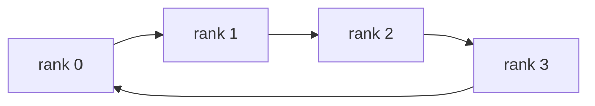
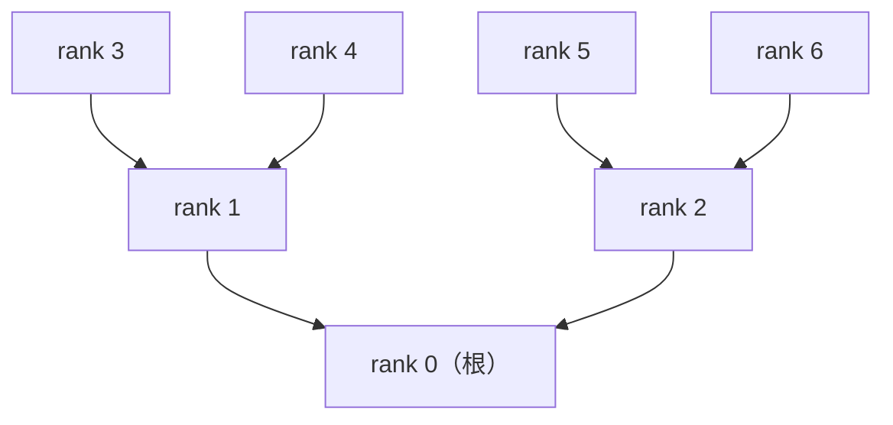
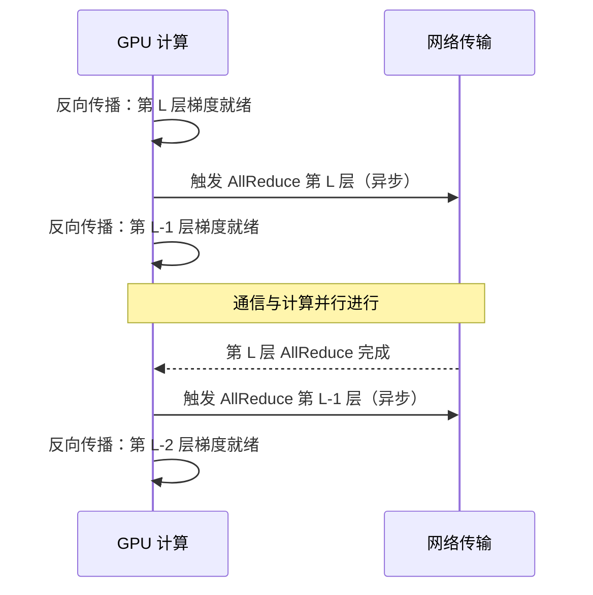

单卡再强也有天花板，大模型训练和推理不可避免地需要多卡甚至多机协作。此时，GPU 之间"怎么说话、说话多快"就成了决定整体效率的关键因素。本文从单机内的 NVLink 讲到跨机的 InfiniBand，再到集合通信原语、Ring/Tree AllReduce 算法、通信计算 Overlap 和 NCCL 通信库，系统梳理 AI 集群通信的完整知识链路。

<!-- more -->

## 📑 目录

- [1. 单机卡间通信：NVLink 与 NVSwitch](#1-单机卡间通信nvlink-与-nvswitch)
- [2. 多机间通信：InfiniBand 与 RoCE](#2-多机间通信infiniband-与-roce)
- [3. 点对点通信：最基础的积木](#3-点对点通信最基础的积木)
- [4. 集合通信原语](#4-集合通信原语)
- [5. Ring AllReduce：带宽最优实现](#5-ring-allreduce带宽最优实现)
- [6. Tree AllReduce：低延迟的另一种思路](#6-tree-allreduce低延迟的另一种思路)
- [7. 通信与计算 Overlap](#7-通信与计算-overlap)
- [8. NCCL：GPU 集合通信库](#8-ncclgpu-集合通信库)
- [9. 从通信视角理解分布式并行策略](#9-从通信视角理解分布式并行策略)
- [总结](#-总结)
- [自我检验清单](#-自我检验清单)
- [参考资料](#-参考资料)


## 1. 单机卡间通信：NVLink 与 NVSwitch

当一个模型需要多张 GPU 协同计算时，卡与卡之间搬运数据的速度直接决定了并行效率。

### 1.1 PCIe：起步但不够用

PCIe 是 GPU 与 CPU、以及 GPU 之间最基本的互联通道。可以把它想象成连接两栋大楼的普通马路——什么车都能跑，但车道窄、红绿灯多。

| PCIe 版本 | 单向带宽 (x16) | 双向带宽 (x16) |
|-----------|:-------------:|:-------------:|
| PCIe 4.0 | 32 GB/s | 64 GB/s |
| PCIe 5.0 | 64 GB/s | 128 GB/s |

对于大模型张量并行来说，每一层前向和反向传播都要做 AllReduce 通信。即便是最新的 PCIe 5.0，128 GB/s 的双向带宽也远远不够——好比上下班高峰时所有车都挤在同一条路上，堵成一锅粥。

### 1.2 NVLink：GPU 之间的专属高速公路

NVLink 是 NVIDIA 专为 GPU 间通信设计的高速互联协议。它绕过了 PCIe 总线，在 GPU 之间搭起直通专线。如果 PCIe 是限速 60 的城市道路，NVLink 就是不设红绿灯的城际高速——车道多、限速高、没有交叉路口。

**NVLink 代际演进**：

| NVLink 版本 | 所属架构 | 单链路带宽 | 每 GPU 链路数 | 每 GPU 总带宽 |
|------------|---------|:---------:|:-----------:|:------------:|
| NVLink 3.0 | Ampere (A100) | 50 GB/s | 12 | 600 GB/s |
| NVLink 4.0 | Hopper (H100) | 50 GB/s | 18 | 900 GB/s |
| NVLink 5.0 | Blackwell (B200) | 100 GB/s | 18 | 1,800 GB/s |

与 PCIe 5.0 的带宽对比：
- NVLink 4.0 (H100)：是 PCIe 5.0 的 **\~14 倍**
- NVLink 5.0 (B200)：是 PCIe 5.0 的 **\~28 倍**

这个差距直接决定了一条重要的工程准则：**需要高频通信的并行策略（如张量并行）必须限制在 NVLink 互联的范围内**。

### 1.3 NVSwitch：全连接交换枢纽

一台 8 卡 GPU 服务器中，如果每两张卡之间都用 NVLink 直连，布线复杂度会爆炸。NVSwitch 是解决这个问题的交换芯片——它相当于一个高速公路立交枢纽，所有 GPU 通过它实现互联，任意两张卡之间都能跑满带宽，不需要逐一拉线。

NVSwitch 的核心价值在于**消除拓扑瓶颈**：无论哪两张卡之间通信，带宽都是满速的。这对张量并行至关重要——TP 在每一层都需要做 AllReduce，如果某些卡对之间的带宽比其他低，整体性能就会被最慢的链路拖累。

### 1.4 查看实际拓扑

在 GPU 服务器上执行以下命令可以查看卡间互联方式：

```bash
nvidia-smi topo -m
```

输出示例：

```
        GPU0  GPU1  GPU2  GPU3  GPU4  GPU5  GPU6  GPU7
GPU0     X    NV18  NV18  NV18  NV18  NV18  NV18  NV18
GPU1    NV18   X    NV18  NV18  NV18  NV18  NV18  NV18
GPU2    NV18  NV18   X    NV18  NV18  NV18  NV18  NV18
...
```

常见标记含义：
- `NV18`：通过 18 条 NVLink 连接（NVLink 4.0 满配）
- `PHB`：通过 PCIe Host Bridge 连接
- `SYS`：跨 NUMA 节点，需经过系统总线
- `NODE`：同一 NUMA 节点内，通过 PCIe 连接

在规划并行策略时，应该把 TP 组内的 GPU 放在 NVLink 互联的卡上，把通信量较小的 PP 或 DP 分配给跨 PCIe 或跨机的链路。

---

## 2. 多机间通信：InfiniBand 与 RoCE

单机 8 卡是 AI 训练的基本单元，但要训练百亿乃至千亿参数的大模型，往往需要几十甚至上百台机器组成集群。这时候，机器之间的网络互联就成了关键。

### 2.1 传统以太网的局限

普通以太网（TCP/IP）虽然成本低、无处不在，但用在大模型训练中有几个硬伤：

- **延迟高**：数据要经过操作系统内核的协议栈处理，端到端延迟在 50-100 微秒
- **CPU 开销大**：数据拷贝和协议处理占用大量 CPU 资源，挤占数据预处理的算力
- **有效带宽受限**：协议开销导致即使硬件是 100GbE，实际可用带宽也打不满

大模型训练的梯度同步是高频操作（每个 training step 都要执行），高延迟和低带宽会成为训练速度的严重拖累。

### 2.2 RDMA：绕过 CPU 直达显存

RDMA（Remote Direct Memory Access，远程直接内存访问）是解决上述问题的核心技术。它允许一台机器**直接读写另一台机器的内存，完全绕过操作系统内核和 CPU 参与**。

打个比方：传统 TCP/IP 就像两家公司之间寄快递——要经过前台收件、登记入库、安检分拣等一系列流程，包裹在各个环节排队等候。RDMA 则像两栋楼之间架了一条专用传送带，物品直接从 A 楼仓库传到 B 楼仓库，谁都不用经手。

RDMA 的三大优势：
- **零拷贝（Zero-Copy）**：数据不需要在用户态和内核态之间来回搬运
- **内核旁路（Kernel Bypass）**：绕过操作系统内核，消除上下文切换开销
- **微秒级延迟**：端到端延迟降低到 1-2 微秒，比 TCP/IP 快 50-100 倍

### 2.3 InfiniBand：AI 集群的主流选择

InfiniBand（简称 IB）是当前大规模 AI 训练集群中最主流的高性能网络方案，原生支持 RDMA。

**速率代际演进**：

| 标准 | 单链路速率 | 4x 带宽（常用配置） | 等效字节带宽 |
|------|:---------:|:------------------:|:-----------:|
| HDR | 50 Gb/s | 200 Gb/s | 25 GB/s |
| NDR | 100 Gb/s | 400 Gb/s | 50 GB/s |
| XDR | 200 Gb/s | 800 Gb/s | 100 GB/s |

目前大型 AI 集群普遍使用 **NDR 400Gb/s** 或更新的 **XDR 800Gb/s**。

InfiniBand 的关键特点：
- 原生 RDMA 支持，协议栈效率极高
- 拥塞控制由硬件完成，大规模集合通信场景表现稳定
- 需要专用交换机和网卡（HCA），成本较高
- NVIDIA（收购 Mellanox 后）是主要供应商，与 GPU 生态深度绑定

### 2.4 RoCE：以太网上的 RDMA

RoCE（RDMA over Converged Ethernet）让标准以太网硬件也能支持 RDMA，是 InfiniBand 之外的另一个选择。

| 版本 | 协议层 | 路由能力 |
|------|--------|---------|
| RoCE v1 | 以太网二层 | 不可跨子网路由 |
| RoCE v2 | UDP/IP 三层 | 可路由，更通用 |

**InfiniBand 与 RoCE v2 对比**：

| 维度 | InfiniBand | RoCE v2 |
|------|-----------|---------|
| 延迟 | \~1 μs | \~2-5 μs |
| 带宽 | 400-800 Gb/s | 100-400 Gb/s |
| 拥塞控制 | 硬件原生实现 | 依赖 ECN/PFC 软件配置 |
| 成本 | 高（专用设备） | 中（复用以太网基础设施） |
| 大规模稳定性 | 成熟 | 需要仔细调优 |
| 适用用户 | 大型 AI Lab、万卡集群 | 云厂商、中小规模集群 |

选型建议：
- 追求极致性能和大规模稳定性（万卡训练）→ **InfiniBand**
- 预算受限或需要复用现有网络 → **RoCE v2**
- 两者对上层训练代码（PyTorch / DeepSpeed）完全透明，NCCL 会自动选择可用的传输方式

---

## 3. 点对点通信：最基础的积木

在进入集合通信原语之前，先理解最基础的通信模式：**Send / Recv**——一个进程发送数据，另一个进程接收。就像两个人打电话，一对一，定向传递。

```python
import torch
import torch.distributed as dist

# 假设已完成 dist.init_process_group(backend="nccl")
if dist.get_rank() == 0:
    tensor = torch.tensor([1.0, 2.0, 3.0]).cuda()
    dist.send(tensor, dst=1)          # rank 0 发送给 rank 1
else:
    tensor = torch.zeros(3).cuda()
    dist.recv(tensor, src=0)          # rank 1 接收来自 rank 0 的数据
    print(f"rank 1 received: {tensor}")
```

点对点通信足够灵活，流水线并行（PP）中 micro-batch 激活值的跨机传递就依赖它。但当需要"多方同时协作"时，手动逐一调用 Send/Recv 既繁琐又低效——这时候就需要集合通信原语了。

---

## 4. 集合通信原语

分布式训练的本质是让多张 GPU 协同完成一个大任务。GPU 之间的数据交换不是随意的，而是遵循一套标准化的**集合通信原语**。掌握这些原语，就能理解各种并行策略中"数据到底怎么流动"。

### 4.1 五大核心原语

**Broadcast（广播）**：一对多发送

一个 GPU 把数据发给所有其他 GPU，典型用途是分发初始模型参数。

```
操作前:          Broadcast 后:
GPU0: [ABCD]     GPU0: [ABCD]
GPU1: [    ]     GPU1: [ABCD]
GPU2: [    ]     GPU2: [ABCD]
GPU3: [    ]     GPU3: [ABCD]
```

**Reduce（归约）**：多对一聚合

所有 GPU 的数据按元素做聚合运算（通常是求和），结果汇总到一个 GPU 上。

```
操作前:          Reduce(sum) 到 GPU0:
GPU0: [1,2,3]    GPU0: [10,20,30]
GPU1: [2,4,6]    GPU1: [2,4,6]    (未变)
GPU2: [3,6,9]    GPU2: [3,6,9]    (未变)
GPU3: [4,8,12]   GPU3: [4,8,12]   (未变)
```

**AllReduce（全归约）**：所有人聚合后所有人都拿到结果

等价于 Reduce + Broadcast，但实际实现比这更高效。用生活语言说：全班同学先把各自的答案汇总求平均，再把最终答案发给每个人。

```
操作前:          AllReduce(sum) 后:
GPU0: [1,2,3]    GPU0: [10,20,30]
GPU1: [2,4,6]    GPU1: [10,20,30]
GPU2: [3,6,9]    GPU2: [10,20,30]
GPU3: [4,8,12]   GPU3: [10,20,30]
```

核心用途：**数据并行训练中同步梯度**——每张卡计算各自的梯度，AllReduce 后所有卡得到相同的梯度均值。

**AllGather（全收集）**：每人拿一片，最后人人拿全部

```
操作前:       AllGather 后:
GPU0: [A]     GPU0: [A,B,C,D]
GPU1: [B]     GPU1: [A,B,C,D]
GPU2: [C]     GPU2: [A,B,C,D]
GPU3: [D]     GPU3: [A,B,C,D]
```

核心用途：ZeRO-3 在前向传播前用 AllGather 收集完整的模型参数。

**ReduceScatter（归约-分发）**：每个人拿到其中一个分片的聚合结果

```
操作前:            ReduceScatter(sum) 后:
GPU0: [1,2,3,4]    GPU0: [4]    (第 0 片归约结果)
GPU1: [1,2,3,4]    GPU1: [8]    (第 1 片归约结果)
GPU2: [1,2,3,4]    GPU2: [12]   (第 2 片归约结果)
GPU3: [1,2,3,4]    GPU3: [16]   (第 3 片归约结果)
```

核心用途：ZeRO 系列中将归约后的梯度分片存储到各卡。

💡 **提示**：`AllReduce = ReduceScatter + AllGather`。这一分解正是 Ring AllReduce 算法的核心思想。

### 4.2 通信量对比一览

| 🔧 原语 | 📤 每 rank 发送量 | 📥 每 rank 接收量 | 典型用途 |
|--------|----------------|----------------|---------|
| Broadcast | $M$（root）/ 0 | 0（root）/ $M$ | 参数初始化广播 |
| Reduce | $M$ | $M$（root）/ 0 | Loss 汇总 |
| AllReduce | $\approx 2M$ | $\approx 2M$ | DDP 梯度同步 |
| AllGather | $(N-1)M/N$ | $(N-1)M/N$ | ZeRO-3 参数收集 |
| ReduceScatter | $(N-1)M/N$ | $(N-1)M/N$ | ZeRO 梯度分片 |

其中 $M$ 为总数据量，$N$ 为参与节点数。

### 4.3 集合通信与并行策略的映射关系

不同的并行策略依赖不同的通信原语，了解这个映射有助于分析通信开销：

| 并行策略 | 主要通信原语 | 通信频率 | 通信数据量 |
|---------|------------|---------|-----------|
| 数据并行 (DDP) | AllReduce | 每层反向后 | 梯度大小 |
| ZeRO-1/2 | ReduceScatter + AllReduce | 每层反向后 | 梯度大小 |
| ZeRO-3 | AllGather + ReduceScatter | 每层前向 + 反向 | 参数大小 |
| 张量并行 (TP) | AllReduce / AllGather | 每层前向 + 反向 | 激活大小 |
| 流水线并行 (PP) | 点对点 Send/Recv | 每个 micro-batch | 激活大小 |

📌 **关键点**：TP 的通信频率最高（每层都要），而且通信量与激活大小相关——这就是为什么 TP 必须放在 NVLink 互联的卡上。PP 虽然跨机，但通信频率和数据量都较小，IB 网络完全能够承载。

---

## 5. Ring AllReduce：带宽最优实现

### 5.1 朴素方案的瓶颈

最直觉的 AllReduce 方案是"中心化归约"：所有 GPU 把梯度发给 rank 0，rank 0 求和后再广播回去。这就像让所有快递都先送到总仓库再分发——节点数一多，rank 0 成为通信瓶颈，其他链路处于空闲，带宽利用率极低。

### 5.2 环形拓扑：让所有链路都忙起来

Ring AllReduce 把所有节点排成一个**逻辑环**，每个节点既向下一个节点发送数据，也从上一个节点接收数据，让所有链路同时工作。



整个过程分两个阶段，以 4 个节点、每个节点持有 $[a, b, c, d]$ 四份数据（各负责一片）为例：

**第一步：ReduceScatter（N-1 轮）**

将每个 rank 的数据均分为 $N$ 块，进行 $N-1$ 轮环形传递。每轮中，每个 rank 将一块数据传给下一个 rank，同时接收上一个 rank 传来的数据并与本地对应块累加。经过 $N-1$ 轮，每个 rank 持有完全归约后的 $\frac{1}{N}$ 数据块。

**第二步：AllGather（N-1 轮）**

再进行 $N-1$ 轮传递，每个 rank 将自己已归约好的那块数据沿环传递出去，最终每个 rank 都拥有完整的归约结果。

### 5.3 通信量公式

每个 rank 在 ReduceScatter 阶段发送 $N-1$ 次，每次 $M/N$ 字节；AllGather 阶段同理。因此每个 rank 的总通信量为：

$$
\text{通信量} = 2 \times (N-1) \times \frac{M}{N} = \frac{2(N-1)}{N} \times M
$$

当 $N$ 较大时，$\frac{N-1}{N} \to 1$，通信量趋近于 $2M$，**与节点数基本无关**。这意味着 Ring AllReduce 是**带宽最优（bandwidth-optimal）**的，线性扩展性极佳。

⚠️ **注意**：Ring AllReduce 带宽最优，但不是延迟最优。$2(N-1)$ 轮传递意味着延迟随节点数线性增长，在节点数很多但数据量很小的场景中会成为瓶颈。

---

## 6. Tree AllReduce：低延迟的另一种思路

Ring AllReduce 延迟是 $O(N)$ 的。在数据量很小（如同步一个标量 loss）的场景下，延迟而非带宽才是瓶颈。Tree AllReduce 以树形拓扑组织通信，将延迟降至 $O(\log N)$。



**Reduce 阶段**（叶 → 根）：从叶节点向根节点逐层归约，共 $\lceil \log_2 N \rceil$ 步。
**Broadcast 阶段**（根 → 叶）：从根节点向叶节点逐层广播，同样 $\lceil \log_2 N \rceil$ 步。

| 📊 对比项 | Ring AllReduce | Tree AllReduce |
|---------|--------------|--------------|
| 端到端延迟 | $O(N)$ | $O(\log N)$ |
| 带宽利用率 | 接近 100\%（大数据量） | 较低（根节点是瓶颈） |
| 最适场景 | 梯度同步（大张量） | 标量指标同步（loss、step） |

💡 **提示**：NCCL 内部会根据数据大小自动在 Ring 和 Tree 算法之间切换（也可通过环境变量 `NCCL_ALGO=Ring` 或 `NCCL_ALGO=Tree` 强制指定），该决策对上层框架完全透明。

---

## 7. 通信与计算 Overlap

训练性能的理论上限是：计算和通信完全并行，通信延迟被"藏进"计算时间里。核心思想是：**在 GPU 反向传播计算后续层梯度的同时，并行传输已就绪的前面层梯度**。



在 PyTorch DDP 中，这一 Overlap 通过 **bucket 机制**自动实现：模型参数被分组为若干 bucket，一个 bucket 内所有参数的梯度计算完毕后，立即异步触发 AllReduce，而无需等待整个模型的梯度全部就绪。

```python
from torch.nn.parallel import DistributedDataParallel as DDP

model = DDP(
    model,
    device_ids=[local_rank],
    bucket_cap_mb=25,    # 默认 25MB，控制 Overlap 粒度
)
```

⚠️ **注意**：`bucket_cap_mb` 需要权衡——太大会导致等待时间长（需积累更多梯度才触发），太小会导致通信次数多（每次通信有固定启动开销）。通常 25MB 是较好的起点，可根据模型层大小适当调整。

---

## 8. NCCL：GPU 集合通信库

### 8.1 NCCL 是什么

NCCL（NVIDIA Collective Communications Library，读作 "Nickel"）是 NVIDIA 开发的 GPU 集合通信库。PyTorch、DeepSpeed、Megatron-LM 等所有主流训练框架底层的多卡通信都由 NCCL 驱动。它相当于一个"智能调度中心"——你只需要说"帮我做个 AllReduce"，NCCL 会自动探测硬件拓扑、选择最优算法和传输路径。

NCCL 的核心能力：
- **自动拓扑感知**：检测 NVLink、PCIe、IB 的连接关系，选择最优通信路径
- **全套集合通信**：AllReduce、AllGather、ReduceScatter、Broadcast、Reduce 等
- **单机多卡和多机多卡**：透明支持，上层代码无需区分
- **通信-计算重叠**：支持与 CUDA Stream 配合，在通信的同时执行计算，隐藏通信延迟

### 8.2 传输后端选择

NCCL 根据硬件环境自动选择底层传输方式：

| 传输方式 | 适用场景 | 说明 |
|---------|---------|------|
| NVLink / NVSwitch | 单机卡间 | 最高带宽，优先使用 |
| PCIe P2P | 单机卡间（无 NVLink） | 带宽较低 |
| InfiniBand Verbs | 多机间 | RDMA 传输，低延迟高带宽 |
| RoCE | 多机间 | 以太网上的 RDMA |
| Socket (TCP) | 回退方案 | 性能最差，仅兼容 |

### 8.3 PyTorch 中使用 NCCL

NCCL 是 PyTorch 分布式训练的默认通信后端，使用起来非常简洁：

```python
import os
import torch
import torch.distributed as dist

def setup(rank, world_size):
    os.environ["MASTER_ADDR"] = "localhost"
    os.environ["MASTER_PORT"] = "12355"
    dist.init_process_group(backend="nccl", rank=rank, world_size=world_size)
    torch.cuda.set_device(rank)

def cleanup():
    dist.destroy_process_group()

# AllReduce：所有卡的 tensor 求和，结果每张卡都拿到
tensor = torch.ones(1024, 1024, device=f"cuda:{dist.get_rank()}")
dist.all_reduce(tensor, op=dist.ReduceOp.SUM)

# AllGather：收集所有卡的 tensor 拼成完整数据
world_size = dist.get_world_size()
local_chunk = torch.randn(256, device=f"cuda:{dist.get_rank()}")
gathered = [torch.zeros(256, device=f"cuda:{dist.get_rank()}") for _ in range(world_size)]
dist.all_gather(gathered, local_chunk)

# ReduceScatter：先归约再分片，每卡只保留归约结果中属于自己的部分
chunk_size = 1024 // world_size
output = torch.zeros(chunk_size, 1024, device=f"cuda:{dist.get_rank()}")
input_chunks = list(tensor.chunk(world_size))
dist.reduce_scatter(output, input_chunks, op=dist.ReduceOp.SUM)
```

### 8.4 关键环境变量

排查和调优多卡通信时，以下环境变量不可或缺：

**调试与诊断**

| 变量 | 说明 | 常用值 |
|------|------|--------|
| `NCCL_DEBUG` | 调试日志级别 | `VERSION` / `WARN` / `INFO` / `TRACE` |
| `NCCL_DEBUG_SUBSYS` | 过滤子系统日志 | `ALL` / `NET` / `INIT` |
| `NCCL_TOPO_DUMP_FILE` | 导出检测到的拓扑为 XML | `/tmp/nccl_topo.xml` |

**算法与协议**

| 变量 | 说明 | 可选值 |
|------|------|--------|
| `NCCL_ALGO` | 强制指定通信算法 | `Ring` / `Tree` |
| `NCCL_PROTO` | 强制指定传输协议 | `LL` / `LL128` / `Simple` |

**网络配置**

| 变量 | 说明 | 示例 |
|------|------|------|
| `NCCL_SOCKET_IFNAME` | 指定 TCP/IP 网络接口 | `eth0` / `^lo`（排除回环） |
| `NCCL_IB_HCA` | 指定 InfiniBand HCA 设备 | `mlx5_0` |
| `NCCL_NET_GDR_LEVEL` | GPUDirect RDMA 拓扑级别 | `0`（禁用）~ `5` |
| `NCCL_P2P_DISABLE` | 禁用 P2P（NVLink/PCIe） | `1` |
| `NCCL_SHM_DISABLE` | 禁用共享内存传输 | `1` |
| `NCCL_BUFFSIZE` | 通信缓冲区大小（默认 4MB） | `16777216`（16MB） |

```bash
# 查看 NCCL 拓扑感知结果和算法选择
NCCL_DEBUG=INFO python train.py

# InfiniBand 集群上指定网卡并开启 GPUDirect
NCCL_IB_HCA=mlx5_0 NCCL_NET_GDR_LEVEL=2 python train.py

# 强制使用 Ring 算法（用于对比测试）
NCCL_ALGO=Ring NCCL_DEBUG=INFO python train.py
```

### 8.5 用 nccl-tests 测量实际通信带宽

NVIDIA 提供了 `nccl-tests` 工具用于测量多卡通信的实际带宽，是验证集群网络性能的标准方法：

```bash
# 获取并编译
git clone https://github.com/NVIDIA/nccl-tests.git
cd nccl-tests
make MPI=1 MPI_HOME=/usr/local/mpi CUDA_HOME=/usr/local/cuda NCCL_HOME=/usr/local/nccl

# 单机 8 卡 AllReduce 带宽测试
./build/all_reduce_perf -b 8 -e 256M -f 2 -g 8

# 多机测试（通过 MPI 启动）
mpirun -np 16 --hostfile hosts \
  -x NCCL_DEBUG=INFO \
  -x NCCL_IB_HCA=mlx5_0 \
  ./build/all_reduce_perf -b 8 -e 256M -f 2 -g 8
```

输出中的关键指标：

```
#  size(B)    count   type    redop    time(us)  algbw(GB/s)  busbw(GB/s)
   8388608  2097152   float     sum      285.4       29.4         51.5
  67108864 16777216   float     sum     1823.0       36.8         64.4
 268435456 67108864   float     sum     5210.0       51.5         90.1
```

- **algbw**（算法带宽）= 数据量 / 时间，反映应用层看到的吞吐
- **busbw**（总线带宽）= algbw $\times \frac{2(N-1)}{N}$，修正了算法传输倍数，反映硬件链路的实际利用率

💡 **提示**：对照硬件理论带宽时应看 `busbw`，而非 `algbw`。**经验参考值**（8x H100 SXM 单机 AllReduce）：busbw 应接近 **\~850 GB/s**（NVLink 4.0 理论 900 GB/s 的 \~95%）。如果实测远低于此值，说明 NVLink 拓扑或 NCCL 配置存在问题。

---

## 9. 从通信视角理解分布式并行策略

掌握了硬件通信和集合通信的基础，我们可以从"数据搬运"的角度解释分布式训练中几个常见的架构选择。

### 9.1 张量并行为什么只能待在机内

张量并行在 Transformer 的每一层中都需要执行 AllReduce：

```
一层前向: 输入 → Linear1 → AllReduce → 激活 → Linear2 → AllReduce → 输出
一层反向: 梯度 → AllReduce → ... → AllReduce → ...
```

每个 Transformer 层包含 Attention 和 MLP 两个子模块，各自前向、反向各 1 次，合计 4 次 AllReduce。一个 80 层的大模型意味着 320 次 AllReduce。

做一个简单的时间估算：假设每次 AllReduce 搬运 1GB 数据：
- 走 NVLink 4.0（900 GB/s）：每次约 1.1 ms，320 次共 \~0.35 秒
- 走 IB NDR（50 GB/s）：每次约 20 ms，320 次共 \~6.4 秒

差距 **18 倍**，训练速度会断崖式下降。这就是"TP 不跨机"的物理原因。

### 9.2 数据并行的通信开销

数据并行中 AllReduce 的数据量等于模型梯度大小：

| 模型参数 | FP16 梯度大小 | 8 卡 Ring AllReduce 每卡通信量 | NVLink 4.0 耗时 |
|---------|:------------:|:----------------------------:|:--------------:|
| 7B | 14 GB | \~28 GB | \~31 ms |
| 70B | 140 GB | \~280 GB | \~311 ms |

如果跨机走 IB（50 GB/s），70B 模型的 AllReduce 耗时约 **5.6 秒**——这就是 ZeRO 系列要把梯度和参数切碎分片存储的动机，用更多次小通信替代一次大通信。

### 9.3 流水线并行的气泡问题

流水线并行把模型按层切分到不同机器，机器间通过点对点 Send/Recv 传递激活值。通信量远小于 TP 和 DP，IB 网络完全够用，但代价是**流水线气泡**（GPU 空闲等待的时间段）。

气泡占比公式：

$$
\text{气泡占比} = \frac{P-1}{P-1+M}
$$

其中 $P$ 是流水线级数，$M$ 是 micro-batch 数量。增大 $M$ 能缩小气泡，但会增加显存占用。

### 9.4 常见通信瓶颈排查清单

| 现象 | 可能原因 | 排查方法 |
|------|---------|---------|
| 训练 step 时间远超预期 | 通信带宽不足 | `nccl-tests` 测实际带宽 |
| GPU 利用率长期偏低 | 数据加载或 CPU 预处理拖后腿 | Nsight Systems 看 CPU-GPU 交互 |
| 不同卡速度不一致 | NVLink 拓扑不对称 | `nvidia-smi topo -m` 检查 |
| 多机扩展效率差 | IB 网络配置问题 | `NCCL_DEBUG=INFO` 查看传输路径 |
| 通信带宽远低于理论值 | 算法选择不优或缓冲区过小 | `NCCL_ALGO` 强制切换算法测试 |
| 显存 OOM | KV Cache / 激活 / 优化器状态超限 | 逐项计算显存占用 |

---

## 📝 总结

集群通信是分布式训练的"血管系统"——再强的 GPU 算力，如果数据传不过来也是白搭。本文的核心要点：

1. **单机用 NVLink，跨机用 IB/RoCE**：NVLink 带宽是 PCIe 的 14-28 倍，TP 等高频通信必须在 NVLink 范围内
2. **理解点对点与集合通信的分工**：Send/Recv 用于定向传递（PP 激活值），五大集合通信原语各司其职，服务于不同的并行策略
3. **Ring AllReduce 带宽最优**：每 rank 通信量 $\frac{2(N-1)}{N} \times M$，随节点数扩展时带宽利用率接近 100\%；Tree AllReduce 延迟 $O(\log N)$，适合小数据量场景
4. **通信计算 Overlap 是关键优化**：DDP 的 bucket 机制让梯度通信与反向计算并行，有效隐藏通信延迟
5. **NCCL 是自动挡**：它帮你检测拓扑、选择算法，但你需要会读调试信息、会用 nccl-tests 验证性能、会区分 algbw 和 busbw

---

## 🎯 自我检验清单

- 能说出 NVLink 4.0 与 PCIe 5.0 的带宽对比（900 GB/s vs 64 GB/s，约 14 倍），并解释这对张量并行的影响
- 能在 8 卡机器上用 `nvidia-smi topo -m` 读懂拓扑输出，判断哪些卡走 NVLink、哪些走 PCIe
- 能画出 AllReduce、AllGather、ReduceScatter 的数据流动示意图，说出各自的典型用途及通信量公式
- 能用 PyTorch 的 `torch.distributed` API 编写 AllReduce / AllGather / Send/Recv 代码
- 能写出 Ring AllReduce 的通信量公式 $\frac{2(N-1)}{N} \times M$，并解释为什么它与 GPU 数量基本无关
- 能对比 Ring AllReduce 与 Tree AllReduce 的延迟和带宽利用率，说出各自的适用场景
- 能解释 DDP bucket 机制如何实现通信计算 Overlap，以及 `bucket_cap_mb` 调参的权衡原则
- 能解释 InfiniBand 与 RoCE 的区别，给出各自的适用场景
- 能用 `nccl-tests` 测量 8 卡 AllReduce 带宽，区分 `algbw` 与 `busbw`，并判断结果是否正常
- 能用 `NCCL_DEBUG=INFO` 和 `NCCL_ALGO` 排查多卡训练中的通信问题
- 能从通信视角解释"为什么 TP 限制在机内而 PP 可以跨机"

## 📚 参考资料

- [NVIDIA NCCL Documentation](https://docs.nvidia.com/deeplearning/nccl/user-guide/docs/)
- [NCCL Collective Operations API](https://docs.nvidia.com/deeplearning/nccl/user-guide/docs/api/colls.html)
- [NCCL Tests - GitHub](https://github.com/NVIDIA/nccl-tests)
- [NVIDIA H100 Tensor Core GPU Architecture Whitepaper](https://resources.nvidia.com/en-us-tensor-core/gtc22-whitepaper-hopper)
- [NVIDIA Deep Learning Performance Guide](https://docs.nvidia.com/deeplearning/performance/index.html)
- [Bringing HPC Techniques to Deep Learning - Baidu Research (Ring AllReduce)](https://andrew.gibiansky.com/blog/machine-learning/baidu-allreduce/)
- [PyTorch Distributed Overview](https://pytorch.org/docs/stable/distributed.html)
- [PyTorch torch.distributed API](https://pytorch.org/docs/stable/distributed.html)
- [InfiniBand Trade Association](https://www.infinibandta.org/)
