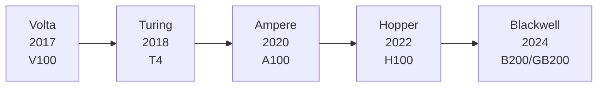
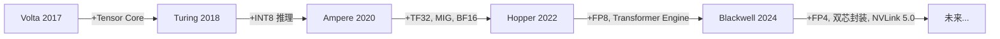

## 📑 目录

- [1. 为什么要了解 GPU 架构演进](#1-为什么要了解-gpu-架构演进)
- [2. 架构演进全景图](#2-架构演进全景图)
- [3. Volta 架构（2017）——AI 加速的开端](#3-volta-架构2017ai-加速的开端)
- [4. Turing 架构（2018）——RT Core 与推理加速](#4-turing-架构2018rt-core-与推理加速)
- [5. Ampere 架构（2020）——数据中心 AI 的分水岭](#5-ampere-架构2020数据中心-ai-的分水岭)
- [6. Hopper 架构（2022）——为大模型而生](#6-hopper-架构2022为大模型而生)
- [7. Blackwell 架构（2024）——万亿参数时代的基石](#7-blackwell-架构2024万亿参数时代的基石)
- [8. 核心技术纵向对比](#8-核心技术纵向对比)
- [9. 如何选择合适的 GPU](#9-如何选择合适的-gpu)
- [总结](#-总结)
- [自我检验清单](#-自我检验清单)
- [参考资料](#-参考资料)

---

## 1. 为什么要了解 GPU 架构演进

做 AI Infra 工程，经常会碰到这样的问题：训练跑不动该升级什么卡？推理延迟高是卡在哪里？FP8 和 BF16 到底选哪个？这些问题的答案往往藏在 GPU 架构本身的设计决策里。

理解 NVIDIA GPU 的代际演进，本质上是在理解**AI 硬件和 AI 算法的协同进化**——每一代架构都在回应上一代暴露出来的瓶颈，每一个新特性都有其针对的工作负载场景。掌握这些演进脉络，才能在硬件选型、性能调优、系统架构设计中做出合理的判断。

## 2. 架构演进全景图

先看全局。NVIDIA 从 2017 年至今推出了五代面向 AI 的 GPU 架构，可以把它们想象成一条不断拓宽、提速的高速公路——每一代都在扩展车道（算力）、提升路面质量（精度支持）和建造更高效的立交桥（互联带宽）。



| 📊 架构 | 📅 年份 | 🖥️ 代表产品 | ⚡ 核心突破 |
|---------|---------|-------------|------------|
| Volta | 2017 | V100 | 首次引入 Tensor Core |
| Turing | 2018 | T4 | INT8/INT4 推理加速、RT Core |
| Ampere | 2020 | A100 | 第三代 Tensor Core、MIG、TF32、BF16 |
| Hopper | 2022 | H100 | FP8、Transformer Engine、NVLink 4.0 |
| Blackwell | 2024 | B200 / GB200 | 第五代 Tensor Core、NVLink 5.0、双芯封装 |

下面逐代展开，重点关注每一代**解决了什么问题**和**引入了什么关键技术**。

## 3. Volta 架构（2017）——AI 加速的开端

### 3.1 背景：GPU 凭什么做 AI？

在 Volta 之前，深度学习训练主要依赖 GPU 的 CUDA Core 做通用浮点运算。CUDA Core 是"万金油"——什么都能算，但没有针对深度学习中最核心的操作（矩阵乘法）做专门优化。这就好比用菜刀切面包，能用，但远不如面包刀好使。

### 3.2 关键创新：Tensor Core

Volta 最重要的贡献是引入了 **Tensor Core**——一种专门为矩阵乘累加运算（Matrix Multiply-Accumulate, MMA）设计的硬件单元。

传统 CUDA Core 每个时钟周期处理一次标量的乘加运算（FMA），而一个 Tensor Core 在每个时钟周期内可以完成一个 $4 \times 4 \times 4$ 的混合精度矩阵乘累加：

$$
D = A \times B + C
$$

其中 $A$、$B$ 为 FP16 矩阵，$C$、$D$ 为 FP16 或 FP32 矩阵。这意味着一次操作就完成了 64 次乘加，相比 CUDA Core 的逐元素计算，效率提升了一个数量级。

### 3.3 V100 关键规格

| 参数 | 规格 |
|------|------|
| Tensor Core 数量 | 640 个 |
| FP16 Tensor 算力 | 125 TFLOPS |
| FP32 CUDA 算力 | 15.7 TFLOPS |
| 显存 | 16 GB / 32 GB HBM2 |
| 显存带宽 | 900 GB/s |
| NVLink | NVLink 2.0，300 GB/s（双向） |

💡 **提示**：V100 是第一块真正意义上的"AI 训练卡"。即使在今天，理解 V100 的 Tensor Core 设计仍然是学习后续架构的基础。

### 3.4 实践意义

Volta 开启了一个重要的编程范式转变：要想充分利用 Tensor Core，你的矩阵维度需要是 8 的倍数（后续架构进一步放宽），数据类型需要使用混合精度（FP16 计算 + FP32 累加）。这也是 NVIDIA 混合精度训练（AMP）的硬件基础。

```python
# PyTorch 中使用混合精度训练（Volta 时代开始受益）
import torch
from torch.cuda.amp import autocast, GradScaler

scaler = GradScaler()
for data, target in dataloader:
    optimizer.zero_grad()
    with autocast():  # 自动选择 FP16/FP32
        output = model(data)
        loss = criterion(output, target)
    scaler.scale(loss).backward()
    scaler.step(optimizer)
    scaler.update()
```

## 4. Turing 架构（2018）——RT Core 与推理加速

### 4.1 解决的问题

Volta 主要面向训练场景。但到了模型部署阶段，推理对延迟和吞吐量的要求更加苛刻，且推理负载通常不需要 FP16 那么高的精度——很多模型用 INT8 就能保持足够的准确率。Volta 的 Tensor Core 只支持 FP16，在推理场景下算力利用不够充分。

### 4.2 关键创新

- **INT8 / INT4 Tensor Core 支持**：第二代 Tensor Core 新增了整数精度运算能力，推理吞吐量相比 FP16 可再翻倍
- **RT Core**：光线追踪加速单元（主要面向图形渲染，AI Infra 领域较少涉及）
- **更高效的推理定位**：T4 卡的 TDP 仅 70W，适合部署在推理服务器中

### 4.3 T4 关键规格

| 参数 | 规格 |
|------|------|
| Tensor Core 数量 | 320 个 |
| FP16 Tensor 算力 | 65 TFLOPS |
| INT8 Tensor 算力 | 130 TOPS |
| 显存 | 16 GB GDDR6 |
| 显存带宽 | 320 GB/s |
| TDP | 70W |

📌 **关键点**：T4 虽然绝对算力不如 V100，但其低功耗、高 INT8 吞吐的特性使它成为推理部署的经典选择。很多云厂商的推理实例至今仍在使用 T4。

### 4.4 实践意义

Turing 架构推动了 **模型量化（Quantization）** 在工业界的普及。TensorRT 的 INT8 量化 pipeline 正是以 Turing 架构为目标设计的：

```bash
# 使用 TensorRT 进行 INT8 量化推理的典型流程
# 1. 导出 ONNX 模型
python export_onnx.py --model resnet50 --output model.onnx

# 2. 用 trtexec 构建 INT8 engine（需要校准数据集）
trtexec --onnx=model.onnx --int8 --calib=calibration_cache.bin --saveEngine=model_int8.engine
```

## 5. Ampere 架构（2020）——数据中心 AI 的分水岭

### 5.1 解决的问题

到 2020 年，AI 模型规模急剧膨胀（GPT-3 有 1750 亿参数），训练所需的算力和显存同步增长。Volta/Turing 时代的两个痛点变得突出：

1. **精度格式不够灵活**：FP16 在某些模型上存在数值溢出问题，FP32 又太慢
2. **单卡利用率不高**：一块 GPU 只能跑一个任务，多租户场景下资源浪费严重

### 5.2 关键创新

#### TF32 —— "不用改代码的加速"

Ampere 引入了 **TF32（TensorFloat-32）** 精度格式。TF32 使用 FP32 的 8 位指数位（保持相同的数值范围）加上 FP16 的 10 位尾数位，在不修改任何代码的情况下，对 FP32 运算自动提速：

| 格式 | 符号位 | 指数位 | 尾数位 | 总位宽 |
|------|--------|--------|--------|--------|
| FP32 | 1 | 8 | 23 | 32 |
| TF32 | 1 | 8 | 10 | 19 |
| FP16 | 1 | 5 | 10 | 16 |
| BF16 | 1 | 8 | 7 | 16 |

💡 **提示**：TF32 在 Ampere 上默认开启。当你在 A100 上跑 `torch.matmul` 时，如果输入是 FP32，Tensor Core 会自动使用 TF32 加速，不需要你显式开启混合精度。

#### MIG —— 一卡多用

**MIG（Multi-Instance GPU）** 允许将一块 A100 物理隔离为最多 7 个独立的 GPU 实例，每个实例拥有独立的显存、缓存和计算资源。这就像把一套大房子隔成多个独立的公寓，每户有自己的水电表，互不干扰。

```bash
# 查看 A100 支持的 MIG 配置
nvidia-smi mig -lgip

# 创建一个 MIG 实例（以 3g.20gb 为例：3 个 Compute Slice + 20GB 显存）
sudo nvidia-smi mig -cgi 9,9 -C

# 查看已创建的实例
nvidia-smi mig -lgi
```

MIG 的典型应用场景：
- ✅ 多个推理服务共享一块 A100，各自隔离互不影响
- ✅ 开发/调试阶段，多人共用一块卡
- ❌ 不适合需要完整 GPU 算力的大模型训练

#### 第三代 Tensor Core

支持的精度矩阵大幅扩展：FP16、**BF16**、TF32、INT8、INT4、Binary（1-bit），覆盖从训练到推理的全场景。

### 5.3 A100 关键规格

| 参数 | 规格 |
|------|------|
| Tensor Core 数量 | 432 个（第三代） |
| FP16 / BF16 Tensor 算力 | 312 TFLOPS |
| TF32 Tensor 算力 | 156 TFLOPS |
| FP32 CUDA 算力 | 19.5 TFLOPS |
| 显存 | 40 GB / 80 GB HBM2e |
| 显存带宽 | 2.0 TB/s |
| NVLink | NVLink 3.0，600 GB/s（双向） |

### 5.4 实践意义

Ampere 架构让 **BF16 混合精度训练**成为主流。BF16 与 FP32 有相同的数值范围（8 位指数），避免了 FP16 常见的溢出问题，同时将显存占用和通信量减半。大部分 LLM 训练从 Ampere 时代起使用 BF16 作为默认训练精度：

```python
# 在 A100 上使用 BF16 训练（PyTorch 原生支持）
model = model.to(dtype=torch.bfloat16, device="cuda")

# 或使用 PyTorch 的 autocast
with torch.autocast(device_type="cuda", dtype=torch.bfloat16):
    output = model(input_ids)
    loss = criterion(output, labels)
```

## 6. Hopper 架构（2022）——为大模型而生

### 6.1 解决的问题

大语言模型（LLM）时代到来后，模型训练面临双重压力：

1. **算力饥渴**：百亿、千亿参数模型训练需要成百上千块 GPU 并行
2. **通信瓶颈**：多卡并行训练中，GPU 之间的数据同步（All-Reduce、All-to-All）成为重要瓶颈

Hopper 架构几乎每个重要特性都在回应这两个挑战。

### 6.2 关键创新

#### FP8 训练 —— 精度再压一刀

Hopper 的第四代 Tensor Core 支持 **FP8** 精度（E4M3 和 E5M2 两种格式），将训练精度从 BF16 的 16 位进一步压缩到 8 位。

| 格式 | 符号位 | 指数位 | 尾数位 | 适用场景 |
|------|--------|--------|--------|----------|
| E4M3 | 1 | 4 | 3 | 前向传播（精度优先） |
| E5M2 | 1 | 5 | 2 | 反向传播（范围优先） |

FP8 的理论算力是 BF16 的两倍。但精度降低了，模型质量不会受损吗？这就引出了 Hopper 的另一个核心技术。

#### Transformer Engine —— 自动驾驶级精度管理

**Transformer Engine** 是一个软硬件协同的机制：它在每一层的计算前，动态分析张量的数值分布，自动决定这一层用 FP8 还是 BF16/FP16。可以理解为一个"自动挡"——在直路上（数值稳定的层）挂高速档（FP8），在弯道上（数值敏感的层）自动降档（BF16）。

```python
# 使用 Transformer Engine 的 FP8 训练
import transformer_engine.pytorch as te

# 替换标准 Linear 层为 TE 的 FP8 版本
model.layer = te.Linear(hidden_size, hidden_size)

# 启用 FP8 自动混合精度
with te.fp8_autocast(enabled=True):
    output = model(input_data)
```

#### NVLink 4.0 与 NVSwitch

| 📊 指标 | Ampere (A100) | Hopper (H100) | 提升 |
|---------|---------------|---------------|------|
| NVLink 带宽（双向） | 600 GB/s | 900 GB/s | 1.5x |
| All-Reduce 带宽 | 600 GB/s | 900 GB/s | 1.5x |
| NVSwitch 支持 | 节点内 8 卡 | 节点内 8 卡 + 跨节点 NVLink Network | 全新 |

⚠️ **注意**：H100 有两个版本——PCIe 版和 SXM 版。SXM 版通过 NVSwitch 支持 8 卡全互联，NVLink 4.0 总带宽 900 GB/s；PCIe 版虽然也有 NVLink 4.0，但仅支持 2 卡桥接互联。选型时务必注意这一区别。

#### 其他重要特性

- **Thread Block Cluster**：CUDA 编程模型新增一层层次结构，允许多个 Thread Block 协作，更好地利用 SM 间的共享存储
- **TMA（Tensor Memory Accelerator）**：硬件异步内存拷贝单元，将数据搬运从计算流水线中解耦出来，减少 SM 空闲等待

### 6.3 H100 关键规格

| 参数 | 规格 |
|------|------|
| Tensor Core 数量 | 528 个（第四代） |
| FP8 Tensor 算力 | 1,979 TFLOPS（Dense）/ 3,958 TFLOPS（稀疏） |
| FP16 / BF16 Tensor 算力 | 989 TFLOPS（Dense）/ 1,979 TFLOPS（稀疏） |
| TF32 Tensor 算力 | 495 TFLOPS（Dense）/ 989 TFLOPS（稀疏） |
| 显存 | 80 GB HBM3 |
| 显存带宽 | 3.35 TB/s |
| NVLink | NVLink 4.0，900 GB/s（双向，SXM 版） |

💡 **提示**：NVIDIA 从 Ampere 架构起支持结构化稀疏性（2:4 Structured Sparsity），可将 Tensor Core 吞吐翻倍。但开启稀疏性需要模型权重经过专门的剪枝处理，实际大多数工作负载使用的是 Dense 算力。

### 6.4 实践意义

Hopper 是当前大模型训练的主力架构。在实际的千卡训练集群中，以下特性的价值最为显著：

1. **FP8 + Transformer Engine** 将训练吞吐提升 30%-60%（取决于模型结构）
2. **NVLink 4.0** 大幅降低了多卡 All-Reduce 的通信延迟
3. **HBM3 的 3.35 TB/s 带宽** 缓解了 Attention 计算的访存瓶颈

```bash
# 查看 H100 的 NVLink 拓扑
nvidia-smi topo -m

# 查看当前 GPU 的 NVLink 状态
nvidia-smi nvlink -s
```

## 7. Blackwell 架构（2024）——万亿参数时代的基石

### 7.1 解决的问题

进入万亿参数模型时代，单块 GPU 的算力增长已经跟不上模型膨胀的速度。Blackwell 的设计哲学是：与其一味堆晶体管提升单 die 性能，不如在芯片互联层面做革命性突破。

### 7.2 关键创新

#### 双芯封装（Dual-Die）

B200 的核心由**两块 die 通过 10 TB/s 的片间互联**封装在同一块芯片上。对外表现为一块完整的 GPU，但实际上拥有两块 die 的算力。这就像把两匹马套在一起拉车，对车夫来说操作方式不变，但拉力翻倍。

#### 第五代 Tensor Core

FP8 Dense 算力相比 H100 提升约 14%（双 die 加持），含稀疏性加速后可达 4,500 TFLOPS。**FP4 精度首次获得硬件级支持**，Dense 算力 4,500 TOPS，开启稀疏性后可达 9,000 TOPS。FP4 的引入为推理场景提供了更极致的算力密度。

#### NVLink 5.0

| 📊 指标 | Hopper (H100) | Blackwell (B200) | 提升 |
|---------|---------------|------------------|------|
| NVLink 带宽（双向） | 900 GB/s | 1,800 GB/s | 2x |
| NVLink 连接的 GPU 数 | 8 | 72（通过 NVLink Switch） | 9x |

1.8 TB/s 的互联带宽意味着 GPU 之间的通信速度已经接近单块 GPU 的显存带宽。这从根本上改变了分布式训练的通信格局——过去需要精心设计通信拓扑来规避的瓶颈，现在可以用"暴力"带宽直接碾过。

#### 其他亮点

- **HBM3e 显存**：单卡最高 192 GB，显存带宽 8 TB/s
- **第二代 Transformer Engine**：更智能的 FP8/FP4 动态精度调度
- **机密计算（Confidential Computing）**：硬件级 GPU TEE，保护训练数据隐私

### 7.3 B200 / GB200 关键规格

| 参数 | B200 | GB200（Grace-Blackwell） |
|------|------|--------------------------|
| FP8 Tensor 算力 | 2,250 TFLOPS（Dense）/ 4,500 TFLOPS（稀疏） | 同左（GPU 部分） |
| FP4 Tensor 算力 | 4,500 TOPS（Dense）/ 9,000 TOPS（稀疏） | 同左（GPU 部分） |
| 显存 | 192 GB HBM3e | 192 GB HBM3e + 480 GB LPDDR5x（CPU） |
| 显存带宽 | 8 TB/s | 8 TB/s（GPU 部分） |
| NVLink | NVLink 5.0，1,800 GB/s | NVLink 5.0，1,800 GB/s |
| 芯片设计 | 双 die 封装 | Grace CPU + Blackwell GPU 紧耦合 |

📌 **关键点**：GB200 是一个 **CPU-GPU 超级芯片**，将 NVIDIA 自研的 Grace ARM CPU 与 Blackwell GPU 通过高速 NVLink-C2C 互联封装在一起。这种设计消除了传统 PCIe 的 CPU-GPU 通信瓶颈。

## 8. 核心技术纵向对比

### 8.1 Tensor Core 算力演进

下表数据统一使用 **Dense（非稀疏）** 算力。Ampere 及之后的架构支持 2:4 结构化稀疏性加速，开启后吞吐可翻倍。V100 / T4 不支持稀疏性。

| 精度 | V100 | T4 | A100 | H100 | B200 |
|------|------|----|------|------|------|
| FP16 / BF16 | 125 TFLOPS | 65 TFLOPS | 312 TFLOPS | 989 TFLOPS | ~1,125 TFLOPS |
| TF32 | — | — | 156 TFLOPS | 495 TFLOPS | ~563 TFLOPS |
| FP8 | — | — | — | 1,979 TFLOPS | ~2,250 TFLOPS |
| INT8 | — | 130 TOPS | 624 TOPS | 1,979 TOPS | ~2,250 TOPS |
| FP4 | — | — | — | — | ~4,500 TOPS |

### 8.2 显存与带宽演进

| 📊 指标 | V100 | A100 | H100 | B200 |
|---------|------|------|------|------|
| 显存容量 | 32 GB | 80 GB | 80 GB | 192 GB |
| 显存类型 | HBM2 | HBM2e | HBM3 | HBM3e |
| 显存带宽 | 900 GB/s | 2.0 TB/s | 3.35 TB/s | 8 TB/s |
| NVLink 带宽 | 300 GB/s | 600 GB/s | 900 GB/s | 1,800 GB/s |

可以看到一个清晰的趋势：**显存带宽的增长速度慢于算力增长**。这反映了 AI 工作负载（尤其是 LLM 推理）的 **memory-bound** 特性——当模型足够大时，瓶颈不在计算而在访存。

### 8.3 关键特性引入时间线



## 9. 如何选择合适的 GPU

选 GPU 不是选最新最贵的就好。要根据具体的工作负载来决策：

### 训练场景

| 场景 | 推荐 | 理由 |
|------|------|------|
| 中小模型训练（< 10B） | A100 80GB | 性价比高，生态成熟 |
| 大模型训练（10B-100B） | H100 SXM | FP8 + NVLink 4.0 大幅提升多卡训练效率 |
| 超大模型训练（> 100B） | B200 / GB200 | 192GB 显存 + 1.8TB/s NVLink 支撑万亿参数 |

### 推理场景

| 场景 | 推荐 | 理由 |
|------|------|------|
| 低成本在线推理 | T4 | 70W 低功耗，INT8 够用 |
| 中等规模 LLM 推理 | A100 / L40S | 显存够大，生态支持完善 |
| 大规模 LLM 推理 | H100 / H200 | FP8 吞吐高，HBM3 带宽充足 |
| 极致推理性能 | B200 | FP4 支持，显存 192GB 容纳更大模型 |

⚠️ **注意**：除了单卡性能，还需要考虑集群网络拓扑（NVLink vs PCIe vs InfiniBand）、功耗散热、供应链交付周期等因素。硬件选型从来不是一个纯技术问题。

## 📝 总结

回顾五代架构的演进，可以提炼出三条主线：

1. **精度格式不断下探**：FP32 → FP16 → BF16/TF32 → FP8 → FP4。每压缩一级精度，理论算力翻一倍，同时需要配套的数值稳定性方案（AMP、Transformer Engine）
2. **互联带宽持续翻倍**：NVLink 从 300 GB/s 一路攀升到 1,800 GB/s，连接范围从节点内 8 卡扩展到跨节点 72 卡。这是分布式训练效率提升的硬件基础
3. **软硬件协同深化**：从 Tensor Core 的硬件加速，到 Transformer Engine 的自动精度调度，再到 MIG 的虚拟化隔离——纯堆算力的时代过去了，体系化的软硬件协同才是竞争力所在

理解这些演进趋势，不仅帮助你做出更好的硬件选型决策，也为后续学习 CUDA 编程、分布式训练、推理优化等主题奠定了必要的硬件认知基础。

## 🎯 自我检验清单

- 能说出 NVIDIA 五代 AI GPU 架构的名称、年份和代表产品
- 能解释 Tensor Core 与 CUDA Core 的本质区别
- 能说明 FP32、TF32、BF16、FP16、FP8 各自的位宽和适用场景
- 能解释 MIG 的作用和适用场景，并用 `nvidia-smi` 命令查看/创建 MIG 实例
- 能说明 Transformer Engine 的工作原理（FP8/BF16 动态切换）
- 能比较 NVLink 各代的带宽差异，理解其对分布式训练的意义
- 能根据训练/推理场景的不同需求推荐合适的 GPU 型号
- 能解释 Blackwell 双芯封装和 GB200 CPU-GPU 紧耦合设计的价值

## 📚 参考资料

- [NVIDIA V100 Tensor Core GPU Architecture Whitepaper](https://images.nvidia.com/content/volta-architecture/pdf/volta-architecture-whitepaper.pdf)
- [NVIDIA A100 Tensor Core GPU Architecture Whitepaper](https://images.nvidia.com/aem-dam/en-zz/Solutions/data-center/nvidia-ampere-architecture-whitepaper.pdf)
- [NVIDIA H100 Tensor Core GPU Architecture Whitepaper](https://resources.nvidia.com/en-us-tensor-core/gtc22-whitepaper-hopper)
- [NVIDIA Blackwell Architecture Technical Brief](https://www.nvidia.com/en-us/data-center/technologies/blackwell-architecture/)
- [NVIDIA Transformer Engine Documentation](https://docs.nvidia.com/deeplearning/transformer-engine/user-guide/index.html)
- [NVIDIA Multi-Instance GPU User Guide](https://docs.nvidia.com/datacenter/tesla/mig-user-guide/)
- [NVIDIA NVLink and NVSwitch](https://www.nvidia.com/en-us/data-center/nvlink/)
