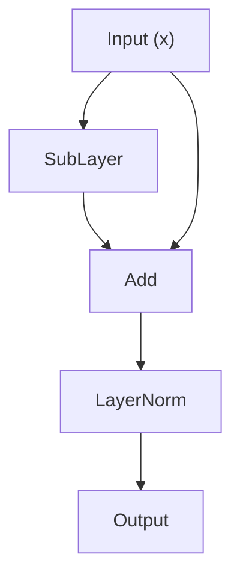
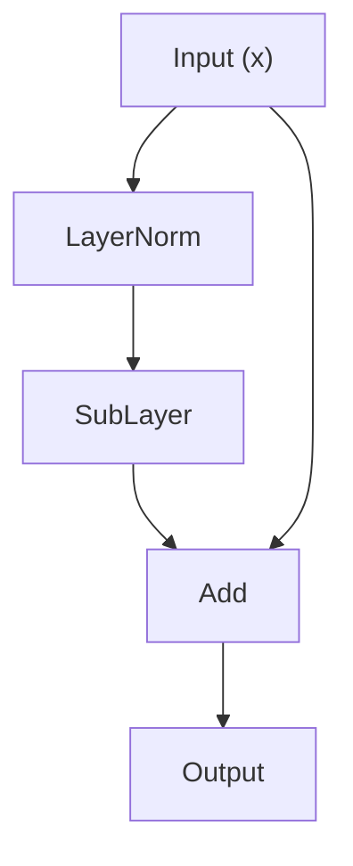

在 Transformer 架构中，Self-Attention 和 FFN 负责"学什么"，而 LayerNorm 和残差连接决定了"能不能学会"。一个没有残差连接的 100 层网络几乎无法训练，一个没有归一化的深层网络则像一辆刹车失灵的卡车——要么冲出路面（梯度爆炸），要么熄火在半路（梯度消失）。本文从深度网络训练的根本困难出发，逐步拆解残差连接和归一化技术的原理、实现与工程优化，帮助你建立对这两个"幕后功臣"的系统认知。

<!-- more -->

## 📑 目录

- [1. 深度网络训练的根本挑战](#1-深度网络训练的根本挑战)
- [2. 残差连接：梯度的高速公路](#2-残差连接梯度的高速公路)
- [3. 归一化方法全景](#3-归一化方法全景)
- [4. Pre-Norm vs Post-Norm：一个影响深远的设计选择](#4-pre-norm-vs-post-norm一个影响深远的设计选择)
- [5. CUDA 优化视角：工程落地的关键考量](#5-cuda-优化视角工程落地的关键考量)
- [6. 大模型的归一化选择一览](#6-大模型的归一化选择一览)
- [自我检验清单](#-自我检验清单)
- [参考资料](#-参考资料)

---

## 1. 深度网络训练的根本挑战

在讨论残差连接和归一化之前，我们必须先理解它们要解决的核心问题：**深度网络为什么难训练？**

### 1.1 梯度消失与梯度爆炸

神经网络的训练依赖反向传播（Backpropagation），其本质是链式法则（Chain Rule）的递归应用。假设一个 $L$ 层的网络，每层的变换为 $f_l$，那么损失函数 Loss 对第 1 层参数的梯度涉及从第 $L$ 层到第 1 层的连续偏导数相乘：

$$
\frac{\partial \text{Loss}}{\partial W_1} = \frac{\partial \text{Loss}}{\partial f_L} \cdot \frac{\partial f_L}{\partial f_{L-1}} \cdots \frac{\partial f_2}{\partial f_1} \cdot \frac{\partial f_1}{\partial W_1}
$$

这是一连串乘法。想象你在玩一个"传话游戏"：消息从队尾传到队首，每个人都会对消息做一次"缩放"处理再传给下一个人。如果每个人都把消息音量缩小 10%，经过 50 个人之后，消息几乎听不见了——这就是**梯度消失**。反过来，如果每个人都把音量放大 10%，经过 50 个人之后就变成了震耳欲聋的噪声——这就是**梯度爆炸**。

用数学来说，假设每层的雅可比矩阵的谱范数（最大奇异值）为 $\sigma$。经过 $L$ 层的连乘后：

- 若 $\sigma < 1$，梯度以 $\sigma^L$ 的速度指数衰减，深层参数几乎收不到有意义的更新信号
- 若 $\sigma > 1$，梯度以 $\sigma^L$ 的速度指数增长，参数更新剧烈震荡甚至变为 NaN
- 只有 $\sigma$ 恰好等于 1 的理想情况下，梯度才能稳定传播——但这在实际训练中几乎不可能自然满足

这个问题随着网络深度的增加而急剧恶化。在 Transformer 出现之前，LSTM 通过门控机制部分缓解了梯度消失；但对于动辄几十上百层的 Transformer 来说，我们需要更根本、更直接的解决方案。

### 1.2 退化问题（Degradation Problem）

2015 年，何恺明等人在训练深层卷积网络时发现了一个反直觉的现象：**更深的网络反而比浅层网络表现更差**——不是因为过拟合（训练误差也更高），而是因为优化本身出了问题。理论上，一个 56 层网络至少不应该比 20 层网络差，因为多出来的 36 层只要学成恒等映射（identity mapping），就能保持 20 层的效果。但实际训练中，让网络"学会什么都不做"远比我们想象的困难。

这个观察直接催生了残差连接的诞生。

---

## 2. 残差连接：梯度的高速公路

### 2.1 从 ResNet 到 Transformer：残差连接的历史

2015 年底，何恺明等人提出了 ResNet（Residual Network），用一个极其简洁的结构解决了上述退化问题：

$$
\text{output} = x + F(x)
$$

其中 $x$ 是层的输入，$F(x)$ 是需要学习的变换（称为"残差函数"）。这个加号看似平淡无奇，却彻底改变了深度学习的格局——ResNet 把网络从几十层成功推进到了 152 层乃至上千层，并赢得了 2015 年 ImageNet 竞赛冠军。

**为什么学"残差"比学"完整映射"容易？**

换一个比喻来理解。假设你是一个建筑设计师，甲方给了你一份初版设计图，让你出终版。有两种工作方式：

- **方式 A**（无残差）：从零开始画一份全新的终版图纸。你需要重新考虑所有细节，压力巨大。
- **方式 B**（有残差）：在初版图纸上用红笔标注修改意见。你只需要关注"哪里需要改"，大部分不需要改的内容自动保留。

显然方式 B 的认知负担小得多。当网络某一层确实不需要做太多变换时，$F(x)$ 只需要趋近于零——而学习一个趋近零的函数远比学习一个恒等映射容易。在初始化阶段，权重通常被设为接近零的小值，这意味着 $F(x)$ 天然就接近零，output 接近 $x$，网络自动具备了"什么都不做"的能力作为起点，然后再从这个起点慢慢学习有意义的变换。

2017 年，Vaswani 等人在设计 Transformer 时直接采用了残差连接。在 Transformer 的每个 Decoder Block 中，Attention 子层和 FFN 子层各有一条残差连接：

$$
\begin{aligned}
h &= x + \text{Attention}(x)
\end{aligned}
$$
$$
\begin{aligned}
\text{output} &= h + \text{FFN}(h)
\end{aligned}
$$

对于一个包含 32 个 Block 的 LLaMA-7B 模型，信号从第 1 层到第 32 层需要经过 64 个子层。没有残差连接，梯度几乎不可能穿越这么多层而不消失。

### 2.2 数学分析：为什么残差连接能保证梯度流

让我们从反向传播的角度，严格地看看残差连接为什么有效。

**无残差连接的情况：**

假设每一层的计算为 $x_{l+1} = f_l(x_l)$，那么损失 $L$ 对某中间层 $x_l$ 的梯度为：

$$
\frac{\partial L}{\partial x_l} = \frac{\partial L}{\partial x_L} \cdot \frac{\partial f_{L-1}}{\partial x_{L-1}} \cdot \frac{\partial f_{L-2}}{\partial x_{L-2}} \cdots \frac{\partial f_l}{\partial x_l}
$$

这是一连串雅可比矩阵的**乘法**。任何一个因子的谱范数偏离 1，经过多层累乘都会导致梯度消失或爆炸。

**有残差连接的情况：**

每一层的计算变为 $x_{l+1} = x_l + F_l(x_l)$，对 $x_l$ 求导：

$$
\frac{\partial x_{l+1}}{\partial x_l} = I + \frac{\partial F_l}{\partial x_l}
$$

其中 $I$ 是单位矩阵。展开从第 $L$ 层到第 $l$ 层的梯度：

$$
\frac{\partial L}{\partial x_l} = \frac{\partial L}{\partial x_L} \cdot \left(I + \frac{\partial F_{L-1}}{\partial x_{L-1}}\right) \cdot \left(I + \frac{\partial F_{L-2}}{\partial x_{L-2}}\right) \cdots \left(I + \frac{\partial F_l}{\partial x_l}\right)
$$

把这个连乘展开后，其中**必然包含一项恒为 $I^{(L-l)} = I$ 的乘积**（即所有括号都选 $I$ 那一项），这意味着：

$$
\frac{\partial L}{\partial x_l} = \frac{\partial L}{\partial x_L} \cdot (I + \text{其他交叉项})
$$

关键在于这个 $I$。无论中间各层的 $\partial F_l / \partial x_l$ 有多小甚至趋近于零，梯度 $\partial L / \partial x_L$ 都可以通过这条"恒等通道"**原封不动地**传递到第 $l$ 层。这就是残差连接被称为"梯度高速公路"的原因——它在反向传播的计算图中开辟了一条短路路径，梯度不必被逼着走那条经过所有非线性变换的崎岖小路，而是可以直达目的地。

从另一个角度看，残差连接把反向传播中的纯"乘法链"变成了"加法 + 乘法"的混合结构。纯乘法链对数值极其敏感（想想连续乘以 0.9 五十次的结果），而加法的引入让梯度有了一个"保底值"，大幅提升了数值稳定性。

### 2.3 PyTorch 实现：带残差连接的 Transformer 子层

以下是一个带残差连接的 Transformer 子层的实现示例（采用 Pre-Norm 风格，先归一化再进子层，残差连接包裹在外面）：

```python
import torch
import torch.nn as nn

class ResidualSubLayer(nn.Module):
    """
    通用的残差子层包装器。
    将任意子层（Attention 或 FFN）包装为：output = x + SubLayer(LayerNorm(x))
    """

    def __init__(self, d_model: int, sublayer: nn.Module, dropout: float = 0.1):
        super().__init__()
        self.norm = nn.LayerNorm(d_model)
        self.sublayer = sublayer
        self.dropout = nn.Dropout(dropout)

    def forward(self, x: torch.Tensor) -> torch.Tensor:
        # Pre-Norm: 先归一化，再送入子层
        normed = self.norm(x)
        # 子层计算
        sub_output = self.sublayer(normed)
        # Dropout 正则化
        sub_output = self.dropout(sub_output)
        # 残差连接：直接加上原始输入
        return x + sub_output

class SimpleFeedForward(nn.Module):
    """简单的两层 FFN，用于演示"""

    def __init__(self, d_model: int, d_ff: int):
        super().__init__()
        self.w1 = nn.Linear(d_model, d_ff)
        self.w2 = nn.Linear(d_ff, d_model)
        self.activation = nn.GELU()

    def forward(self, x: torch.Tensor) -> torch.Tensor:
        return self.w2(self.activation(self.w1(x)))

# 使用示例
d_model = 512
d_ff = 2048
ffn = SimpleFeedForward(d_model, d_ff)
residual_ffn = ResidualSubLayer(d_model, ffn)

# 模拟输入：batch_size=2, seq_len=10, d_model=512
x = torch.randn(2, 10, d_model)
output = residual_ffn(x)
print(output.shape)  # torch.Size([2, 10, 512])

# 验证：输出与输入的差值就是子层学到的"残差"
residual = output - x
print(f"残差的均值: {residual.mean().item():.6f}")
print(f"残差的标准差: {residual.std().item():.6f}")
```

这段代码清晰地展示了残差连接的核心模式：`return x + sub_output`。无论 `sublayer` 内部多复杂，外层的加法确保了梯度能直达输入。

---

## 3. 归一化方法全景

残差连接解决了梯度能否传回去的问题，但还有另一个同样严峻的挑战：**特征分布的漂移（Internal Covariate Shift）**。随着训练进行，每一层的输入分布不断变化，后续层必须不断适应前面层的"新脾气"，导致训练不稳定且收敛缓慢。归一化技术的目标就是把每一层的输入拉回到一个稳定的分布区间，让各层能安心学自己的参数。

### 3.1 BatchNorm：开山之作，但不适合 NLP

$$\text{BatchNorm}(x) = \gamma \cdot \frac{x - \mu}{\sqrt{\sigma^2 + \epsilon}} + \beta$$

**✳️ 原理：**

BatchNorm（Batch Normalization，2015 年 Ioffe 和 Szegedy 提出）沿 batch 维度 对每个特征做归一化。对于一个形状为 $(B, d)$ 的输入（$B$ 是 batch size，$d$ 是特征维度），对每个特征维度 $j$：

$$
\begin{aligned}
\mu_j &= \frac{1}{B} \sum\_{i=1}^{B} x_{i,j}
\end{aligned}
$$
$$
\begin{aligned}
\sigma_j^2 &= \frac{1}{B} \sum\_{i=1}^{B} (x\_{i,j} - \mu_j)^2
\end{aligned}
$$
$$
\begin{aligned}
y\_{i,j} &= \gamma_j \cdot \frac{x\_{i,j} - \mu_j}{\sqrt{\sigma_j^2 + \epsilon}} + \beta_j
\end{aligned}
$$

即：对每个特征通道，统计这个 batch 内所有样本在该通道上的均值和方差，然后做标准化。$\gamma$ 和 $\beta$ 是可学习的参数，用于恢复表达能力。

BatchNorm 在 CV 领域取得了巨大成功——它让 CNN 的训练速度和稳定性都有了质的飞跃。但把它搬到 NLP 和 Transformer 中时，会遇到几个根本性的困难：

**❓ 为什么 BatchNorm 不适合 NLP？**

1. **序列长度不等**：NLP 中同一个 batch 内的句子长度通常不同。即使做了 padding，短句 padding 位置的特征值是无意义的，将其纳入均值/方差的计算会引入噪声。
2. **Batch 维度统计不稳定**：在大模型训练中，受显存限制，单卡的 micro batch size 可能很小（比如 1-4）。用极少的样本去估计 batch 统计量，方差本身就很大，归一化的效果很不可靠。
3. **推理时的不一致性**：训练时用 batch 统计量，推理时用指数移动平均（running mean/variance），两个分布可能不完全匹配，造成训练-推理不一致。
4. **自回归生成不友好**：Decoder 模型在推理时逐 token 生成，此时 batch size 为 1，batch 统计量完全没有意义。

### 3.2 LayerNorm：Transformer 的标准配置

$$\text{LayerNorm}(x) = \gamma \cdot \frac{x - \mu}{\sqrt{\sigma^2 + \epsilon}} + \beta$$

**✳️ 原理：**

LayerNorm（Layer Normalization，2016 年 Jimmy Ba 等人提出）转换了归一化的方向：不是沿 batch 维度，而是沿**特征维度**对每个样本独立做归一化。对于一个形状为 $(B, N, d)$ 的输入（$B$ 是 batch size，$N$ 是序列长度，$d$ 是特征维度），对每个 token 的 $d$ 维特征向量独立归一化。对于位置 $(b, n)$ 的 token，其特征向量 $x$ 维度为 $d$：

$$
\begin{aligned}
\mu &= \frac{1}{d} \sum_{j=1}^{d} x_j
\end{aligned}
$$
$$
\begin{aligned}
\sigma^2 &= \frac{1}{d} \sum_{j=1}^{d} (x_j - \mu)^2
\end{aligned}
$$
$$
\begin{aligned}
y_j &= \gamma_j \cdot \frac{x_j - \mu}{\sqrt{\sigma^2 + \epsilon}} + \beta_j
\end{aligned}
$$

**❓ 为什么 LayerNorm 适合 Transformer？**

1. **完全独立于 batch**：每个 token 的归一化只依赖自身的 $d$ 维特征，与 batch 中其他样本无关，避免了 BatchNorm 的所有问题。
2. **不受序列长度影响**：不同长度的句子中的 token 各自独立归一化，长度不等完全不是问题。
3. **训练和推理行为一致**：没有 running mean/variance，训练和推理时的计算逻辑完全相同。
4. **自回归友好**：逐 token 生成时，每个 token 可以独立归一化，不需要依赖其他 token。

**PyTorch 手动实现 LayerNorm**

```python
import torch
import torch.nn as nn

class ManualLayerNorm(nn.Module):
    """
    手动实现的 LayerNorm，与 nn.LayerNorm 行为一致。
    目的是让你清楚每一步在做什么。
    """

    def __init__(self, normalized_shape: int, eps: float = 1e-5):
        super().__init__()
        self.eps = eps
        # 可学习的缩放参数 gamma，初始化为 1
        self.gamma = nn.Parameter(torch.ones(normalized_shape))
        # 可学习的偏移参数 beta，初始化为 0
        self.beta = nn.Parameter(torch.zeros(normalized_shape))

    def forward(self, x: torch.Tensor) -> torch.Tensor:
        # x 的形状: (..., normalized_shape)
        # 沿最后一个维度计算均值
        mean = x.mean(dim=-1, keepdim=True)
        # 沿最后一个维度计算方差（无偏估计不重要，这里用有偏）
        var = x.var(dim=-1, keepdim=True, unbiased=False)
        # 标准化：减均值，除标准差
        x_norm = (x - mean) / torch.sqrt(var + self.eps)
        # 仿射变换：用可学习参数恢复表达能力
        return self.gamma * x_norm + self.beta

# 验证：与 PyTorch 官方实现对比
d_model = 768
manual_ln = ManualLayerNorm(d_model)
official_ln = nn.LayerNorm(d_model)

# 让两者使用相同的参数
with torch.no_grad():
    manual_ln.gamma.copy_(official_ln.weight)
    manual_ln.beta.copy_(official_ln.bias)

x = torch.randn(2, 10, d_model)
out_manual = manual_ln(x)
out_official = official_ln(x)
print(f"最大差异: {(out_manual - out_official).abs().max().item():.2e}")
# 输出约为 1e-7 量级，来自浮点精度差异
```

### 3.3 RMSNorm：大模型时代的新宠

$$\text{RMSNorm}(x) = \gamma \cdot \frac{x}{\text{RMS}(x)}$$

**✳️ 动机与原理**

2019 年，Biao Zhang 和 Rico Sennrich 提出了 RMSNorm（Root Mean Square Layer Normalization）。他们提出了一个大胆的假设：**LayerNorm 的效果主要来自"重新缩放（re-scaling）"而非"重新中心化（re-centering）\"**。也就是说，减去均值那一步或许并不是必需的。

RMSNorm 去掉了均值的计算，只保留了基于均方根（Root Mean Square）的缩放：

$$
\begin{aligned}
\text{RMS}(x) &= \sqrt{\frac{1}{d} \sum_{j=1}^{d} x_j^2}
\end{aligned}
$$
$$
\begin{aligned}
y_j &= \gamma_j \cdot \frac{x_j}{\text{RMS}(x)}
\end{aligned}
$$

注意两个关键简化：

1. **去掉了均值的计算**：不做 re-centering，直接用 RMS 归一化
2. **通常去掉了 $\beta$ 参数**：没有 re-centering 也就不需要偏移项

从数学上看，$\text{RMS}(x)$ 和标准差 $\text{std}(x)$ 的关系为：

$$
\text{RMS}(x)^2 = \text{mean}(x^2) = \text{Var}(x) + \text{mean}(x)^2
$$

当 $\text{mean}(x)$ 接近 0 时，$\text{RMS}(x)$ 近似等于 $\text{std}(x)$，RMSNorm 和 LayerNorm 的行为基本一致。实验表明，在深层 Transformer 中，各层特征向量的均值确实通常接近于零（尤其在 Pre-Norm 架构中，因为残差连接会不断累加，均值的相对比重越来越小），这为 RMSNorm 的有效性提供了直觉解释。

**❓ 为什么效果相当？**

核心原因在于：归一化的本质作用是**控制激活值的尺度（scale）**，防止某些维度的数值过大或过小导致梯度不稳定。这个目标通过除以 RMS 就已经基本达成了。减去均值（re-centering）提供的"去除直流分量"效果，在深度网络的上下文中并非不可或缺——每一层的可学习参数已经足以隐式地处理均值偏移。

**计算量优势**

RMSNorm 比 LayerNorm 节省的计算量看似不多（少了一次求均值和一次减法），但在实际工程中，这个差异不可忽视：

- LayerNorm 需要**两遍扫描**特征向量：第一遍算均值，第二遍用均值算方差，第三遍用均值和方差做归一化（实际实现中通常合并为两遍：第一遍同时算 $\sum x$ 和 $\sum x^2$，第二遍归一化）
- RMSNorm 天然只需要**一遍扫描**算 $\sum x^2$，然后一遍做归一化

在 GPU 上，这类操作是 memory-bound 的（瓶颈在显存带宽而非计算能力），减少一次全局扫描意味着少一次 HBM 读取，对性能有实实在在的提升。

**PyTorch 手动实现 RMSNorm**

```python
import torch
import torch.nn as nn

class ManualRMSNorm(nn.Module):
    """
    手动实现的 RMSNorm。
    相比 LayerNorm，去掉了均值计算和 beta 参数。
    """

    def __init__(self, normalized_shape: int, eps: float = 1e-6):
        super().__init__()
        self.eps = eps
        # 只有缩放参数 gamma（通常称为 weight），没有偏移 beta
        self.weight = nn.Parameter(torch.ones(normalized_shape))

    def forward(self, x: torch.Tensor) -> torch.Tensor:
        # 计算均方根 RMS(x) = sqrt(mean(x^2))
        rms = torch.sqrt(x.pow(2).mean(dim=-1, keepdim=True) + self.eps)
        # 归一化
        x_norm = x / rms
        # 缩放
        return self.weight * x_norm

# 使用示例
d_model = 4096
rms_norm = ManualRMSNorm(d_model)

x = torch.randn(2, 128, d_model)
output = rms_norm(x)
print(output.shape)  # torch.Size([2, 128, 4096])

# 验证归一化效果：输出的 RMS 应接近 1（受 weight 参数影响）
rms_after = torch.sqrt(output.pow(2).mean(dim=-1))
print(f"归一化后 RMS 的均值: {rms_after.mean().item():.4f}")
# 初始化时 weight 全为 1，所以 RMS 约为 1.0
```

### 3.4 三种归一化方法对比

| 对比维度 | BatchNorm | LayerNorm | RMSNorm |
|---------|-----------|-----------|---------|
| **归一化维度** | Batch 维度（对每个特征通道跨样本统计） | 特征维度（对每个样本独立统计） | 特征维度（对每个样本独立统计） |
| **是否有 Mean Shift（去均值）** | 是 | 是 | 否 |
| **可学习参数** | $\gamma$ + $\beta$ | $\gamma$ + $\beta$ | 仅 $\gamma$ |
| **Batch 依赖** | 强依赖，小 batch 不稳定 | 无依赖 | 无依赖 |
| **训练/推理一致性** | 不一致（需 running stats） | 完全一致 | 完全一致 |
| **计算量（相对）** | 较高（需跨 batch 通信） | 中等（两遍扫描） | 较低（可一遍扫描） |
| **主要适用场景** | CV（CNN + 大 batch） | NLP / Transformer | 大规模 LLM |
| **代表使用者** | ResNet, EfficientNet | GPT-2, GPT-3, BERT | LLaMA, Mistral, Qwen |

---

## 4. Pre-Norm vs Post-Norm：一个影响深远的设计选择

LayerNorm 放在子层的前面还是后面，看起来只是一个微不足道的顺序调整，但对大模型的训练稳定性有着决定性的影响。

### 4.1 两种架构的数据流对比

**Post-Norm（原始 Transformer 论文，Vaswani et al. 2017）**


计算公式：`output = LayerNorm(x + SubLayer(x))`

**Pre-Norm（GPT-2 开始采用，现已成为主流）**



计算公式：`output = x + SubLayer(LayerNorm(x))`

### 4.2 梯度流分析：为什么 Pre-Norm 更稳定

两种架构的根本区别在于**残差路径是否"干净\"**。

**🍎 Post-Norm 的梯度流**

在 Post-Norm 中，残差加法的结果要再经过一次 LayerNorm。从反向传播的角度看，梯度从第 $L$ 层回传到第 $l$ 层时，每经过一个 Block 都要被 LayerNorm 的雅可比矩阵"调制"一次：

$$
\frac{\partial L}{\partial x_l} = \frac{\partial L}{\partial x_L} \prod_{k=l}^{L-1} \left[\frac{\partial \text{LN}_k}{\partial(x_k + F_k)} \cdot \left(I + \frac{\partial F_k}{\partial x_k}\right)\right]
$$

LayerNorm 的雅可比矩阵并不是单位阵——它涉及均值和方差的梯度，会对回传的梯度做一次非平凡的线性变换。这些变换累乘起来，可能导致梯度的方向和大小发生显著变化。在深层网络中（比如 96 层的 GPT-3），这种累积效应可能引发梯度爆炸，需要精心设计学习率 warmup 策略来抑制。

**🍎 Pre-Norm 的梯度流**

在 Pre-Norm 中，残差加法之后**没有**任何操作，输出直接传入下一层。梯度从第 $L$ 层到第 $l$ 层的传播为：

$$
\frac{\partial L}{\partial x_l} = \frac{\partial L}{\partial x_L} \prod_{k=l}^{L-1} \left[I + \frac{\partial\big(F_k(\text{LN}_k(x_k))\big)}{\partial x_k}\right]
$$

注意这里每个因子都是 "$I$ + 某个东西" 的形式。和前面第 2.2 节的分析一样，展开这个连乘后必然包含 $I$ 项——梯度可以通过恒等路径直达任意浅层，不经过任何 LayerNorm。LayerNorm 的雅可比矩阵只出现在"交叉项"中，不会阻塞主梯度通路。

✳️ 一句话总结：**Pre-Norm 让残差路径保持"纯净\"**，梯度可以无损地穿越任意多层，训练自然更加稳定。

### 4.3 训练稳定性：实验证据

多篇论文的实验结果指向一致的结论：

1. **Pre-Norm 对学习率更鲁棒**：Xiong et al.（2020, "On Layer Normalization in the Transformer Architecture"）通过理论分析证明，Post-Norm 在初始化时各层输出的方差会随深度线性增长，必须用较小的学习率和较长的 warmup 来抑制；而 Pre-Norm 各层方差天然保持稳定，可以省略 warmup 直接使用较大的学习率。
2. **Post-Norm 的理论优势在实践中很难兑现**：有研究表明 Post-Norm 在训练充分收敛时效果略好于 Pre-Norm（约 0.1-0.5 BLEU 点），但这需要极其精细的超参数调优。当模型规模增大到数十亿参数以上，Post-Norm 经常出现 loss spike（损失突然飙升）甚至训练发散，而 Pre-Norm 则稳如泰山。
3. **大规模训练零容忍不稳定**：训练一个 175B 参数的模型可能需要花费数百万美元的算力成本。一次训练发散意味着前功尽弃，重新来过。在这种约束下，Pre-Norm 提供的稳定性保障远比 Post-Norm 可能带来的微小效果提升更有工程价值。

### 4.4 为什么大模型时代 Pre-Norm 成为默认选择

总结以上分析，Pre-Norm 胜出的逻辑链条是：

```
大模型 → 层数多（64-128层） → 梯度流路径长
→ 需要极其稳定的梯度传播 → 残差路径必须干净
→ Pre-Norm 不在残差路径上放 LayerNorm → 梯度直通
→ 训练更稳定，超参数更好调 → 工程友好 → 成为默认选择
```

从 GPT-2（2019）开始，到 GPT-3、PaLM、LLaMA、Mistral、Qwen 等几乎所有主流大模型，Pre-Norm 都是标准配置。

### 4.5 DeepNorm：一种混合方案

尽管 Pre-Norm 已经是主流，研究者仍在探索能否兼得两者优点。2022 年，微软提出的 DeepNorm 是一种值得注意的混合方案：

$$
\text{output} = \text{LayerNorm}(\alpha \cdot x + \text{SubLayer}(x))
$$

其中 $\alpha$ 是一个与网络深度相关的常数（大于 1），用于放大残差路径的贡献。关键设计是：

- 残差路径乘以 $\alpha$ 进行放大
- SubLayer 的参数按特定规则缩小初始化（乘以 $\beta$，$\beta < 1$）
- $\alpha$ 和 $\beta$ 的取值由模型深度 $L$ 决定

这样做的效果是：在形式上采用 Post-Norm 的结构（可能获得更好的最终效果），但通过放大残差路径和缩小子层输出，实现了类似 Pre-Norm 的梯度稳定性。微软用 DeepNorm 成功训练了 1000 层的 Transformer。

不过在实际的开源大模型中，DeepNorm 的采用率远不如 Pre-Norm。原因很简单：Pre-Norm 足够好用，工程实现简单，社区验证充分，没有引入额外超参数的必要。

---

## 5. CUDA 优化视角：工程落地的关键考量

对 AI Infra 工程师而言，理解 LayerNorm 和残差连接不仅需要知道"做什么"，还需要知道"在 GPU 上怎么高效地做"。

### 5.1 LayerNorm Kernel 的实现挑战

LayerNorm 的计算在数学上并不复杂，但在 GPU 上高效实现却有讲究。核心挑战在于它是一个 **reduction 操作**——需要对整个特征维度做求和（算均值和方差），而 GPU 擅长的是大规模并行的逐元素计算。

**🔴 两遍扫描问题**

最朴素的 LayerNorm 实现需要两遍扫描输入数据：

```
第一遍：遍历 d 个元素，计算 sum(x) 和 sum(x²)，进而得到 mean 和 variance
第二遍：再次遍历 d 个元素，用 mean 和 variance 对每个元素做归一化
```

这意味着特征向量的数据需要从 HBM（高带宽显存）被读取**两次**。对于 $d_{model} = 4096$ 甚至 8192 的大模型，每个 token 的特征向量有 4096-8192 个 float16 元素，虽然绝对大小不算大（8-16 KB），但 LayerNorm 在每个 Transformer Block 中被调用两次（Attention 前一次，FFN 前一次），而模型有几十个 Block，加上 batch 和序列长度，累计的 HBM 访问量相当可观。

**🔵 Welford 算法与在线计算**

一种优化是使用 Welford 在线算法，一遍扫描同时计算均值和方差，避免数值不稳定的 $\frac{1}{N}\sum x_i^2 - \left(\frac{1}{N}\sum x_i\right)^2$ 公式（*平方的均值 - 均值的平方*）。但这种方法的累加操作是顺序的，在 GPU 的并行 reduction 框架下实现起来需要仔细处理。


**✳️ RMSNorm 的优势在这里体现**

RMSNorm 去掉了均值计算，只需要计算 $\sum x^2$。这**不仅减少了计算量**，更重要的是简化了 reduction 操作——只需要一个 reduction（sum of squares）而非两个（sum 和 sum of squares），kernel 实现更简单，**数值稳定性问题也更少**。

### 5.2 Residual Add + LayerNorm 融合

在 Pre-Norm 架构中，残差加法和 LayerNorm 在数据流上紧密相连：

```
h = x + SubLayer_output    # Residual Add
next_input = LayerNorm(h)  # 下一个子层的输入需要先归一化
```

如果分开实现，`h` 需要先写回 HBM，然后 LayerNorm kernel 再把 `h` 从 HBM 读出来。这意味着 `h` 的数据被写一次、读一次，两次 HBM 访问完全可以避免。

**融合 kernel 的思路：**

将 Residual Add 和 LayerNorm 合并为一个 kernel（fused kernel），在 GPU 的寄存器或 shared memory 中直接完成加法后立即做归一化，省去中间结果写回 HBM 的开销：

```
一个 fused kernel 内部：
1. 从 HBM 读取 x 和 SubLayer_output
2. 在寄存器中计算 h = x + SubLayer_output
3. 在寄存器/shared memory 中对 h 做 reduction（求 mean 和 var）
4. 对 h 做归一化，得到 LayerNorm(h)
5. 将 h（用于后续残差）和 LayerNorm(h)（用于下一个子层）写回 HBM
```

这种融合是 NVIDIA Apex、Megatron-LM 等框架中的标准优化。实测显示，Residual Add + LayerNorm 融合可以为整个 Transformer 带来约 5-10% 的端到端推理加速。

### 5.3 FP16/BF16 下的数值精度问题

大模型训练和推理普遍使用半精度浮点数（FP16 或 BF16）来节省显存和提升吞吐。但归一化操作对数值精度格外敏感：

**FP16 的精度陷阱**

FP16 的有效精度约 3.3 位十进制数（11 位尾数），可表示的最小正数约 6e-8，最大值约 65504。在归一化计算中：

1. **求和时的精度损失**：当 $d_{model} = 4096$ 时，$\sum x$ 涉及 4096 个数的累加。如果这些数的量级相近且符号一致，累加结果可能远大于单个元素，导致精度不足。更严重的是，$\sum x^2$ 中的平方操作会放大数值范围，可能溢出 FP16 的表示范围（65504）。
2. **方差计算的灾难性抵消**：$\text{Var}(x) = \text{mean}(x^2) - \text{mean}(x)^2$，当方差较小时，这是一个"大数减大数"的操作，会导致灾难性的精度损失。

**工程解决方案**

主流的做法是在 reduction 操作（求均值和方差）时**提升到 FP32 精度**进行累加，计算完 mean 和 variance 后再转回 FP16/BF16 做归一化。这在 CUDA kernel 的实现中通常表现为：

```cpp
// 伪代码
float sum = 0.0f;      // FP32 累加器
float sum_sq = 0.0f;   // FP32 累加器
for (int i = 0; i < d; i++) {
    float val = (float)input[i];   // FP16 → FP32
    sum += val;
    sum_sq += val * val;
}
float mean = sum / d;
float var = sum_sq / d - mean * mean;
float inv_std = rsqrtf(var + eps);
for (int i = 0; i < d; i++) {
    float val = (float)input[i];
    output[i] = (half)((val - mean) * inv_std * gamma[i] + beta[i]);  // FP32 → FP16
}
```

这种"输入输出半精度、中间计算全精度"的混合精度策略，是所有主流框架的标准做法。

**BF16 vs FP16**

BF16（Brain Floating Point 16）的指数位更多（8 位 vs FP16 的 5 位），动态范围与 FP32 一致，大幅降低了溢出风险。代价是尾数位更少（7 位 vs FP16 的 10 位），单个数值的精度略低。在归一化场景中，BF16 的优势很明显——不容易溢出，减少了 FP32 fallback 的需要。这也是为什么越来越多的大模型训练选择 BF16 而非 FP16。

---

## 6. 大模型的归一化选择一览

不同的大模型在归一化方案上做出了不同的选择，反映了各自的工程权衡。以下是主流模型的归一化配置：

| 模型 | 归一化方法 | Norm 位置 | 备注 |
|------|-----------|----------|------|
| **原始 Transformer**（2017） | LayerNorm | Post-Norm | 论文原始设计 |
| **BERT**（2018） | LayerNorm | Post-Norm | 沿用原始设计 |
| **GPT-2**（2019） | LayerNorm | Pre-Norm | 首个转向 Pre-Norm 的大模型 |
| **GPT-3**（2020） | LayerNorm | Pre-Norm | 沿用 GPT-2 的设计 |
| **PaLM**（2022） | LayerNorm | Pre-Norm | 并行 Attention + FFN |
| **LLaMA / LLaMA-2**（2023） | RMSNorm | Pre-Norm | 开源标杆，确立 RMSNorm 主流地位 |
| **Mistral**（2023） | RMSNorm | Pre-Norm | 沿用 LLaMA 架构 |
| **Qwen**（2023） | RMSNorm | Pre-Norm | 沿用 LLaMA 架构 |
| **DeepSeek**（2024） | RMSNorm | Pre-Norm | 沿用 LLaMA 架构 |
| **Gemma**（2024） | RMSNorm | Pre-Norm | Google 的开源模型 |

可以看到一个清晰的演进趋势：

1. **2017-2018**：Post-Norm + LayerNorm（原始设计）
2. **2019-2022**：Pre-Norm + LayerNorm（训练稳定性驱动的转变）
3. **2023 至今**：Pre-Norm + RMSNorm（效率驱动的进一步简化）

LLaMA 系列在这个演进中起到了关键作用。Meta 在 LLaMA 论文中系统性地验证了 RMSNorm 在大规模模型上的有效性，加上其开源的示范效应，使得 RMSNorm + Pre-Norm 迅速成为事实标准。

此外，值得注意的是部分模型在最后一个 Decoder Block 之后、语言模型 head 之前还会加一个额外的 LayerNorm/RMSNorm（称为 Final Norm）。这个 Final Norm 的作用是在最终输出之前做一次最后的分布稳定化，确保送入 softmax 之前的 logits 在合理的数值范围内。

---

## 🎯 自我检验清单

### 自检清单

学完本文后，你应该能回答以下问题：

- **基础概念**：梯度消失和梯度爆炸的根本原因是什么？为什么深度与这个问题正相关？
- **残差连接**：写出残差连接的反向传播公式，解释为什么它包含一个"恒等捷径"。
- **归一化对比**：BatchNorm 和 LayerNorm 的归一化维度有什么区别？为什么 BatchNorm 不适合 Transformer？
- **RMSNorm**：RMSNorm 相比 LayerNorm 省略了什么？为什么在大模型中效果不受影响？
- **Pre-Norm vs Post-Norm**：画出两种架构的数据流图，解释为什么 Pre-Norm 的梯度流更稳定。
- **工程实践**：为什么 Residual Add 和 LayerNorm 通常融合为一个 kernel？FP16 下归一化需要注意什么？

### 动手练习

1. 用本文提供的 `ManualLayerNorm` 和 `ManualRMSNorm` 代码，对比两者在相同输入上的输出差异，观察当输入均值接近 0 时两者的近似程度。
2. 实现一个完整的 Pre-Norm Transformer Block（包含 Attention + FFN + 两个残差连接），用随机数据跑一次前向传播和反向传播，打印每层的梯度范数。
3. 把练习 2 改为 Post-Norm 架构，对比两者在深层网络（比如 48 层堆叠）下的梯度范数变化趋势。

## 📚 参考资料

- **Deep Residual Learning for Image Recognition** (He et al., 2016)：[https://arxiv.org/abs/1512.03385](https://arxiv.org/abs/1512.03385) -- ResNet 原始论文
- **Layer Normalization** (Ba et al., 2016)：[https://arxiv.org/abs/1607.06450](https://arxiv.org/abs/1607.06450) -- LayerNorm 原始论文
- **Root Mean Square Layer Normalization** (Zhang & Sennrich, 2019)：[https://arxiv.org/abs/1910.07467](https://arxiv.org/abs/1910.07467) -- RMSNorm 原始论文
- **On Layer Normalization in the Transformer Architecture** (Xiong et al., 2020)：[https://arxiv.org/abs/2002.04745](https://arxiv.org/abs/2002.04745) -- Pre-Norm vs Post-Norm 理论分析
- **DeepNet: Scaling Transformers to 1,000 Layers** (Wang et al., 2022)：[https://arxiv.org/abs/2203.00555](https://arxiv.org/abs/2203.00555) -- DeepNorm 方案
- **LLaMA: Open and Efficient Foundation Language Models** (Touvron et al., 2023)：[https://arxiv.org/abs/2302.13971](https://arxiv.org/abs/2302.13971) -- LLaMA 架构选择
- **Batch Normalization: Accelerating Deep Network Training** (Ioffe & Szegedy, 2015)：[https://arxiv.org/abs/1502.03167](https://arxiv.org/abs/1502.03167) -- BatchNorm 原始论文
- **Attention Is All You Need** (Vaswani et al., 2017)：[https://arxiv.org/abs/1706.03762](https://arxiv.org/abs/1706.03762) -- Transformer 原始论文
