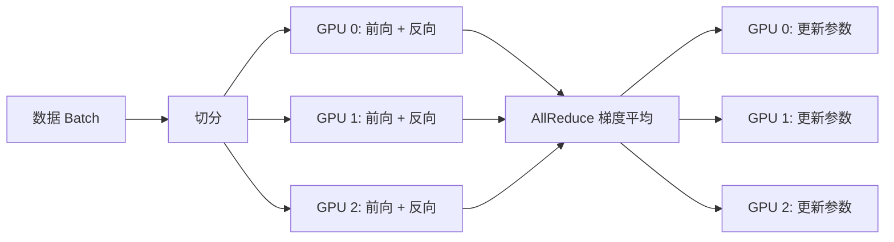

当模型参数从百万级增长到千亿级，单块 GPU 的显存和算力就像一个杯子——装不下整条河的水。分布式训练的核心任务就是把这条河分成若干支流，让多块 GPU 各自处理一部分，最后汇聚成一个统一的训练结果。

PyTorch 是目前大模型训练最主流的框架，它提供了从底层通信原语到上层并行策略的完整工具链。本文将从"为什么需要分布式训练"出发，逐步讲解通信基础、DDP、FSDP 和多机训练实战，帮你建立完整的分布式训练认知体系。

## 📑 目录

- [1. 为什么需要分布式训练](#1-为什么需要分布式训练)
- [2. 并行策略全景图](#2-并行策略全景图)
- [3. PyTorch 分布式通信基础](#3-pytorch-分布式通信基础)
- [4. DDP：数据并行的标准方案](#4-ddp数据并行的标准方案)
- [5. FSDP：参数分片的显存优化方案](#5-fsdp参数分片的显存优化方案)
- [6. DDP vs FSDP：如何选择](#6-ddp-vs-fsdp如何选择)
- [7. torchrun 与多机训练实战](#7-torchrun-与多机训练实战)
- [8. 分布式训练常见踩坑指南](#8-分布式训练常见踩坑指南)
- [总结](#-总结)
- [自我检验清单](#-自我检验清单)
- [参考资料](#-参考资料)

---

## 1. 为什么需要分布式训练

### 1.1 模型越来越大，单卡装不下

以 LLaMA 系列为例，看看模型规模和显存需求的增长趋势：

| 📊 模型 | 参数量 | FP16 参数显存 | Adam 训练显存（估算） |
|---|---|---|---|
| LLaMA-7B | 7B | 14 GB | ~126 GB |
| LLaMA-13B | 13B | 26 GB | ~234 GB |
| LLaMA-70B | 70B | 140 GB | ~1,260 GB |
| LLaMA-405B | 405B | 810 GB | ~7,290 GB |

Adam 训练显存按每参数 18 Bytes 估算（FP16 参数 2B + FP32 master weight 4B + FP32 梯度 4B + Adam 一阶动量 4B + 二阶动量 4B）。这还不包括激活值占用。

即使是最新的 H100（80 GB 显存），训练 7B 模型也至少需要 2 块卡，70B 则需要至少 16 块。分布式训练不是"锦上添花"，而是训练大模型的**必要条件**。

### 1.2 训练速度的瓶颈

除了显存，训练时间同样是关键。一个 70B 模型在 1T token 上训练，单卡可能需要数年。通过多卡并行可以近线性地缩短训练时间——理论上 $N$ 张卡可以加速 $N$ 倍（实际因通信开销会打些折扣）。

💡 **提示**：分布式训练解决的两个核心问题是 **"装不下"**（显存不足）和 **"跑不完"**（时间太长）。不同的并行策略侧重解决不同的问题。

---

## 2. 并行策略全景图

分布式训练有多种并行方式，每种解决不同维度的问题。先建立全局认知，再逐个深入。

### 2.1 四种核心并行策略

| 📊 策略 | 拆分维度 | 解决的问题 | 代表方案 |
|---|---|---|---|
| **数据并行（DP）** | 数据 | 加速训练 | PyTorch DDP |
| **参数分片（ZeRO/FSDP）** | 优化器状态 / 梯度 / 参数 | 显存不足 | PyTorch FSDP、DeepSpeed ZeRO |
| **张量并行（TP）** | 单层内的矩阵 | 单层参数太大 | Megatron-LM TP |
| **流水线并行（PP）** | 层间 | 模型层数太多 | Megatron-LM PP、GPipe |

实际训练大模型时，通常组合使用多种策略（即 **3D 并行**：DP + TP + PP），本文聚焦 PyTorch 原生提供的 **数据并行（DDP）** 和 **参数分片（FSDP）**。

### 2.2 数据并行的基本思路

数据并行的想法非常直观——就像考试时把试卷分成多份，让多位老师同时批改，最后汇总分数。

具体来说：

1. 每块 GPU 持有一份**完整的模型副本**
2. 每个 mini-batch 的数据被**均匀切分**到各 GPU
3. 各 GPU 独立前向传播、反向传播，计算出各自的梯度
4. 所有 GPU 的梯度通过 **AllReduce** 通信取平均
5. 每块 GPU 用相同的平均梯度更新参数，保持模型一致



---

## 3. PyTorch 分布式通信基础

在理解 DDP 和 FSDP 之前，需要先了解它们底层依赖的通信机制。

### 3.1 核心概念

| 📊 概念 | 含义 | 示例 |
|---|---|---|
| **World Size** | 参与训练的总进程数 | 2 台机器各 4 卡 → world_size = 8 |
| **Rank** | 每个进程的全局唯一编号 | 0, 1, 2, ..., 7 |
| **Local Rank** | 进程在本机内的编号 | 每台机器上 0, 1, 2, 3 |
| **Backend** | 底层通信库 | NCCL（GPU）、Gloo（CPU） |
| **Process Group** | 一组参与通信的进程 | 默认所有进程属于同一组 |

### 3.2 通信后端选择

PyTorch 支持三种通信后端：

| 📊 后端 | 适用硬件 | 支持操作 | 说明 |
|---|---|---|---|
| **NCCL** | NVIDIA GPU | 几乎所有集合通信 | GPU 训练的首选，性能最优 |
| **Gloo** | CPU / GPU | 大部分集合通信 | 跨平台，CPU 训练首选 |
| **MPI** | CPU / GPU | 取决于 MPI 实现 | 需要单独安装 MPI 库 |

📌 **关键点**：GPU 分布式训练几乎都用 NCCL 后端。NCCL（NVIDIA Collective Communications Library）针对 NVLink、NVSwitch、InfiniBand 等 NVIDIA 互联做了深度优化。

### 3.3 集合通信原语

分布式训练中的数据同步依赖**集合通信**（Collective Communication）操作。以下是最常用的几种：

| 📊 原语 | 作用 | DDP/FSDP 中的用途 |
|---|---|---|
| **Broadcast** | 一个进程的数据发送给所有进程 | 初始化时同步模型参数 |
| **AllReduce** | 所有进程的数据聚合（如求和），结果发给所有进程 | DDP 梯度同步 |
| **ReduceScatter** | 先 Reduce 再 Scatter——聚合后分片给各进程 | FSDP 梯度同步 |
| **AllGather** | 每个进程的分片收集到所有进程，得到完整数据 | FSDP 前向时重组参数 |
| **Barrier** | 等待所有进程到达同一点再继续 | 同步控制 |

💡 **提示**：理解 AllReduce = ReduceScatter + AllGather 这个等价关系，是理解 DDP 和 FSDP 通信模式差异的关键。

### 3.4 初始化通信

所有分布式训练的第一步都是初始化进程组：

```python
import torch.distributed as dist

# 方式一：通过环境变量初始化（最常用，配合 torchrun）
dist.init_process_group(backend="nccl")

# 方式二：显式指定参数
dist.init_process_group(
    backend="nccl",
    init_method="tcp://192.168.1.1:29500",
    world_size=8,
    rank=0,
)
```

使用 `torchrun` 启动时，`MASTER_ADDR`、`MASTER_PORT`、`RANK`、`WORLD_SIZE`、`LOCAL_RANK` 等环境变量会被自动设置，因此代码中只需调用 `dist.init_process_group(backend="nccl")` 即可。

---

## 4. DDP：数据并行的标准方案

DDP（DistributedDataParallel）是 PyTorch 中最成熟、使用最广的数据并行方案。

### 4.1 DDP 的工作原理

DDP 的核心机制可以用三句话概括：

1. **初始化**：将 rank 0 的模型参数 Broadcast 到所有进程，确保起点一致
2. **前向 + 反向**：每个进程在自己的数据分片上独立计算梯度
3. **梯度同步**：反向传播过程中，DDP 通过 **AllReduce** 将所有进程的梯度取平均

⚠️ **注意**：DDP 的梯度同步不是等反向传播完全结束后才开始的。它使用 **Bucket 机制**：将参数梯度按照反向计算顺序分成若干 Bucket，每个 Bucket 的梯度就绪后立即发起 AllReduce，实现**计算与通信重叠**。这是 DDP 性能的关键优化。

### 4.2 完整的 DDP 训练代码

下面是一个可直接运行的 DDP 训练示例：

```python
import os
import torch
import torch.nn as nn
import torch.distributed as dist
from torch.nn.parallel import DistributedDataParallel as DDP
from torch.utils.data import DataLoader, DistributedSampler
from torchvision import datasets, transforms


def setup():
    """初始化分布式环境"""
    dist.init_process_group(backend="nccl")
    local_rank = int(os.environ["LOCAL_RANK"])
    torch.cuda.set_device(local_rank)
    return local_rank


def cleanup():
    """清理分布式环境"""
    dist.destroy_process_group()


def main():
    local_rank = setup()
    rank = dist.get_rank()
    world_size = dist.get_world_size()

    # 1. 构建模型并包装为 DDP
    model = nn.Sequential(
        nn.Linear(784, 256),
        nn.ReLU(),
        nn.Linear(256, 10),
    ).to(local_rank)
    model = DDP(model, device_ids=[local_rank])

    # 2. 构建数据加载器（必须使用 DistributedSampler）
    transform = transforms.Compose([
        transforms.ToTensor(),
        transforms.Lambda(lambda x: x.view(-1)),
    ])
    dataset = datasets.MNIST("./data", train=True, download=True, transform=transform)
    sampler = DistributedSampler(dataset, num_replicas=world_size, rank=rank, shuffle=True)
    dataloader = DataLoader(dataset, batch_size=64, sampler=sampler, num_workers=2)

    # 3. 优化器和损失函数
    optimizer = torch.optim.Adam(model.parameters(), lr=1e-3)
    criterion = nn.CrossEntropyLoss()

    # 4. 训练循环
    model.train()
    for epoch in range(5):
        sampler.set_epoch(epoch)  # 关键：每个 epoch 设置不同随机种子
        total_loss = 0.0
        for batch_idx, (data, target) in enumerate(dataloader):
            data, target = data.to(local_rank), target.to(local_rank)

            optimizer.zero_grad()
            output = model(data)
            loss = criterion(output, target)
            loss.backward()  # DDP 在这里自动进行 AllReduce
            optimizer.step()

            total_loss += loss.item()

        if rank == 0:
            avg_loss = total_loss / len(dataloader)
            print(f"Epoch {epoch}: avg_loss = {avg_loss:.4f}")

    cleanup()


if __name__ == "__main__":
    main()
```

启动命令：

```bash
# 单机 4 卡
torchrun --nproc_per_node=4 train_ddp.py
```

### 4.3 DDP 使用要点

使用 DDP 时有几个容易忽视但非常重要的细节：

**1. 必须使用 DistributedSampler**

```python
sampler = DistributedSampler(dataset, num_replicas=world_size, rank=rank, shuffle=True)
dataloader = DataLoader(dataset, batch_size=64, sampler=sampler)
```

如果不使用 `DistributedSampler`，每个进程会读到相同的数据，数据并行就失去了意义。

**2. 每个 epoch 必须调用 `sampler.set_epoch(epoch)`**

```python
for epoch in range(num_epochs):
    sampler.set_epoch(epoch)  # 打乱不同 epoch 的数据分配
    for batch in dataloader:
        ...
```

不调用 `set_epoch` 会导致每个 epoch 各进程的数据分配完全相同。

**3. 只在 rank 0 上做日志和保存**

```python
if dist.get_rank() == 0:
    print(f"Loss: {loss.item()}")
    torch.save(model.module.state_dict(), "checkpoint.pt")  # 注意是 model.module
```

⚠️ **注意**：保存模型时要用 `model.module.state_dict()` 而不是 `model.state_dict()`。DDP 会给参数名加上 `module.` 前缀，直接保存会导致加载时 key 不匹配。

### 4.4 DDP 的局限

DDP 简单高效，但有一个根本性限制：**每块 GPU 都持有完整的模型副本**。这意味着：

- 模型参数 + 梯度 + 优化器状态必须能装进单卡显存
- 对于 7B 以上的模型，单卡 80 GB 显存往往不够

这就是 FSDP 要解决的问题。

---

## 5. FSDP：参数分片的显存优化方案

FSDP（FullyShardedDataParallel）是 PyTorch 对 DeepSpeed ZeRO 思想的原生实现——核心理念是**不让每块卡都存一份完整的模型，而是把参数、梯度、优化器状态分片存储**。

### 5.1 从 ZeRO 理解 FSDP

ZeRO（Zero Redundancy Optimizer）的核心洞察是：DDP 中每块 GPU 都冗余存储了完整的优化器状态、梯度和参数，这是巨大的浪费。

ZeRO 分三个阶段逐步消除冗余：

| 📊 阶段 | 分片内容 | 每卡显存（$N$ 卡，$\Psi$ 参数量） | 对应 FSDP |
|---|---|---|---|
| **Stage 1** | 优化器状态 | $4\Psi + \frac{12\Psi}{N}$ | `SHARD_GRAD_OP` 的一部分 |
| **Stage 2** | + 梯度 | $2\Psi + \frac{14\Psi}{N}$ | `SHARD_GRAD_OP` |
| **Stage 3** | + 参数 | $\frac{16\Psi}{N}$ | `FULL_SHARD` |

以 7B 模型、8 卡为例（按 ZeRO 论文的 16 Bytes/参数估算，即 FP16 参数 2B + FP16 梯度 2B + FP32 优化器状态 12B）：
- DDP：每卡 ~112 GB（装不下 80 GB 的 H100）
- FSDP（FULL_SHARD）：每卡 ~$\frac{112}{8}$ = ~14 GB（轻松装下）

### 5.2 FSDP 的工作流程

FSDP 的执行流程比 DDP 复杂，涉及参数的"按需组装"和"用完即弃"：

1. **初始状态**：每块 GPU 只存储自己负责的参数分片
2. **前向传播**：计算某一层时，通过 **AllGather** 收集所有分片，重组完整参数 → 计算 → 释放非本地分片
3. **反向传播**：同样先 AllGather 重组参数 → 计算梯度 → 通过 **ReduceScatter** 将梯度分片回各 GPU → 释放完整参数
4. **参数更新**：每块 GPU 只更新自己分片对应的参数和优化器状态

📌 **关键点**：FSDP 用**通信换显存**。每层的前向和反向都需要一次 AllGather + 一次 ReduceScatter，通信量比 DDP 更大，但显存占用大幅降低。

### 5.3 FSDP 分片策略

PyTorch FSDP 提供四种分片策略，灵活度很高：

| 📊 策略 | 行为 | 显存节省 | 通信开销 | 适用场景 |
|---|---|---|---|---|
| `FULL_SHARD` | 参数 + 梯度 + 优化器全部分片 | 最高 | 最高 | 大模型，显存紧张 |
| `SHARD_GRAD_OP` | 梯度 + 优化器分片，参数不分片 | 中等 | 中等 | 中等模型 |
| `HYBRID_SHARD` | 机内全分片，机间数据并行 | 高 | 机间较低 | 多机训练 |
| `NO_SHARD` | 不分片（等价于 DDP） | 无 | 最低 | 调试或小模型 |

💡 **提示**：`HYBRID_SHARD` 是多机训练的推荐策略。它在机内走 FSDP（利用高带宽 NVLink），机间走数据并行（适应较低的 InfiniBand 带宽），是通信效率和显存节省的最佳平衡。

### 5.4 FSDP 完整训练代码

```python
import os
import functools
import torch
import torch.nn as nn
import torch.distributed as dist
from torch.distributed.fsdp import (
    FullyShardedDataParallel as FSDP,
    MixedPrecision,
    ShardingStrategy,
)
from torch.distributed.fsdp.wrap import size_based_auto_wrap_policy
from torch.utils.data import DataLoader, DistributedSampler
from torchvision import datasets, transforms


def setup():
    dist.init_process_group(backend="nccl")
    local_rank = int(os.environ["LOCAL_RANK"])
    torch.cuda.set_device(local_rank)
    return local_rank


def cleanup():
    dist.destroy_process_group()


class SimpleMLP(nn.Module):
    def __init__(self, input_dim=784, hidden_dim=2048, num_layers=8, output_dim=10):
        super().__init__()
        layers = []
        for i in range(num_layers):
            in_d = input_dim if i == 0 else hidden_dim
            out_d = output_dim if i == num_layers - 1 else hidden_dim
            layers.append(nn.Linear(in_d, out_d))
            if i < num_layers - 1:
                layers.append(nn.ReLU())
        self.net = nn.Sequential(*layers)

    def forward(self, x):
        return self.net(x)


def main():
    local_rank = setup()
    rank = dist.get_rank()
    world_size = dist.get_world_size()

    # 1. 创建模型
    model = SimpleMLP().to(local_rank)

    # 2. 配置混合精度
    bf16_policy = MixedPrecision(
        param_dtype=torch.bfloat16,
        reduce_dtype=torch.bfloat16,
        buffer_dtype=torch.bfloat16,
    )

    # 3. 配置自动包装策略（参数量超过阈值的子模块单独分片）
    wrap_policy = functools.partial(
        size_based_auto_wrap_policy,
        min_num_params=1_000_000,
    )

    # 4. 用 FSDP 包装模型
    model = FSDP(
        model,
        sharding_strategy=ShardingStrategy.FULL_SHARD,
        mixed_precision=bf16_policy,
        auto_wrap_policy=wrap_policy,
        device_id=local_rank,
    )

    # 5. 数据加载
    transform = transforms.Compose([
        transforms.ToTensor(),
        transforms.Lambda(lambda x: x.view(-1)),
    ])
    dataset = datasets.MNIST("./data", train=True, download=(rank == 0), transform=transform)
    dist.barrier()  # 等 rank 0 下载完成
    sampler = DistributedSampler(dataset, num_replicas=world_size, rank=rank, shuffle=True)
    dataloader = DataLoader(dataset, batch_size=64, sampler=sampler, num_workers=2)

    # 6. 优化器
    optimizer = torch.optim.AdamW(model.parameters(), lr=1e-3)
    criterion = nn.CrossEntropyLoss()

    # 7. 训练循环
    model.train()
    for epoch in range(5):
        sampler.set_epoch(epoch)
        total_loss = 0.0
        for data, target in dataloader:
            data, target = data.to(local_rank), target.to(local_rank)

            optimizer.zero_grad()
            output = model(data)
            loss = criterion(output, target)
            loss.backward()
            optimizer.step()

            total_loss += loss.item()

        if rank == 0:
            print(f"Epoch {epoch}: avg_loss = {total_loss / len(dataloader):.4f}")

    cleanup()


if __name__ == "__main__":
    main()
```

### 5.5 FSDP 模型保存与加载

FSDP 的模型保存比 DDP 复杂，因为参数是分片存储的。推荐使用 PyTorch 的 **Distributed Checkpoint**（DCP）：

```python
import torch.distributed.checkpoint as dcp

# 保存（所有 rank 参与）
dcp.save(model.state_dict(), checkpoint_id="./checkpoints/epoch_5")

# 加载（所有 rank 参与）
state_dict = model.state_dict()
dcp.load(state_dict, checkpoint_id="./checkpoints/epoch_5")
model.load_state_dict(state_dict)
```

⚠️ **注意**：不要用 `torch.save()` 保存 FSDP 模型。FSDP 的 state_dict 行为取决于 `state_dict_type` 配置，直接 `torch.save` 可能只保存了本地分片。使用 DCP 可以正确处理分片的保存和恢复。

### 5.6 FSDP2：下一代 API

PyTorch 正在推进新一代的 FSDP API——`torch.distributed.fsdp.fully_shard`（通常称为 FSDP2）。与 FSDP1 的 module-wrapper 方式不同，FSDP2 采用**可组合的 per-parameter 分片**方式：

```python
from torch.distributed.fsdp import fully_shard

# FSDP2 风格：直接对模块调用 fully_shard
for layer in model.layers:
    fully_shard(layer)
fully_shard(model)
```

FSDP2 的优势：
- 更好地与张量并行（TP）等其他并行策略组合
- 基于 DTensor（Distributed Tensor）抽象，API 更统一
- 更灵活的分片粒度控制

💡 **提示**：截至 PyTorch 2.x，FSDP2 已可用但仍在快速迭代中。新项目可以尝试 FSDP2，但生产环境中 FSDP1 仍然是更稳定的选择。

---

## 6. DDP vs FSDP：如何选择

| 📊 对比维度 | DDP | FSDP |
|---|---|---|
| 核心思路 | 每卡完整模型，梯度 AllReduce | 参数分片，按需 AllGather |
| 每卡显存 | 完整参数 + 梯度 + 优化器 | $\frac{1}{N}$ 参数 + 梯度 + 优化器 |
| 通信量（每步） | AllReduce 梯度（$2\Psi$） | AllGather + ReduceScatter（$3\Psi$） |
| 通信模式 | 一次 AllReduce | 每层：AllGather（前向）+ AllGather + ReduceScatter（反向） |
| 适用模型规模 | 单卡能装下的模型 | 单卡装不下的大模型 |
| 代码复杂度 | 低（改动极小） | 中（需要配置分片策略、包装策略） |
| 吞吐量 | 通信少，吞吐高 | 通信多，吞吐略低 |
| 模型保存 | `model.module.state_dict()` | 推荐 DCP |

**选择建议**：

- ✅ 模型参数 + 优化器状态能装进单卡显存 → 用 **DDP**
- ✅ 单卡装不下完整模型 → 用 **FSDP**
- ✅ 多机训练 + 大模型 → 用 **FSDP + HYBRID_SHARD**
- ✅ 超大模型（百亿级以上）→ 考虑 FSDP + TP + PP（需引入 Megatron-LM 或 DeepSpeed）

---

## 7. torchrun 与多机训练实战

### 7.1 torchrun 简介

`torchrun` 是 PyTorch 推荐的分布式训练启动工具（替代已废弃的 `torch.distributed.launch`）。它的核心能力是：

- **自动设置环境变量**：`RANK`、`WORLD_SIZE`、`LOCAL_RANK`、`MASTER_ADDR`、`MASTER_PORT` 等
- **弹性训练支持**：支持节点动态加入/退出
- **容错机制**：Worker 进程失败时可自动重启

### 7.2 单机多卡启动

```bash
# 单机 4 卡
torchrun --nproc_per_node=4 train.py --batch_size 64

# 指定 master 端口（避免端口冲突）
torchrun --nproc_per_node=4 --master_port=29501 train.py
```

### 7.3 多机多卡启动

多机训练需要在每台机器上分别启动 `torchrun`，指定相同的 rendezvous（会合）信息：

```bash
# 机器 0（master 节点）
torchrun \
    --nnodes=2 \
    --nproc_per_node=4 \
    --node_rank=0 \
    --rdzv_backend=c10d \
    --rdzv_endpoint=192.168.1.100:29500 \
    train.py

# 机器 1
torchrun \
    --nnodes=2 \
    --nproc_per_node=4 \
    --node_rank=1 \
    --rdzv_backend=c10d \
    --rdzv_endpoint=192.168.1.100:29500 \
    train.py
```

| 📊 参数 | 含义 |
|---|---|
| `--nnodes` | 总机器数 |
| `--nproc_per_node` | 每台机器的进程数（通常等于 GPU 数） |
| `--node_rank` | 当前机器的编号（从 0 开始） |
| `--rdzv_backend` | 会合后端（`c10d` 无需外部依赖，推荐） |
| `--rdzv_endpoint` | 会合地址（master 节点的 IP:端口） |

### 7.4 弹性训练

torchrun 支持弹性训练——允许节点数量在指定范围内动态变化：

```bash
# 最少 1 台、最多 4 台机器
torchrun \
    --nnodes=1:4 \
    --nproc_per_node=4 \
    --rdzv_id=my_training_job \
    --rdzv_backend=c10d \
    --rdzv_endpoint=192.168.1.100:29500 \
    train.py
```

⚠️ **注意**：弹性训练要求训练代码能正确处理 checkpoint 的保存和恢复。当节点加入或退出时，torchrun 会重启所有 Worker，训练脚本需要从最近的 checkpoint 恢复状态。

### 7.5 训练代码中获取分布式信息

使用 torchrun 启动时，训练代码中通过环境变量获取分布式信息：

```python
import os

local_rank = int(os.environ["LOCAL_RANK"])     # 本机内的 GPU 编号
rank = int(os.environ["RANK"])                  # 全局进程编号
world_size = int(os.environ["WORLD_SIZE"])      # 总进程数
local_world_size = int(os.environ["LOCAL_WORLD_SIZE"])  # 本机进程数
```

---

## 8. 分布式训练常见踩坑指南

### 8.1 死锁（Hang）

分布式训练最常见的问题就是"卡住不动"。常见原因：

| ❌ 问题 | 📝 原因 | ✅ 解决 |
|---|---|---|
| 不同 rank 走了不同的代码分支 | 某个 rank 跳过了 forward/backward | 确保所有 rank 执行相同的计算路径 |
| 只有部分 rank 调用了集合通信 | 比如 `if rank == 0: dist.barrier()` | 集合通信必须所有 rank 共同调用 |
| 数据集大小不一致 | 不同 rank 的数据条数不同，导致有的 rank 先结束 | 使用 `DistributedSampler(drop_last=True)` |
| NCCL 超时 | 网络问题或某个 rank 计算太慢 | 设置 `NCCL_DEBUG=INFO` 排查 |

### 8.2 常用调试环境变量

```bash
# 开启 NCCL 调试日志
export NCCL_DEBUG=INFO
export NCCL_DEBUG_SUBSYS=ALL

# 增加 NCCL 超时时间（默认 1800 秒），在代码中设置：
# dist.init_process_group(..., timeout=datetime.timedelta(seconds=3600))
# 或使用 PyTorch 环境变量（PyTorch 2.4+）
export TORCH_NCCL_HEARTBEAT_TIMEOUT_SEC=3600

# PyTorch 分布式日志
export TORCH_DISTRIBUTED_DEBUG=DETAIL

# 指定可见 GPU（避免 GPU 编号错位）
export CUDA_VISIBLE_DEVICES=0,1,2,3
```

### 8.3 随机种子一致性

分布式训练中的随机性管理需要特别注意：

```python
import torch
import random
import numpy as np

def set_seed(seed, rank):
    # 模型初始化需要一致的种子（保证 DDP 各 rank 参数一致）
    torch.manual_seed(seed)
    np.random.seed(seed)
    random.seed(seed)

    # 数据增强等需要不同的种子（避免各 rank 数据完全相同）
    torch.manual_seed(seed + rank)
```

📌 **关键点**：DDP 要求所有 rank 的初始参数一致（DDP 构造时会从 rank 0 Broadcast），但数据增强、Dropout 等应该在不同 rank 上有不同的随机行为——否则各 rank 的"数据并行"就失去了多样性。

### 8.4 学习率缩放

数据并行的有效 batch size = 单卡 batch size × world_size。当 world_size 增大时，通常需要同比放大学习率：

$$
lr_{\text{effective}} = lr_{\text{base}} \times \text{world\_size}
$$

但这个线性缩放在 world_size 很大时可能导致训练不稳定。实践中常配合 **学习率预热**（Warmup）使用：

```python
# 线性预热 + 线性缩放
base_lr = 1e-4
effective_lr = base_lr * world_size
warmup_steps = 1000

for step in range(total_steps):
    if step < warmup_steps:
        lr = effective_lr * (step / warmup_steps)
    else:
        lr = effective_lr  # 或后续加 cosine decay
    for param_group in optimizer.param_groups:
        param_group["lr"] = lr
```

💡 **提示**：线性缩放学习率是经验法则，不是绝对规则。大规模训练中（数百卡以上），可能需要用 $\sqrt{\text{world\_size}}$ 缩放（即 LAMB/LARS 优化器的思路）来保持稳定性。

---

## 📝 总结

本文系统地介绍了 PyTorch 分布式训练的核心知识：

- **分布式训练的必要性**：大模型时代，单卡显存和算力都是瓶颈
- **并行策略全景**：数据并行、参数分片、张量并行、流水线并行各有侧重
- **通信基础**：NCCL 后端、AllReduce / AllGather / ReduceScatter 等集合通信原语
- **DDP**：最成熟的数据并行方案，适合单卡能装下的模型。核心是 Bucket 化的 AllReduce 梯度同步
- **FSDP**：参数分片的显存优化方案，适合单卡装不下的大模型。核心是 AllGather + ReduceScatter 的按需组装
- **torchrun**：推荐的启动工具，支持单机、多机、弹性训练
- **常见问题**：死锁排查、随机种子管理、学习率缩放

掌握这些基础后，下一步可以深入学习 3D 并行（TP + PP + DP）、DeepSpeed ZeRO、Megatron-LM 等更高级的分布式训练技术。

---

## 🎯 自我检验清单

- 能解释 DDP 和 FSDP 的核心区别（完整副本 vs 参数分片）
- 能画出 DDP 中 AllReduce 梯度同步的数据流
- 能说出 ZeRO 三个阶段分别分片了什么，对应 FSDP 的哪种策略
- 能用 PyTorch DDP 将一个单卡训练脚本改为多卡训练
- 能正确配置 FSDP 的分片策略、混合精度和自动包装策略
- 能用 torchrun 启动单机多卡和多机多卡训练
- 能解释 DistributedSampler 的作用和 `set_epoch` 的必要性
- 能列举 3 种常见的分布式训练死锁原因和排查方法
- 能计算数据并行下有效 batch size 并正确缩放学习率
- 能用 Distributed Checkpoint（DCP）保存和恢复 FSDP 模型

---

## 📚 参考资料

- [PyTorch Distributed Communication Package — torch.distributed](https://docs.pytorch.org/docs/stable/distributed.html)
- [PyTorch DistributedDataParallel — Getting Started](https://docs.pytorch.org/tutorials/intermediate/ddp_tutorial.html)
- [PyTorch FSDP — FullyShardedDataParallel](https://docs.pytorch.org/docs/stable/fsdp.html)
- [PyTorch torchrun (Elastic Launch)](https://docs.pytorch.org/docs/stable/elastic/run.html)
- [PyTorch Distributed Checkpoint](https://docs.pytorch.org/docs/stable/distributed.checkpoint.html)
- [ZeRO: Memory Optimizations Toward Training Trillion Parameter Models](https://arxiv.org/abs/1910.02054)
- [PyTorch FSDP: Experiences on Scaling Fully Sharded Data Parallel](https://arxiv.org/abs/2304.11277)
- [NCCL Documentation](https://docs.nvidia.com/deeplearning/nccl/user-guide/docs/)
