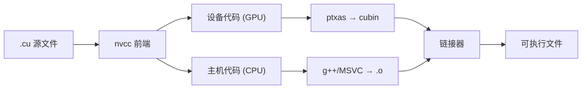

从零搭建一套完整的 CUDA 开发环境，包括驱动安装、Toolkit 配置、编译工具链和 IDE 集成，让你在 10 分钟内写出并运行第一个 GPU 程序。

<!-- more -->

## 📑 目录

- [1. GPU 驱动与 CUDA Toolkit 的关系](#1-gpu-驱动与-cuda-toolkit-的关系)
- [2. 安装 NVIDIA 驱动](#2-安装-nvidia-驱动)
- [3. 安装 CUDA Toolkit](#3-安装-cuda-toolkit)
- [4. 环境变量配置](#4-环境变量配置)
- [5. nvcc 编译工具链](#5-nvcc-编译工具链)
- [6. CMake 集成 CUDA](#6-cmake-集成-cuda)
- [7. Hello World：第一个 CUDA 程序](#7-hello-world第一个-cuda-程序)
- [8. 多版本 CUDA 管理](#8-多版本-cuda-管理)
- [9. IDE 配置建议](#9-ide-配置建议)
- [10. 常见安装问题排查](#10-常见安装问题排查)
- [总结](#-总结)

---

## 1. GPU 驱动与 CUDA Toolkit 的关系

很多初学者搞不清"驱动"和"CUDA Toolkit"到底是什么关系。打个比方：驱动就像是你手机的操作系统固件——它让硬件能正常工作；而 CUDA Toolkit 则是你在这个操作系统上安装的开发工具包——它提供编译器、库和调试器，让你能写出在 GPU 上跑的程序。

### 1.1 版本兼容性规则

NVIDIA 采用**前向兼容**的设计：新版驱动可以运行旧版 CUDA Toolkit 编译的程序，但反过来不行。核心规则：

- 每个 CUDA Toolkit 版本都有**最低驱动版本要求**
- 驱动版本 ≥ Toolkit 要求即可，不必精确匹配
- `nvidia-smi` 显示的 "CUDA Version" 是驱动**最高支持**的 Toolkit 版本，不是当前安装的 Toolkit 版本

| CUDA Toolkit 版本 | 最低 Linux 驱动版本 | 最低 Windows 驱动版本 |
|-------------------|--------------------|--------------------|
| CUDA 12.6 | ≥ 560.28 | ≥ 560.70 |
| CUDA 12.4 | ≥ 550.54 | ≥ 551.61 |
| CUDA 12.2 | ≥ 535.54 | ≥ 536.25 |
| CUDA 11.8 | ≥ 520.61 | ≥ 520.06 |

💡 **提示**：始终优先升级驱动到最新稳定版，它既能向后兼容旧 Toolkit，也为后续升级 Toolkit 留出空间。

### 1.2 CUDA Toolkit 包含的组件

| 📦 组件 | 📝 作用 |
|---------|---------|
| nvcc | CUDA C/C++ 编译器 |
| cuBLAS | 线性代数运算库 |
| cuDNN | 深度学习原语库（需单独下载） |
| cuFFT | 快速傅里叶变换库 |
| cuRAND | 随机数生成库 |
| Nsight Systems | 系统级性能分析工具 |
| Nsight Compute | Kernel 级性能分析工具 |
| CUDA Runtime (libcudart) | 运行时 API 库 |
| cuda-gdb | GPU 调试器 |

---

## 2. 安装 NVIDIA 驱动

### 2.1 Linux（Ubuntu）

```bash
# 方法 1：使用 apt 包管理器（推荐）
sudo apt update
sudo apt install nvidia-driver-560

# 安装完成后重启
sudo reboot

# 验证安装
nvidia-smi
```

```bash
# 方法 2：使用官方 .run 安装包
# 先禁用 nouveau 开源驱动
sudo bash -c "echo 'blacklist nouveau' >> /etc/modprobe.d/blacklist.conf"
sudo update-initramfs -u
sudo reboot

# 下载并执行安装脚本
chmod +x NVIDIA-Linux-x86_64-560.35.03.run
sudo ./NVIDIA-Linux-x86_64-560.35.03.run
```

⚠️ **注意**：使用 `.run` 安装包前必须禁用 `nouveau` 驱动并切换到文本模式（tty），否则安装会失败。对于生产服务器，建议使用包管理器安装以便后续自动更新。

### 2.2 Windows

Windows 用户直接从 [NVIDIA 驱动下载页面](https://www.nvidia.com/Download/index.aspx) 选择对应 GPU 型号下载安装即可。安装后在命令行运行 `nvidia-smi` 验证。

### 2.3 验证驱动安装

```bash
$ nvidia-smi
+-----------------------------------------------------------------------------------------+
| NVIDIA-SMI 560.35.03              Driver Version: 560.35.03      CUDA Version: 12.6     |
|-----------------------------------------+------------------------+----------------------+
| GPU  Name                 Persistence-M | Bus-Id          Disp.A | Volatile Uncorr. ECC |
| Fan  Temp   Perf          Pwr:Usage/Cap |           Memory-Usage | GPU-Util  Compute M. |
|=========================================+========================+======================|
|   0  NVIDIA GeForce RTX 4090       Off | 00000000:01:00.0  Off |                  Off |
|  0%   35C    P8              12W / 450W |       1MiB / 24564MiB |      0%      Default |
+-----------------------------------------+------------------------+----------------------+
```

关注三个信息：
- **Driver Version**：当前驱动版本
- **CUDA Version**：驱动支持的最高 CUDA 版本
- **Memory-Usage**：显存使用情况

---

## 3. 安装 CUDA Toolkit

### 3.1 Linux 安装（推荐 runfile 方式）

```bash
# 下载 CUDA 12.6 runfile
wget https://developer.download.nvidia.com/compute/cuda/12.6.0/local_installers/cuda_12.6.0_560.28.03_linux.run

# 执行安装（注意：取消勾选 Driver，避免覆盖已有驱动）
sudo sh cuda_12.6.0_560.28.03_linux.run
```

安装时选择界面中：
- ❌ 取消 Driver（已经单独安装过）
- ✅ 勾选 CUDA Toolkit
- ✅ 勾选 CUDA Samples（学习用，可选）

💡 **提示**：如果你用 `apt` 安装，可以用 `sudo apt install cuda-toolkit-12-6`，这样不会捆绑驱动安装。

### 3.2 Windows 安装

从 [CUDA Toolkit Archive](https://developer.nvidia.com/cuda-toolkit-archive) 下载对应版本的 `.exe` 安装包，选择"Custom"安装模式，按需勾选组件。

### 3.3 conda 安装（适用于 Python 开发者）

```bash
# 仅安装 CUDA 运行时和编译器（不含驱动）
conda install -c nvidia cuda-toolkit=12.6
```

这种方式适合在已有系统驱动的前提下，为特定 conda 环境配置独立的 CUDA 版本。

---

## 4. 环境变量配置

安装完成后，需要将 CUDA 的路径加入系统环境变量。

### 4.1 Linux

在 `~/.bashrc` 或 `~/.zshrc` 中添加：

```bash
# CUDA 路径配置
export CUDA_HOME=/usr/local/cuda-12.6
export PATH=$CUDA_HOME/bin:$PATH
export LD_LIBRARY_PATH=$CUDA_HOME/lib64:$LD_LIBRARY_PATH
```

```bash
# 使配置生效
source ~/.bashrc

# 验证
nvcc --version
which nvcc
```

### 4.2 Windows

系统环境变量中添加：
- `CUDA_PATH` = `C:\Program Files\NVIDIA GPU Computing Toolkit\CUDA\v12.6`
- `PATH` 中添加 `%CUDA_PATH%\bin`

### 4.3 验证安装

```bash
$ nvcc --version
nvcc: NVIDIA (R) Cuda compiler driver
Copyright (c) 2005-2024 NVIDIA Corporation
Built on ...
Cuda compilation tools, release 12.6, V12.6.20
Build cuda_12.6.r12.6/compiler.34431801_0
```

```bash
# 编译并运行官方 CUDA Samples（需从 GitHub 单独下载）
git clone https://github.com/NVIDIA/cuda-samples.git
cd cuda-samples/Samples/1_Utilities/deviceQuery
make
./deviceQuery
```

如果 `deviceQuery` 输出 `Result = PASS`，说明整个环境（驱动 + Toolkit + GPU）工作正常。

⚠️ **注意**：从 CUDA 11.6 起，Samples 不再随 Toolkit 安装包附带，需要从 [GitHub](https://github.com/NVIDIA/cuda-samples) 单独下载。

---

## 5. nvcc 编译工具链

nvcc 是 CUDA 程序的编译器驱动程序。它不是一个独立的编译器，而是一个**编译协调器**：将 `.cu` 文件中的设备代码和主机代码分离，分别用 NVIDIA PTX 编译器和系统 C++ 编译器处理，最终链接成可执行文件。

### 5.1 编译流程



### 5.2 常用编译选项

```bash
# 基本编译
nvcc hello.cu -o hello

# 指定 GPU 架构（为 RTX 4090 的 sm_89 编译）
nvcc -arch=sm_89 hello.cu -o hello

# 生成多架构兼容的 fatbinary
nvcc -gencode arch=compute_80,code=sm_80 \
     -gencode arch=compute_89,code=sm_89 \
     hello.cu -o hello

# 开启调试信息（用于 cuda-gdb）
nvcc -g -G hello.cu -o hello_debug

# 开启优化
nvcc -O3 hello.cu -o hello_opt

# 显示编译过程的详细信息
nvcc --verbose hello.cu -o hello
```

### 5.3 关键编译选项说明

| 选项 | 作用 |
|------|------|
| `-arch=sm_XX` | 指定目标 GPU 架构的计算能力 |
| `-gencode` | 生成多架构代码，适配不同 GPU |
| `-G` | 生成设备代码调试信息 |
| `-lineinfo` | 在优化代码中保留行号信息（性能分析用） |
| `-Xcompiler` | 将后续选项传递给主机编译器 |
| `-std=c++17` | 指定 C++ 标准版本 |
| `-maxrregcount=N` | 限制每个线程使用的寄存器数量 |
| `--ptxas-options=-v` | 显示每个 kernel 的寄存器和共享内存用量 |

### 5.4 GPU 架构代号速查

| 架构代号 | 代表 GPU | 计算能力 |
|---------|---------|---------|
| sm_70 | V100 | 7.0 |
| sm_75 | T4, RTX 2080 | 7.5 |
| sm_80 | A100 | 8.0 |
| sm_86 | RTX 3090 | 8.6 |
| sm_89 | RTX 4090, L40 | 8.9 |
| sm_90 | H100 | 9.0 |

---

## 6. CMake 集成 CUDA

在实际项目中，很少直接手动调用 `nvcc`，而是使用 CMake 作为构建系统来管理编译过程。CMake 从 3.8 版本开始原生支持 CUDA 作为一等语言。

### 6.1 最小 CMakeLists.txt

```cmake
cmake_minimum_required(VERSION 3.18)
project(MyCUDAProject LANGUAGES CXX CUDA)

# 设置 C++ 和 CUDA 标准
set(CMAKE_CXX_STANDARD 17)
set(CMAKE_CUDA_STANDARD 17)

# 指定目标 GPU 架构
set(CMAKE_CUDA_ARCHITECTURES 80 89 90)

# 添加可执行文件
add_executable(main src/main.cu)

# 链接 CUDA 运行时库
target_link_libraries(main PRIVATE CUDA::cudart)
```

### 6.2 混合 C++ 和 CUDA 源文件

```cmake
cmake_minimum_required(VERSION 3.18)
project(HybridProject LANGUAGES CXX CUDA)

set(CMAKE_CXX_STANDARD 17)
set(CMAKE_CUDA_STANDARD 17)
set(CMAKE_CUDA_ARCHITECTURES 80 89)

# CUDA 源文件
add_library(kernels STATIC
    src/kernels/vector_add.cu
    src/kernels/matrix_mul.cu
)

# C++ 主程序链接 CUDA 库
add_executable(app src/main.cpp)
target_link_libraries(app PRIVATE kernels CUDA::cudart)
```

### 6.3 构建和运行

```bash
mkdir build && cd build
cmake .. -DCMAKE_BUILD_TYPE=Release
make -j$(nproc)
./main
```

💡 **提示**：使用 `CMAKE_CUDA_ARCHITECTURES` 变量代替在代码中硬编码 `-arch`，这样切换目标 GPU 时只需改一处配置。

---

## 7. Hello World：第一个 CUDA 程序

现在万事俱备，让我们写一个完整的 Hello World 来验证整个工具链。

### 7.1 源代码 `hello_cuda.cu`

```cpp
#include <cstdio>

// __global__ 修饰符表明这是一个 GPU 上执行的 kernel 函数
__global__ void helloKernel() {
    // threadIdx.x 是当前线程在 Block 内的编号
    printf("Hello from GPU thread %d in block %d!\n",
           threadIdx.x, blockIdx.x);
}

int main() {
    printf("Launching kernel...\n");

    // <<<2, 4>>> 表示启动 2 个 Block，每个 Block 有 4 个线程
    helloKernel<<<2, 4>>>();

    // 等待 GPU 上所有操作完成
    cudaDeviceSynchronize();

    printf("Done!\n");
    return 0;
}
```

### 7.2 编译并运行

```bash
$ nvcc hello_cuda.cu -o hello_cuda
$ ./hello_cuda
Launching kernel...
Hello from GPU thread 0 in block 0!
Hello from GPU thread 1 in block 0!
Hello from GPU thread 2 in block 0!
Hello from GPU thread 3 in block 0!
Hello from GPU thread 0 in block 1!
Hello from GPU thread 1 in block 1!
Hello from GPU thread 2 in block 1!
Hello from GPU thread 3 in block 1!
Done!
```

📌 **关键点**：线程的实际执行顺序并不确定——两个 Block 的输出可能交替出现。并行程序的执行顺序由 GPU 硬件调度器决定。

### 7.3 代码解析

| 要素 | 含义 |
|------|------|
| `__global__` | 标记函数为 kernel，由 CPU 调用、GPU 执行 |
| `<<<2, 4>>>` | 启动配置：2 个 Block，每 Block 4 个线程 |
| `threadIdx.x` | 线程在所属 Block 内的索引 |
| `blockIdx.x` | Block 在 Grid 内的索引 |
| `cudaDeviceSynchronize()` | CPU 阻塞等待 GPU 完成所有任务 |

---

## 8. 多版本 CUDA 管理

实际开发中，你可能需要同时维护多个 CUDA 版本（比如项目 A 用 CUDA 11.8，项目 B 用 CUDA 12.6）。NVIDIA 的设计允许多版本共存。

### 8.1 多版本安装

每个版本安装到独立目录：
```
/usr/local/cuda-11.8/
/usr/local/cuda-12.4/
/usr/local/cuda-12.6/
```

### 8.2 使用符号链接切换

```bash
# 切换到 CUDA 12.6
sudo rm -f /usr/local/cuda
sudo ln -s /usr/local/cuda-12.6 /usr/local/cuda

# 切换到 CUDA 11.8
sudo rm -f /usr/local/cuda
sudo ln -s /usr/local/cuda-11.8 /usr/local/cuda
```

环境变量统一指向 `/usr/local/cuda`：
```bash
export CUDA_HOME=/usr/local/cuda
export PATH=$CUDA_HOME/bin:$PATH
export LD_LIBRARY_PATH=$CUDA_HOME/lib64:$LD_LIBRARY_PATH
```

### 8.3 使用 module 系统（集群环境）

在 HPC 集群上通常使用 Environment Modules：
```bash
module avail cuda
module load cuda/12.6
module list
```

### 8.4 写一个快速切换脚本

```bash
#!/bin/bash
# 保存为 ~/bin/switch-cuda.sh
# 用法：source switch-cuda.sh 12.6

CUDA_VERSION=$1
if [ -d "/usr/local/cuda-$CUDA_VERSION" ]; then
    export CUDA_HOME=/usr/local/cuda-$CUDA_VERSION
    export PATH=$CUDA_HOME/bin:$PATH
    export LD_LIBRARY_PATH=$CUDA_HOME/lib64:$LD_LIBRARY_PATH
    echo "Switched to CUDA $CUDA_VERSION"
    nvcc --version
else
    echo "CUDA $CUDA_VERSION not found!"
fi
```

---

## 9. IDE 配置建议

### 9.1 VS Code（推荐）

安装以下扩展：
- **NVIDIA Nsight Visual Studio Code Edition**：语法高亮、调试支持
- **C/C++（Microsoft）**：IntelliSense 补全
- **CMake Tools**：CMake 集成

`.vscode/settings.json` 配置示例：
```json
{
    "files.associations": {
        "*.cu": "cuda-cpp",
        "*.cuh": "cuda-cpp"
    },
    "C_Cpp.default.includePath": [
        "/usr/local/cuda/include"
    ]
}
```

### 9.2 CLion

CLion 原生支持 CUDA（通过 CMake）：
- 确保 CMakeLists.txt 正确配置 `LANGUAGES CXX CUDA`
- CLion 会自动识别 `.cu` 文件并提供补全和调试
- 在 Settings → Build → CMake 中配置 `-DCMAKE_CUDA_COMPILER=/usr/local/cuda/bin/nvcc`

### 9.3 Nsight Visual Studio Edition（Windows）

Windows 上 CUDA Toolkit 自带 Nsight 插件可集成到 Visual Studio 中，提供 GPU 调试和性能分析功能。Linux 上建议使用命令行工具 Nsight Systems/Compute 配合 VS Code 或 CLion。

💡 **提示**：Nsight Eclipse Edition 从 CUDA 12.0 起已被移除，不再随 Toolkit 附带。Linux 开发者建议使用 VS Code + Nsight 扩展。

---

## 10. 常见安装问题排查

| ❌ 问题 | ✅ 解决方案 |
|--------|------------|
| `nvidia-smi` 报 "command not found" | 驱动未安装或未加入 PATH |
| `nvidia-smi` 报 "driver/library version mismatch" | 驱动被更新但未重启，执行 `sudo reboot` |
| `nvcc` 报 "command not found" | CUDA Toolkit 未安装或环境变量未配置 |
| 编译报 "unsupported gpu architecture sm_XX" | nvcc 版本太旧不支持你的 GPU，升级 Toolkit |
| 链接报 "cannot find -lcudart" | `LD_LIBRARY_PATH` 未包含 CUDA lib64 目录 |
| CMake 报 "No CUDA toolset found" | 设置 `CMAKE_CUDA_COMPILER` 显式指向 nvcc 路径 |
| 运行时报 "CUDA error: no CUDA-capable device" | 驱动问题或 GPU 未被系统识别，检查 `lspci \| grep NVIDIA` |

⚠️ **注意**：安装过程中遇到问题时，优先查看 `/var/log/nvidia-installer.log`（Linux）中的详细错误日志。

---

## 📝 总结

本文覆盖了 CUDA 开发环境搭建的完整流程：

1. **驱动是基础**：先装驱动，确保 `nvidia-smi` 正常
2. **Toolkit 是工具箱**：提供编译器、库和调试器
3. **环境变量是桥梁**：让系统找到 nvcc 和 CUDA 库
4. **CMake 是生产力**：实际项目中必用的构建系统
5. **多版本管理**：符号链接切换，灵活应对不同项目需求

整个安装流程总结为一句话：**装驱动 → 装 Toolkit → 配环境变量 → 跑 deviceQuery 验证**。

## 🎯 自我检验清单

- 能区分 GPU 驱动和 CUDA Toolkit 的作用及版本兼容关系
- 能在 Linux 上独立完成驱动和 CUDA Toolkit 的安装
- 能正确配置 `CUDA_HOME`、`PATH`、`LD_LIBRARY_PATH` 环境变量
- 能使用 `nvcc` 编译一个 `.cu` 文件并指定目标架构
- 能编写一个包含 CUDA 的 CMakeLists.txt 并成功构建项目
- 能在同一台机器上管理和切换多个 CUDA 版本
- 能根据错误信息定位常见的安装和编译问题

## 📚 参考资料

- [NVIDIA CUDA Toolkit 官方文档](https://docs.nvidia.com/cuda/)
- [CUDA Toolkit Archive（历史版本下载）](https://developer.nvidia.com/cuda-toolkit-archive)
- [NVIDIA Driver Downloads](https://www.nvidia.com/Download/index.aspx)
- [CMake CUDA 支持文档](https://cmake.org/cmake/help/latest/manual/cmake-compile-features.7.html#supported-compilers)
- [CUDA Compatibility Guide](https://docs.nvidia.com/deploy/cuda-compatibility/)
