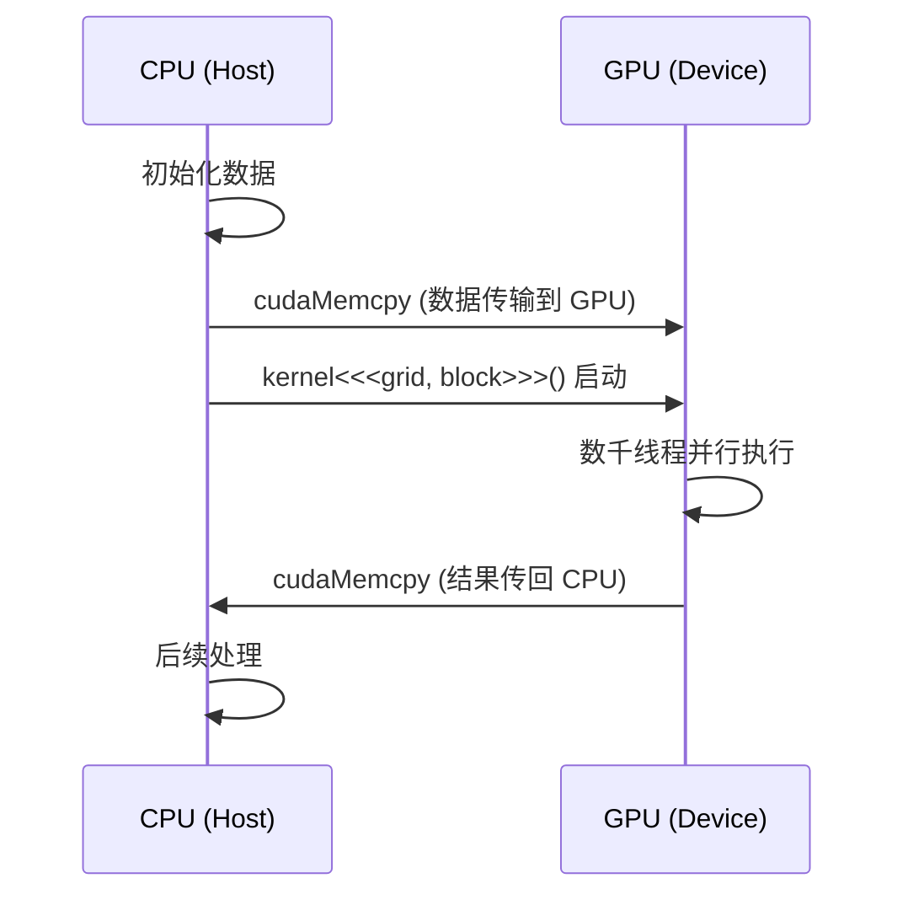

深入理解 CUDA 的 Grid/Block/Thread 三级线程层次结构、线程索引计算方法和 Kernel 启动配置策略，这是编写高效 GPU 程序的核心基础。

<!-- more -->

## 📑 目录

- [1. 异构计算模型概览](#1-异构计算模型概览)
- [2. Grid/Block/Thread 三级线程层次](#2-gridblockthread-三级线程层次)
- [3. 线程索引计算](#3-线程索引计算)
- [4. Kernel 函数与启动语法](#4-kernel-函数与启动语法)
- [5. Block 大小选择策略](#5-block-大小选择策略)
- [6. Warp：硬件调度的基本单位](#6-warp硬件调度的基本单位)
- [7. 多维索引与实际应用](#7-多维索引与实际应用)
- [8. 占用率与性能](#8-占用率与性能)
- [总结](#-总结)

---

## 1. 异构计算模型概览

CUDA 程序运行在一个**异构系统**上：CPU（Host）负责控制逻辑和串行代码，GPU（Device）负责大规模并行计算。想象一个工厂——CPU 是厂长，负责下达指令、调配资源；GPU 是拥有上万工人的车间，一旦接到任务就全员并行开工。

### 1.1 程序执行流程



### 1.2 三种函数修饰符

CUDA 用修饰符来标记函数在哪里执行、由谁调用：

| 修饰符 | 执行位置 | 调用方 | 用途 |
|--------|---------|--------|------|
| `__global__` | GPU | CPU（或 GPU 动态并行） | Kernel 入口函数 |
| `__device__` | GPU | GPU | Kernel 内部调用的辅助函数 |
| `__host__` | CPU | CPU | 普通 CPU 函数（默认） |

```cpp
// 可以组合使用：同时为 CPU 和 GPU 编译
__host__ __device__ float square(float x) {
    return x * x;
}
```

---

## 2. Grid/Block/Thread 三级线程层次

CUDA 的核心设计哲学是**层次化并行**：将海量线程组织为三级结构，既方便程序员思考，也贴合 GPU 硬件的物理布局。

### 2.1 概念模型

打个比方：
- **Grid（网格）** = 整个学校——一次 Kernel 启动产生的所有线程的集合
- **Block（线程块）** = 一个班级——Block 内线程可以协作（共享内存、同步）
- **Thread（线程）** = 一个学生——最小的执行单位


### 2.2 维度与索引

Grid 和 Block 都可以是 1D、2D 或 3D 的：

```cpp
// 1D：处理向量
dim3 grid(256);        // 256 个 Block
dim3 block(256);       // 每个 Block 256 个线程

// 2D：处理图像/矩阵
dim3 grid(16, 16);     // 16x16 = 256 个 Block
dim3 block(16, 16);    // 每个 Block 16x16 = 256 个线程

// 3D：处理体数据
dim3 grid(8, 8, 8);    // 8x8x8 = 512 个 Block
dim3 block(8, 8, 4);   // 每个 Block 8x8x4 = 256 个线程
```

### 2.3 硬件限制

| 限制项 | 最大值（Compute Capability ≥ 8.0） |
|--------|-------------------------------------|
| Block 每维最大线程数 | x:1024, y:1024, z:64 |
| Block 内最大线程总数 | 1024 |
| Grid 每维最大 Block 数 | x:$2^{31}-1$, y:65535, z:65535 |
| 每个 SM 最大活跃线程数 | 2048（sm\_80）/ 1536（sm\_89） |
| 每个 SM 最大活跃 Block 数 | 16~32（取决于架构） |

⚠️ **注意**：Block 内线程总数不能超过 1024，即 `blockDim.x * blockDim.y * blockDim.z ≤ 1024`。

---

## 3. 线程索引计算

每个线程都能通过内置变量获取自身在层次结构中的位置，进而计算出它应该处理哪一份数据。

### 3.1 内置变量

| 变量 | 类型 | 含义 |
|------|------|------|
| `threadIdx` | `dim3` | 线程在所属 Block 内的索引 |
| `blockIdx` | `dim3` | Block 在 Grid 内的索引 |
| `blockDim` | `dim3` | 每个 Block 的维度（线程数） |
| `gridDim` | `dim3` | Grid 的维度（Block 数） |

### 3.2 一维索引计算

最常用的模式——将线程映射到一维数组：

```cpp
// 全局线程 ID = Block 编号 × Block 大小 + Block 内线程编号
int globalIdx = blockIdx.x * blockDim.x + threadIdx.x;
```

对于一个 `gridDim=4, blockDim=8` 的配置，全局索引分布如下：

```
Block 0: [ 0  1  2  3  4  5  6  7]
Block 1: [ 8  9 10 11 12 13 14 15]
Block 2: [16 17 18 19 20 21 22 23]
Block 3: [24 25 26 27 28 29 30 31]
```

### 3.3 二维索引计算

处理矩阵时，通常使用 2D Grid 和 2D Block：

```cpp
int col = blockIdx.x * blockDim.x + threadIdx.x;
int row = blockIdx.y * blockDim.y + threadIdx.y;

// 转换为一维线性索引（行主序）
int linearIdx = row * width + col;
```

### 3.4 Grid-stride Loop 模式

当数据量大于线程总数时，使用循环让每个线程处理多个元素：

```cpp
__global__ void processLargeArray(float* data, int N) {
    int idx = blockIdx.x * blockDim.x + threadIdx.x;
    int stride = blockDim.x * gridDim.x;  // 总线程数

    // 每个线程以 stride 为步长遍历
    for (int i = idx; i < N; i += stride) {
        data[i] = data[i] * 2.0f;
    }
}
```

💡 **提示**：Grid-stride loop 是 CUDA 编程的**最佳实践**——它既能正确处理任意大小的数据，又能让你自由选择 Grid 大小来优化性能。

---

## 4. Kernel 函数与启动语法

### 4.1 Kernel 定义规则

```cpp
__global__ void myKernel(float* input, float* output, int N) {
    int idx = blockIdx.x * blockDim.x + threadIdx.x;
    if (idx < N) {
        output[idx] = input[idx] * 2.0f;
    }
}
```

Kernel 函数的约束：
- 返回类型必须是 `void`
- 不能使用可变参数（variadic）
- 不能是类的虚函数
- 不能递归（Compute Capability < 2.0，现代 GPU 均已支持）
- 参数通过值传递，指针必须指向设备内存

### 4.2 启动语法 `<<<...>>>`

```cpp
kernel<<<gridDim, blockDim, sharedMemBytes, stream>>>(args...);
```

| 参数 | 类型 | 必填 | 说明 |
|------|------|------|------|
| `gridDim` | `dim3` 或 `int` | 是 | Grid 中 Block 的数量 |
| `blockDim` | `dim3` 或 `int` | 是 | 每个 Block 中线程的数量 |
| `sharedMemBytes` | `size_t` | 否 | 动态共享内存大小（默认 0） |
| `stream` | `cudaStream_t` | 否 | 执行流（默认 0，即默认流） |

### 4.3 计算启动配置

给定数据大小 N 和 Block 大小，计算需要多少个 Block：

```cpp
int N = 1000000;
int blockSize = 256;
int gridSize = (N + blockSize - 1) / blockSize;  // 向上取整

myKernel<<<gridSize, blockSize>>>(input, output, N);
```

📌 **关键点**：`(N + blockSize - 1) / blockSize` 是整数除法向上取整的标准写法。当 N 不是 blockSize 整数倍时，最后一个 Block 中会有一些线程"越界"，因此 Kernel 内必须做边界检查 `if (idx < N)`。

### 4.4 错误检查

Kernel 启动是异步的，错误不会立即被捕获：

```cpp
myKernel<<<grid, block>>>(args);

// 检查启动错误
cudaError_t err = cudaGetLastError();
if (err != cudaSuccess) {
    printf("Kernel launch error: %s\n", cudaGetErrorString(err));
}

// 等待执行完成并检查运行时错误
err = cudaDeviceSynchronize();
if (err != cudaSuccess) {
    printf("Kernel execution error: %s\n", cudaGetErrorString(err));
}
```

---

## 5. Block 大小选择策略

Block 大小的选择直接影响 GPU 利用率和性能。没有放之四海皆准的最优值，但有一些实用的经验法则。

### 5.1 基本原则

| ✅ 推荐做法 | ❌ 不推荐做法 | 📝 原因 |
|-------------|--------------|---------|
| Block 大小为 32 的倍数 | 使用非 32 倍数的大小 | Warp 以 32 线程为单位调度 |
| 128~512 线程/Block | < 64 或 > 1024 | 平衡寄存器压力和并行度 |
| 根据 Kernel 寄存器用量调整 | 一律使用 256 | 寄存器多时需减小 Block |

### 5.2 为什么必须是 32 的倍数

GPU 的执行以 **Warp**（32 个连续线程）为最小调度单位。如果 Block 大小不是 32 的倍数，最后一个 Warp 中的部分线程会被浪费：

```
Block 大小 = 100 → 4 个 Warp，但第 4 个 Warp 中只有 4 个线程活跃
Block 大小 = 128 → 4 个 Warp，全部线程都活跃 ✅
```

### 5.3 Occupancy API（自动选择）

CUDA 提供 API 来自动计算最优 Block 大小：

```cpp
int blockSize;
int minGridSize;

// 自动计算使占用率最大化的 Block 大小
cudaOccupancyMaxPotentialBlockSize(
    &minGridSize,
    &blockSize,
    myKernel,       // kernel 函数指针
    0,              // 动态共享内存大小
    0               // Block 大小上限（0 = 不限制）
);

int gridSize = (N + blockSize - 1) / blockSize;
myKernel<<<gridSize, blockSize>>>(args);
```

### 5.4 实用选择指南

| 场景 | 建议 Block 大小 | 理由 |
|------|----------------|------|
| 简单逐元素操作 | 256 或 512 | 寄存器少，可以承受大 Block |
| 使用大量共享内存 | 128 或 256 | 共享内存限制了活跃 Block 数 |
| 寄存器用量大的 Kernel | 128 | 减少 Block 大小释放寄存器压力 |
| 需要 Block 内同步 | 256 | 平衡同步开销和并行度 |

---

## 6. Warp：硬件调度的基本单位

### 6.1 什么是 Warp

如果说 Block 是逻辑上的协作单位，那 Warp 就是**物理上的执行单位**。SM（Streaming Multiprocessor）以 Warp 为粒度调度执行——一个 Warp 包含 32 个连续线程，它们在同一时钟周期内执行同一条指令（SIMT，Single Instruction Multiple Threads）。

### 6.2 Warp 分歧（Divergence）

当 Warp 内的线程走不同的分支路径时，发生 **Warp 分歧**——GPU 不得不串行执行两个分支：

```cpp
// ❌ 容易导致分歧
if (threadIdx.x % 2 == 0) {
    // 偶数线程执行这里
    result = pathA(data);
} else {
    // 奇数线程执行这里
    result = pathB(data);
}

// ✅ 以 Warp 为边界分支，避免分歧
if (threadIdx.x / 32 < 2) {
    // 前两个 Warp 执行 pathA
    result = pathA(data);
} else {
    // 后续 Warp 执行 pathB
    result = pathB(data);
}
```

💡 **提示**：只要同一个 Warp 内的 32 个线程走相同分支，就不会有分歧惩罚。分歧发生在 Warp 内部，不同 Warp 之间走不同分支完全没有代价。

### 6.3 Warp 级原语

现代 CUDA 提供 Warp 级操作，允许线程在 Warp 内直接交换数据：

```cpp
// Warp 内广播：将 lane 0 的值广播给整个 Warp
float val = __shfl_sync(0xffffffff, data, 0);

// Warp 内规约求和
for (int offset = 16; offset > 0; offset >>= 1) {
    val += __shfl_down_sync(0xffffffff, val, offset);
}
```

---

## 7. 多维索引与实际应用

### 7.1 图像处理：2D Grid + 2D Block

```cpp
__global__ void grayscaleKernel(unsigned char* rgb, unsigned char* gray,
                                 int width, int height) {
    int col = blockIdx.x * blockDim.x + threadIdx.x;
    int row = blockIdx.y * blockDim.y + threadIdx.y;

    if (col < width && row < height) {
        int rgbIdx = (row * width + col) * 3;
        int grayIdx = row * width + col;
        // ITU-R BT.601 标准灰度转换
        gray[grayIdx] = (unsigned char)(
            0.299f * rgb[rgbIdx] +
            0.587f * rgb[rgbIdx + 1] +
            0.114f * rgb[rgbIdx + 2]
        );
    }
}

// 启动配置
dim3 block(16, 16);  // 每个 Block 16x16 = 256 线程
dim3 grid((width + 15) / 16, (height + 15) / 16);
grayscaleKernel<<<grid, block>>>(d_rgb, d_gray, width, height);
```

### 7.2 矩阵运算：行列映射

```cpp
__global__ void matrixAdd(float* A, float* B, float* C,
                          int rows, int cols) {
    int col = blockIdx.x * blockDim.x + threadIdx.x;
    int row = blockIdx.y * blockDim.y + threadIdx.y;

    if (row < rows && col < cols) {
        int idx = row * cols + col;
        C[idx] = A[idx] + B[idx];
    }
}
```

### 7.3 批处理：3D Grid

```cpp
// 第三个维度表示 batch
__global__ void batchProcess(float* data, int batchSize,
                             int height, int width) {
    int col = blockIdx.x * blockDim.x + threadIdx.x;
    int row = blockIdx.y * blockDim.y + threadIdx.y;
    int batch = blockIdx.z;

    if (col < width && row < height && batch < batchSize) {
        int idx = batch * height * width + row * width + col;
        data[idx] = data[idx] * 2.0f;
    }
}

dim3 block(16, 16, 1);
dim3 grid((width + 15) / 16, (height + 15) / 16, batchSize);
batchProcess<<<grid, block>>>(d_data, batchSize, height, width);
```

---

## 8. 占用率与性能

### 8.1 什么是占用率（Occupancy）

占用率 = SM 上实际活跃的 Warp 数 / SM 理论支持的最大 Warp 数。

$$
\text{Occupancy} = \frac{\text{Active Warps per SM}}{\text{Max Warps per SM}}
$$

占用率越高不一定性能越好，但过低的占用率通常意味着 GPU 资源闲置。

### 8.2 影响占用率的因素

| 📊 因素 | 📝 影响方式 |
|---------|------------|
| Block 大小 | Block 太小则活跃 Warp 少 |
| 寄存器用量/线程 | 寄存器多则 SM 能容纳的线程少 |
| 共享内存用量/Block | 共享内存多则 SM 能容纳的 Block 少 |
| SM 的硬件限制 | 不同架构的最大 Block 数和线程数不同 |

### 8.3 用 Occupancy Calculator 分析

```bash
# 编译时输出寄存器和共享内存用量
nvcc --ptxas-options=-v mykernel.cu -o mykernel
```

输出示例：
```
ptxas info    : Used 32 registers, 4096 bytes smem, 368 bytes cmem[0]
```

然后用 [CUDA Occupancy Calculator](https://docs.nvidia.com/cuda/cuda-occupancy-calculator/) 或 `cudaOccupancyMaxActiveBlocksPerMultiprocessor` API 来计算占用率。

---

## 📝 总结

CUDA 编程模型的核心要点：

1. **三级层次结构**：Grid → Block → Thread，逻辑清晰、硬件友好
2. **索引计算公式**：`globalIdx = blockIdx.x * blockDim.x + threadIdx.x`
3. **Grid-stride loop**：通用的数据遍历模式，处理任意规模数据
4. **Block 大小选择**：32 的倍数，通常 128~512，可用 Occupancy API 自动选择
5. **Warp 是执行单位**：理解 Warp 分歧，对齐访问模式
6. **边界检查**：Kernel 内必须检查索引是否越界

掌握编程模型就掌握了 CUDA 并行编程的"地图"——之后学习内存模型、同步原语和优化技巧时，都要回到这个层次结构上来思考。

## 🎯 自我检验清单

- 能画出 Grid/Block/Thread 的层次结构示意图
- 能根据数据维度选择合适的 Grid 和 Block 维度
- 能手算给定配置下任意线程的全局索引
- 能编写 Grid-stride loop 处理超大数组
- 能使用 Occupancy API 自动计算最优 Block 大小
- 能识别 Warp 分歧并重构代码避免分歧
- 能为矩阵运算和图像处理配置 2D Grid/Block
- 能根据 `--ptxas-options=-v` 的输出分析占用率瓶颈

## 📚 参考资料

- [NVIDIA CUDA C++ Programming Guide - Programming Model](https://docs.nvidia.com/cuda/cuda-c-programming-guide/index.html#programming-model)
- [CUDA C++ Best Practices Guide](https://docs.nvidia.com/cuda/cuda-c-best-practices-guide/)
- [CUDA Occupancy Calculator](https://docs.nvidia.com/cuda/cuda-occupancy-calculator/)
- [Professional CUDA C Programming (Cheng et al.)](https://www.wiley.com/en-us/Professional+CUDA+C+Programming-p-9781118739327)
