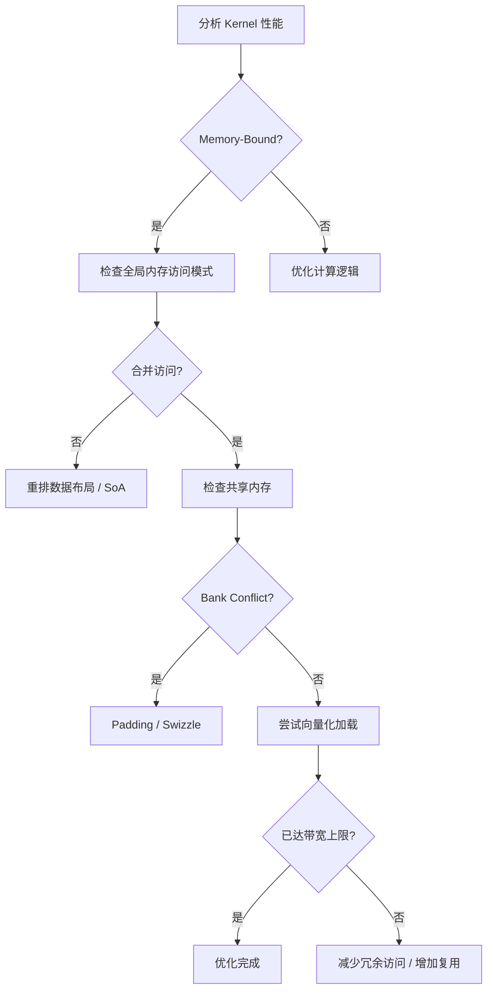

内存访问效率是 CUDA Kernel 性能最大的杠杆。本文深入讲解合并访问（Coalesced Access）的原理与判定方法、共享内存 Bank Conflict 的成因与 Padding 解决方案，以及向量化加载（float4/int4）提升带宽利用率的实战技巧。

<!-- more -->

## 📑 目录

- [1. 为什么内存访问是性能瓶颈](#1-为什么内存访问是性能瓶颈)
- [2. 全局内存与合并访问](#2-全局内存与合并访问)
- [3. 共享内存与 Bank Conflict](#3-共享内存与-bank-conflict)
- [4. 向量化加载](#4-向量化加载)
- [5. 内存访问优化实战](#5-内存访问优化实战)
- [6. 高级技巧与工具](#6-高级技巧与工具)
- [总结](#-总结)
- [自我检验清单](#-自我检验清单)
- [参考资料](#-参考资料)

---

## 1. 为什么内存访问是性能瓶颈

GPU 像一个巨大的工厂——车间里有几千台机器（计算核心）同时运转，但原料仓库（显存）只有一条搬运通道（内存总线）。无论工厂的机器多快，如果搬运通道被堵住，整条生产线都只能等着。

做一道算术：A100 的峰值计算能力为 312 TFLOPS（FP16 Tensor Core），而 HBM2e 带宽约 2 TB/s。对于一个简单的向量加法 `c[i] = a[i] + b[i]`：

$$
\text{Arithmetic Intensity} = \frac{\text{1 FLOP}}{\text{12 Bytes (读2写1)}} \approx 0.083 \text{ FLOP/Byte}
$$

$$
\text{带宽可支撑的计算量} = 2 \text{ TB/s} \times 0.083 = 166 \text{ GFLOPS}
$$

只有峰值算力的 0.05%。因此，**优化内存访问模式往往比优化计算逻辑更能提升性能**。

### 1.1 Roofline 模型快速回顾

Roofline 模型将 Kernel 分为两类：

- **Memory-Bound**：受带宽限制，优化方向是减少内存访问、提高访问效率
- **Compute-Bound**：受计算限制，优化方向是提高计算并行度

大多数 Kernel（特别是 Elementwise、归约、矩阵转置等）都是 Memory-Bound。对它们而言，合并访问和高效的内存使用模式才是性能关键。

---

## 2. 全局内存与合并访问

### 2.1 合并访问的原理

全局内存的访问以 **Warp** 为单位进行事务（transaction）合并。当一个 Warp 的 32 个线程同时发起内存读写时，硬件会尝试将这些请求合并为最少的内存事务。

每个内存事务的粒度为 **32 Bytes**（一个 cache line sector）。L1 cache line 为 128 Bytes，由 4 个 32B sector 组成。

💡 **提示**：合并访问的核心原则很简单——让 Warp 内的连续线程访问连续的内存地址。


### 2.2 合并 vs 非合并的性能差异

```cpp
// ✅ 合并访问：连续线程访问连续地址
// 1个 Warp 的 32 线程访问连续 128B，恰好落在 1 条 cache line 内
__global__ void coalesced_read(float* data, float* out, int N) {
    int tid = threadIdx.x + blockIdx.x * blockDim.x;
    if (tid < N) {
        out[tid] = data[tid];  // data[0], data[1], ..., data[31] 连续
    }
}

// ❌ 非合并（跳跃访问）：连续线程访问间隔地址
// stride=32 时，每个线程的地址相差 128B，需 32 个事务
__global__ void strided_read(float* data, float* out, int N, int stride) {
    int tid = threadIdx.x + blockIdx.x * blockDim.x;
    if (tid < N) {
        out[tid] = data[tid * stride];  // data[0], data[32], data[64], ...
    }
}
```

性能对比（A100，读取 1GB 数据）：

| 📊 访问模式 | 内存事务数 | 有效带宽利用率 | 相对耗时 |
|------------|-----------|--------------|---------|
| 连续对齐（stride=1） | 1x | ~95% | 1x |
| stride=2 | 2x | ~50% | 2x |
| stride=4 | 4x | ~25% | 4x |
| stride=32 | 32x | ~3% | 32x |
| 完全随机 | 32x | ~3% | 32x |

### 2.3 对齐要求

除了连续性，对齐也很重要：

```cpp
// ✅ 对齐访问：起始地址是 128B 的倍数
float* aligned_ptr = data;  // cudaMalloc 保证 256B 对齐
out[tid] = aligned_ptr[tid];

// ⚠️ 偏移访问：起始地址未对齐，可能多出一个事务
out[tid] = data[tid + 1];  // 起始地址偏移 4B，不再 128B 对齐
```

好消息是 `cudaMalloc` 分配的内存始终 256 Bytes 对齐，所以只要从头开始连续访问通常不会有对齐问题。需要注意的是手动指针偏移的情况。

### 2.4 结构体数组 vs 数组结构体

这是经典的 AoS vs SoA 问题：

```cpp
// ❌ AoS（Array of Structures）：不利于合并访问
struct Particle {
    float x, y, z, w;
};
Particle particles[N];
// 访问所有 x：particles[0].x, particles[1].x, ...
// 地址跳跃：0, 16, 32, 48, ... （stride=4）

// ✅ SoA（Structure of Arrays）：利于合并访问
struct ParticlesSoA {
    float x[N], y[N], z[N], w[N];
};
ParticlesSoA particles;
// 访问所有 x：particles.x[0], particles.x[1], ...
// 地址连续：0, 4, 8, 12, ... （stride=1）
```

📌 **关键点**：在 GPU 编程中，**SoA 几乎总是优于 AoS**，因为 GPU 的 Warp 并行模式天然适合连续线程访问连续字段。

### 2.5 二维数组的行列访问

```cpp
// 二维数组按行存储（Row-Major），element[row][col] 在地址 row*cols+col
// ✅ 行方向遍历：连续线程访问同一行的连续列
int col = threadIdx.x + blockIdx.x * blockDim.x;
int row = blockIdx.y;
float val = matrix[row * cols + col];  // 合并

// ❌ 列方向遍历：连续线程访问同一列的连续行
int row2 = threadIdx.x + blockIdx.x * blockDim.x;
int col2 = blockIdx.y;
float val2 = matrix[row2 * cols + col2];  // stride = cols，极差
```

---

## 3. 共享内存与 Bank Conflict

### 3.1 共享内存的 Bank 结构

共享内存被划分为 **32 个 Bank**（与 Warp 大小一致），每个 Bank 宽 4 Bytes（32 bits）。连续的 4 Byte 字被分配到连续的 Bank：

```
地址 0~3:   Bank 0
地址 4~7:   Bank 1
地址 8~11:  Bank 2
...
地址 124~127: Bank 31
地址 128~131: Bank 0  （循环）
...
```

每个时钟周期，每个 Bank 只能服务一次读或写请求。如果同一个 Warp 中有多个线程访问**同一个 Bank 的不同地址**，这些访问必须串行化——这就是 Bank Conflict。

### 3.2 Bank Conflict 的类型与代价

| 📊 冲突类型 | 含义 | 性能影响 |
|------------|------|---------|
| 无冲突（No Conflict） | 32 线程访问 32 个不同 Bank | 1 个周期完成 |
| 2-way Conflict | 2 个线程访问同一 Bank | 2 个周期（串行化） |
| N-way Conflict | N 个线程访问同一 Bank | N 个周期 |
| 广播（Broadcast） | 多个线程访问同一 Bank 的**同一地址** | 1 个周期（免费） |

⚠️ **注意**：广播是特殊情况——如果多个线程读的是同一个地址（完全相同），硬件会广播该值给所有请求线程，不算冲突。只有"同一 Bank，不同地址"才会产生冲突。

### 3.3 经典冲突场景：矩阵转置

```cpp
// 朴素矩阵转置（Naive Transpose）
__shared__ float tile[32][32];

// 写入时：连续线程写同一行的不同列 → 无冲突
tile[threadIdx.y][threadIdx.x] = input[gy * N + gx];

// 读取时：连续线程读同一列的不同行
output[gx * N + gy] = tile[threadIdx.x][threadIdx.y];
// threadIdx.x=0 → tile[0][ty], 地址= (0*32+ty)*4 = ty*4 → Bank = ty%32
// threadIdx.x=1 → tile[1][ty], 地址= (1*32+ty)*4 → Bank = (32+ty)%32 = ty%32
// threadIdx.x=2 → tile[2][ty], 地址= (2*32+ty)*4 → Bank = (64+ty)%32 = ty%32
// 所有线程的 Bank 相同（= ty%32）→ 32-way Bank Conflict！
```

### 3.4 解决方案一：Padding

在共享内存声明中额外加一列，打破 32 的倍数对齐：

```cpp
// ✅ 添加 1 列 Padding
__shared__ float tile[32][32 + 1];  // 33 列

// 原本 tile[row][col] 地址 = (row * 32 + col) * 4
// 现在 tile[row][col] 地址 = (row * 33 + col) * 4
// Bank = (row * 33 + col) % 32

// 读取 tile[threadIdx.x][ty]：
// threadIdx.x=0 → Bank = (0*33+ty)%32 = ty%32
// threadIdx.x=1 → Bank = (1*33+ty)%32 = (33+ty)%32 = (1+ty)%32
// threadIdx.x=2 → Bank = (2*33+ty)%32 = (66+ty)%32 = (2+ty)%32
// 每个线程访问不同的 Bank → 无冲突！
```

Padding 的代价是每行多浪费 4 Bytes 共享内存，但带来的性能提升通常远超这点开销。

### 3.5 解决方案二：Swizzle（高级）

对于某些访问模式，可以使用地址变换（Swizzle）来避免冲突：

```cpp
// Swizzle 思路：将线性索引通过 XOR 变换打乱 Bank 分布
__device__ int swizzle_index(int row, int col) {
    return row * 32 + (col ^ row);  // XOR 变换
}

// 写入
tile[row][col ^ row] = input_val;
// 读取
float val = tile[col][row ^ col];
```

Swizzle 不浪费额外空间，但增加了索引计算的复杂度。在高性能 GEMM 实现（如 CUTLASS）中广泛使用。

### 3.6 如何检测 Bank Conflict

使用 **Nsight Compute** 观察共享内存指标：

```
l1tex__data_bank_conflicts_pipe_lsu_mem_shared_op_ld  # 加载冲突
l1tex__data_bank_conflicts_pipe_lsu_mem_shared_op_st  # 存储冲突
```

如果这两个计数器不为零，说明存在 Bank Conflict，需要检查共享内存的访问模式。

---

## 4. 向量化加载

### 4.1 什么是向量化加载

向量化加载指的是用一条指令读取多个连续元素（如 `float4` 一次读 4 个 float，16 Bytes）。好处是：

1. **减少指令数**：4 次 `LDG.32` → 1 次 `LDG.128`
2. **提高带宽利用率**：单次事务传输更多有效数据
3. **减少调度开销**：更少的内存指令排队

### 4.2 常用向量类型

| 📊 类型 | 大小 | 等价 |
|---------|------|------|
| `float2` | 8 Bytes | 2 个 float |
| `float4` | 16 Bytes | 4 个 float |
| `int4` | 16 Bytes | 4 个 int |
| `double2` | 16 Bytes | 2 个 double |

💡 **提示**：GPU 一条 cache line 为 128 Bytes。一个 Warp 的 32 个线程每人加载一个 `float4`（16B）= 512B，需要请求 4 条 cache line。对比每人加载一个 `float`（4B）= 128B 只需 1 条 cache line。虽然 cache line 请求数增多了，但每条加载指令处理的数据量是 4 倍，总指令数减少 75%。

### 4.3 基本用法

```cpp
// 标量版本：每个线程加载 1 个 float
__global__ void scalar_copy(float* dst, float* src, int N) {
    int tid = threadIdx.x + blockIdx.x * blockDim.x;
    if (tid < N) {
        dst[tid] = src[tid];
    }
}

// 向量化版本：每个线程加载 4 个 float
__global__ void vectorized_copy(float* dst, float* src, int N) {
    int tid = threadIdx.x + blockIdx.x * blockDim.x;
    int idx = tid * 4;  // 每个线程负责4个元素

    if (idx + 3 < N) {
        // 将 float* 强制转换为 float4*，一条指令读取 16B
        float4 val = reinterpret_cast<float4*>(src)[tid];
        reinterpret_cast<float4*>(dst)[tid] = val;
    }
}
```

### 4.4 对齐要求

向量化加载有严格的对齐要求：

```cpp
// float4 要求 16B 对齐
// cudaMalloc 分配的地址是 256B 对齐的 → 满足

// 但如果有偏移，需要特殊处理
float* base = ...; // 256B 对齐
float* offset_ptr = base + 3;  // 偏移 12B，不满足 16B 对齐

// ✅ 安全做法：先标量处理头部未对齐部分，再向量化处理主体
__global__ void safe_vectorized(float* data, int offset, int N) {
    // 处理头部未对齐的元素
    int align_offset = (4 - (offset % 4)) % 4;
    // ... 标量处理前 align_offset 个元素

    // 主体向量化处理
    float4* aligned_ptr = reinterpret_cast<float4*>(data + offset + align_offset);
    // ...
}
```

### 4.5 实用模式：向量化归约

```cpp
__global__ void vectorized_sum(float* input, float* output, int N) {
    int tid = threadIdx.x + blockIdx.x * blockDim.x;
    int stride = blockDim.x * gridDim.x;

    float sum = 0.0f;

    // 每次迭代处理4个元素
    int vec_N = N / 4;
    float4* vec_input = reinterpret_cast<float4*>(input);

    for (int i = tid; i < vec_N; i += stride) {
        float4 val = vec_input[i];
        sum += val.x + val.y + val.z + val.w;
    }

    // 处理尾部不足4个的元素
    int tail_start = vec_N * 4;
    for (int i = tail_start + tid; i < N; i += stride) {
        sum += input[i];
    }

    // 后续做 Block 归约...
    output[blockIdx.x] = sum;  // 简化，实际需要归约
}
```

### 4.6 何时使用向量化加载

| ✅ 适合场景 | ❌ 不适合场景 |
|------------|-------------|
| Elementwise 操作（加减乘除） | 复杂的索引模式（gather/scatter） |
| 大规模数据拷贝/初始化 | 数据量不是 4 的倍数且无法处理尾部 |
| 带宽受限的 Kernel | 计算密集型 Kernel（瓶颈不在访存） |
| 数据地址可保证对齐 | 起始地址无法对齐 |

---

## 5. 内存访问优化实战

### 5.1 案例：矩阵转置优化

矩阵转置是内存访问优化的经典教科书案例，因为它不涉及任何计算，性能完全取决于内存访问效率。

**朴素版本**：

```cpp
__global__ void transpose_naive(float* out, float* in, int width, int height) {
    int col = threadIdx.x + blockIdx.x * blockDim.x;
    int row = threadIdx.y + blockIdx.y * blockDim.y;
    if (col < width && row < height) {
        out[col * height + row] = in[row * width + col];
        // 读取：合并（连续线程访问连续列）
        // 写入：不合并（stride = height）
    }
}
```

**共享内存优化版本**：

```cpp
// 每个线程处理 TILE_DIM / BLOCK_ROWS 个元素
#define TILE_DIM 32
#define BLOCK_ROWS 8

__global__ void transpose_shared(float* out, float* in, int width, int height) {
    __shared__ float tile[TILE_DIM][TILE_DIM + 1];  // +1 Padding 消除 Bank Conflict

    int x = blockIdx.x * TILE_DIM + threadIdx.x;
    int y = blockIdx.y * TILE_DIM + threadIdx.y;

    // 合并读取：每个 warp 读取连续元素
    for (int j = 0; j < TILE_DIM; j += BLOCK_ROWS) {
        if (x < width && (y + j) < height) {
            tile[threadIdx.y + j][threadIdx.x] = in[(y + j) * width + x];
        }
    }

    __syncthreads();

    // 合并写入：转置后的索引，连续线程写连续地址
    x = blockIdx.y * TILE_DIM + threadIdx.x;
    y = blockIdx.x * TILE_DIM + threadIdx.y;

    for (int j = 0; j < TILE_DIM; j += BLOCK_ROWS) {
        if (x < height && (y + j) < width) {
            out[(y + j) * height + x] = tile[threadIdx.x][threadIdx.y + j];
        }
    }
}

// 调用方式：
// dim3 block(TILE_DIM, BLOCK_ROWS);
// dim3 grid((width + TILE_DIM - 1) / TILE_DIM, (height + TILE_DIM - 1) / TILE_DIM);
```

核心思路：用共享内存做"中转站"，将全局内存的非合并写入转化为共享内存的列读取（通过 Padding 消除 Bank Conflict），再以合并方式写出。

### 5.2 案例：归约操作中的内存优化

```cpp
// ❌ 朴素归约：交错访问导致 Bank Conflict 和低带宽利用
__global__ void reduce_interleaved(float* input, float* output, int N) {
    int tid = threadIdx.x;
    int idx = blockIdx.x * blockDim.x + tid;
    __shared__ float sdata[256];
    sdata[tid] = (idx < N) ? input[idx] : 0.0f;
    __syncthreads();

    for (int s = 1; s < blockDim.x; s *= 2) {
        if (tid % (2 * s) == 0) {
            sdata[tid] += sdata[tid + s];
        }
        __syncthreads();
    }
    if (tid == 0) output[blockIdx.x] = sdata[0];
}

// ✅ 优化归约：连续线程操作连续地址
__global__ void reduce_sequential(float* input, float* output, int N) {
    int tid = threadIdx.x;
    int idx = blockIdx.x * blockDim.x + tid;
    __shared__ float sdata[256];
    sdata[tid] = (idx < N) ? input[idx] : 0.0f;
    __syncthreads();

    for (int s = blockDim.x / 2; s > 0; s >>= 1) {
        if (tid < s) {
            sdata[tid] += sdata[tid + s];
        }
        __syncthreads();
    }
    if (tid == 0) output[blockIdx.x] = sdata[0];
}
```

---

## 6. 高级技巧与工具

### 6.1 缓存提示（Cache Hints）

CUDA 提供内存访问的缓存策略控制：

```cpp
// 使用 __ldg() 通过只读数据缓存（texture cache）加载
// 适合只读数据，可避免 L1 缓存污染
float val = __ldg(&input[tid]);

// PTX 级别的缓存控制（通过 inline asm 或编译器 flag）
// .ca (cache all levels) — 默认，缓存到 L1 和 L2
// .cg (cache global) — 只缓存到 L2，跳过 L1
// .cs (cache streaming) — 标记为流式数据，优先级低
// .cv (cache volatile) — 不缓存，每次都从显存读
```

### 6.2 内存访问分析工具

使用 Nsight Compute 的关键指标：

```
# 全局内存效率
sm__sass_average_data_bytes_per_sector_mem_global_op_ld  # 理想128B
l1tex__t_sectors_pipe_lsu_mem_global_op_ld  # 实际事务数

# 计算带宽利用率
gpu__compute_memory_throughput  # 实际吞吐
dram__bytes_read + dram__bytes_write  # 实际传输量
```

### 6.3 优化决策流程图



---

## 📝 总结

| 优化技术 | 核心要点 | 收益 |
|---------|---------|------|
| 合并访问 | 连续线程访问连续地址，SoA 优于 AoS | 最高 32x 带宽差异 |
| 对齐访问 | 起始地址对齐到 128B 边界 | 避免额外事务 |
| Padding | 共享内存 `[N][N+1]` 打破 Bank 周期 | 消除 Bank Conflict |
| 向量化加载 | `float4` / `int4` 一次读 16B | 减少 75% 指令数 |
| 缓存提示 | `__ldg()`、cache policy 控制 | 减少缓存污染 |
| 数据布局 | AoS → SoA，行列互换 | 结构性解决合并问题 |

---

## 🎯 自我检验清单

- 能判断给定的内存访问模式是否满足合并访问条件
- 能计算一个 Warp 的全局内存访问需要多少个 32B 事务
- 能将 AoS 数据结构改写为 SoA 以实现合并访问
- 能解释共享内存 Bank 的编址方式及 Bank Conflict 的产生原因
- 能对存在 32-way Bank Conflict 的代码添加 Padding 解决冲突
- 能正确使用 `float4` 向量类型实现向量化加载和存储
- 能处理向量化加载中的对齐问题和尾部元素
- 能使用共享内存将非合并的全局内存写入转化为合并写入
- 能用 Nsight Compute 识别内存效率相关的性能指标
- 能对矩阵转置 Kernel 应用完整的内存访问优化链

---

## 📚 参考资料

- [NVIDIA CUDA C++ Programming Guide - Memory Hierarchy](https://docs.nvidia.com/cuda/cuda-c-programming-guide/index.html#memory-hierarchy)
- [NVIDIA CUDA C++ Best Practices Guide - Memory Optimizations](https://docs.nvidia.com/cuda/cuda-c-best-practices-guide/index.html#memory-optimizations)
- [An Efficient Matrix Transpose in CUDA C/C++ - NVIDIA Developer Blog](https://developer.nvidia.com/blog/efficient-matrix-transpose-cuda-cc/)
- [How to Access Global Memory Efficiently in CUDA C/C++ Kernels - NVIDIA Developer Blog](https://developer.nvidia.com/blog/how-access-global-memory-efficiently-cuda-c-kernels/)
- [CUTLASS: CUDA Templates for Linear Algebra Subroutines - GitHub](https://github.com/NVIDIA/cutlass)
