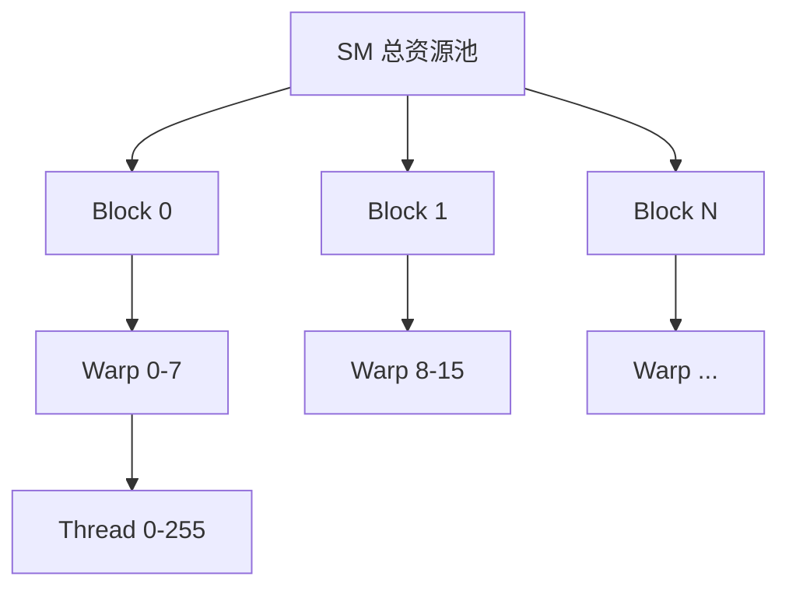
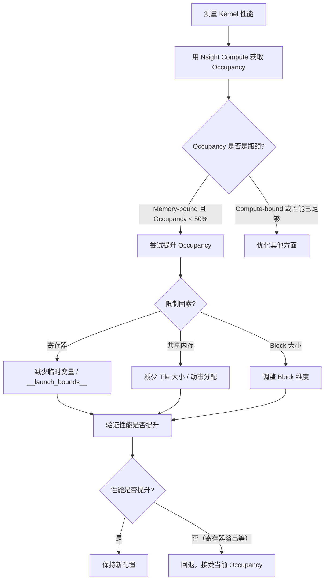

Occupancy 衡量 SM 上实际活跃 Warp 数与理论最大值的比例，是调优 CUDA Kernel 的核心指标之一。本文讲解 Occupancy 的定义、计算方法、三大限制因素（寄存器/共享内存/Block 大小），以及为什么 Occupancy 并非越高越好——真正的目标是在延迟隐藏与资源利用之间找到平衡点。

<!-- more -->

## 📑 目录

- [1. Occupancy 是什么](#1-occupancy-是什么)
- [2. SM 的资源清单](#2-sm-的资源清单)
- [3. 影响 Occupancy 的三大因素](#3-影响-occupancy-的三大因素)
- [4. Occupancy 计算实例](#4-occupancy-计算实例)
- [5. Occupancy 不是越高越好](#5-occupancy-不是越高越好)
- [6. 调优策略与工具](#6-调优策略与工具)
- [7. 实战案例分析](#7-实战案例分析)
- [总结](#-总结)
- [自我检验清单](#-自我检验清单)
- [参考资料](#-参考资料)

---

## 1. Occupancy 是什么

想象一个停车场有 64 个车位（SM 最大可驻留的 Warp 数），如果当前只有 32 辆车停着，停车场利用率就是 50%。Occupancy 就是 GPU 中 SM 的"停车场利用率"——它告诉你硬件资源被用了多少。

### 1.1 正式定义

$$
\text{Occupancy} = \frac{\text{每个 SM 上活跃 Warp 数}}{\text{每个 SM 支持的最大 Warp 数}}
$$

例如在 A100（Compute Capability 8.0）上：
- 每个 SM 最大支持 64 个 Warp（2048 个线程）
- 如果你的 Kernel 由于资源限制只能在每个 SM 上运行 32 个 Warp
- 那么 Occupancy = 32/64 = 50%

### 1.2 为什么 Occupancy 重要

Occupancy 的核心价值在于**延迟隐藏**（Latency Hiding）。GPU 的执行模型依赖 Warp 切换来掩盖内存访问延迟：

```
时间线：
Warp 0: [计算] [等待内存...400cycles...] [计算]
Warp 1:        [计算] [等待内存...400cycles...] [计算]
Warp 2:               [计算] [等待内存...400cycles...]
...

如果活跃 Warp 足够多，调度器总能找到就绪的 Warp 来填充等待期
```

需要多少 Warp 才能完全隐藏延迟？一个粗略估算：

$$
\text{所需 Warp 数} \geq \frac{\text{内存延迟（cycles）}}{\text{每条指令的执行周期}} = \frac{400}{4} = 100
$$

但由于一个 SM 最多 64 个 Warp，实际中无法完全隐藏延迟——这正是为什么要让 Occupancy 尽可能高（但不是唯一目标）。

---

## 2. SM 的资源清单

每个 SM 有一组固定的硬件资源，所有驻留在其上的 Block 共享这些资源。理解资源上限是计算 Occupancy 的基础。

### 2.1 主要架构资源对比

| 📊 资源 | Ampere (A100) | Ada (RTX 4090) | Hopper (H100) |
|---------|---------------|----------------|---------------|
| 每 SM 最大线程数 | 2048 | 1536 | 2048 |
| 每 SM 最大 Warp 数 | 64 | 48 | 64 |
| 每 SM 最大 Block 数 | 32 | 16 | 32 |
| 每 SM 寄存器总数 | 65536 | 65536 | 65536 |
| 每线程最大寄存器数 | 255 | 255 | 255 |
| 每 SM 共享内存上限 | 164 KB | 100 KB | 228 KB |
| 每 Block 最大共享内存 | 163 KB | 99 KB | 227 KB |
| 每 Block 最大线程数 | 1024 | 1024 | 1024 |

### 2.2 资源分配的层级关系



📌 **关键点**：资源以 **Block 为单位**分配。一个 Block 要么完整进入 SM，要么完全不进入——不存在半个 Block 驻留的情况。因此，如果一个 Block 占用的资源刚好超过 SM 剩余资源的一半多一点，那整个剩余空间就浪费了。

---

## 3. 影响 Occupancy 的三大因素

### 3.1 因素一：寄存器用量

每个线程使用的寄存器数量是最常见的 Occupancy 限制因素。

**计算逻辑**：

$$
\text{每 SM 可驻留线程数} = \lfloor \frac{\text{SM 寄存器总数}}{\text{每线程寄存器数}} \rfloor
$$

但实际分配要满足粒度约束。寄存器以 **256 个为一组**（Allocation Granularity）分配给一个 Warp。即每个 Warp 的寄存器分配量 = $\lceil \frac{\text{每线程寄存器数} \times 32}{256} \rceil \times 256$。

**示例**（A100，65536 寄存器/SM）：

| 每线程寄存器数 | 每 Warp 实际分配 | SM 可容纳 Warp 数 | Occupancy |
|--------------|-----------------|-------------------|-----------|
| 32 | 32×32=1024 | 65536/1024=64 | 100% |
| 48 | 48×32=1536 | 65536/1536=42 | 42/64≈65% |
| 64 | 64×32=2048 | 65536/2048=32 | 50% |
| 128 | 128×32=4096 | 65536/4096=16 | 25% |
| 255 | 255×32=8160 → 对齐到 8192 | 65536/8192=8 | 12.5% |

💡 **提示**：可以使用 `__launch_bounds__` 或 `maxrregcount` 编译选项限制寄存器用量：

```cpp
// 方式一：通过 __launch_bounds__(maxThreadsPerBlock, minBlocksPerMultiprocessor) 提示编译器
访存密集（带宽瓶颈）  __launch_bounds__(N, 大值)  → 提升 occupancy
计算密集（FLOP瓶颈）  __launch_bounds__(N, 1)     → 保留寄存器

__global__ void __launch_bounds__(256, 2)  // 每 Block 最多256线程，目标每SM 2个Block
my_kernel(...) { ... }

// 编译器行为
SM 寄存器总量（A100）= 65536 个/SM
maxThreadsPerBlock=256, minBlocksPerMultiprocessor=2
↓
需要同时驻留：256线程 × 2block = 512线程
↓
每线程最大寄存器数：65536 / 512 = 128个
↓
编译器将寄存器上限设为 128（通常会更激进压缩）
↓
溢出的变量 spill 到 Local Memory（显存）

// 方式二：编译时全局限制
// nvcc -maxrregcount=32 my_kernel.cu
```

⚠️ **注意**：强制限制寄存器数可能导致编译器将变量溢出到局部内存（register spilling），反而降低性能。需要用 profiler 实际验证效果。

### 3.2 因素二：共享内存用量

每个 Block 声明的共享内存总量（静态 + 动态）会限制 SM 能容纳的 Block 数。

**计算逻辑**：

$$
\text{每 SM 可驻留 Block 数} = \lfloor \frac{\text{SM 共享内存总量}}{\text{每 Block 共享内存用量}} \rfloor
$$

**示例**（A100，164KB 共享内存/SM）：

| 每 Block 共享内存 | SM 可容纳 Block 数 | 每 Block 256线程时总线程 | Occupancy |
|-----------------|-------------------|------------------------|-----------|
| 8 KB | 20（但受最大 Block 数 32 限制） | min(20,32)×256=5120→cap at 2048 | 100% |
| 32 KB | 5 | 5×256=1280 | 62.5% |
| 64 KB | 2 | 2×256=512 | 25% |
| 164 KB | 1 | 1×256=256 | 12.5% |

共享内存的分配粒度也不是字节级的，而是以 **128 Bytes**（或 256 Bytes，因架构而异）为单位。

### 3.3 因素三：Block 大小

Block 大小同时受两个限制：
1. 每 Block 最大 1024 个线程
2. 每 SM 最大 Block 数量（A100 为 32）

**一个容易被忽视的限制**：如果你的 Block 大小很小（如 32 个线程 = 1 个 Warp），即使每个 Block 资源消耗很低，也可能被"每 SM 最大 Block 数"限制：

| Block 大小 | 每 SM Block 数上限 | 总 Warp 数 | Occupancy |
|-----------|-------------------|-----------|-----------|
| 32 (1 Warp) | 32（Block 数限制） | 32 | 50% |
| 64 (2 Warps) | 32（Block 数限制） | 64 | 100% |
| 128 (4 Warps) | 16（2048/128） | 64 | 100% |
| 256 (8 Warps) | 8（2048/256） | 64 | 100% |
| 512 (16 Warps) | 4（2048/512） | 64 | 100% |
| 1024 (32 Warps) | 2（2048/1024） | 64 | 100% |

📌 **关键点**：Block 大小建议至少 128 或 256，既能避免被 Block 数限制，又能让编译器有更多优化空间。通常 **256** 是个不错的默认选择。

---

## 4. Occupancy 计算实例

### 4.1 综合示例

已知条件（A100 架构）：
- Kernel 每个线程使用 40 个寄存器
- Block 大小：256 线程 = 8 个 Warp
- 每 Block 使用 16 KB 共享内存

**步骤一：寄存器限制**

$$
\text{每 Warp 寄存器} = 40 \times 32 = 1280 \rightarrow \text{对齐到} 1280
$$

$$
\text{SM 可容纳 Warp} = \lfloor \frac{65536}{1280} \rfloor = 51 \text{ Warps}
$$

**步骤二：共享内存限制**

$$
\text{SM 可容纳 Block} = \lfloor \frac{164\text{KB}}{16\text{KB}} \rfloor = 10 \text{ Blocks}
$$

$$
\text{对应 Warp 数} = 10 \times 8 = 80 \text{ Warps}
$$

**步骤三：Block 数限制**

每 SM 最多 32 个 Block，10 Block 未触达上限。

**步骤四：线程数限制**

每 SM 最多 2048 线程 = 64 Warps。

**综合取最小值**：

$$
\text{实际 Warp 数} = \min(51, 80, 64) = 51 \text{ Warps}
$$

但由于 Block 是整体分配的（每 Block 8 Warp），实际为：

$$
\lfloor \frac{51}{8} \rfloor \times 8 = 6 \times 8 = 48 \text{ Warps}
$$

$$
\text{Occupancy} = \frac{48}{64} = 75\%
$$

### 4.2 使用 CUDA Occupancy API

```cpp
#include <cuda_runtime.h>

int main() {
    int blockSize = 256;
    int minGridSize, gridSize;

    // 自动计算最佳 Block 大小
    cudaOccupancyMaxPotentialBlockSize(
        &minGridSize, &blockSize,
        my_kernel,  // kernel 函数指针
        0,          // 动态共享内存大小
        0           // Block 大小上限（0=无限制）
    );

    // 查询给定配置的 Occupancy
    int maxActiveBlocks;
    cudaOccupancyMaxActiveBlocksPerMultiprocessor(
        &maxActiveBlocks,
        my_kernel,
        blockSize,
        0  // 动态共享内存
    );

    int device;
    cudaGetDevice(&device);
    cudaDeviceProp prop;
    cudaGetDeviceProperties(&prop, device);

    float occupancy = (float)(maxActiveBlocks * blockSize) /
                      prop.maxThreadsPerMultiProcessor;
    printf("Occupancy: %.1f%%\n", occupancy * 100);
    return 0;
}
```

---

## 5. Occupancy 不是越高越好

这是 CUDA 优化中最重要的认知之一：**高 Occupancy 不等于高性能**。

### 5.1 反直觉的例子

考虑两个版本的矩阵乘法 Kernel：

| 📊 版本 | 寄存器/线程 | 共享内存/Block | Occupancy | 实际 GFLOPS |
|---------|------------|--------------|-----------|------------|
| Version A | 32 | 8 KB | 100% | 800 |
| Version B | 96 | 48 KB | 33% | 1200 |

Version B 的 Occupancy 更低，但性能更高！原因是它使用更多寄存器和共享内存来**增加数据复用**，每次从全局内存加载的数据被反复使用多次，减少了总的内存访问量。

### 5.2 高 Occupancy 的代价

盲目追求高 Occupancy 可能导致：

1. **寄存器溢出（Register Spilling）**：为降低寄存器用量强制限制 `maxrregcount`，编译器将变量溢出到局部内存（实质是全局内存 + L1 缓存），速度慢数十倍

2. **共享内存复用不足**：使用更少的共享内存意味着 Tile 更小，数据复用率降低，总的全局内存访问量反而增加

3. **缓存抖动（Cache Thrashing）**：太多活跃 Warp 争抢有限的 L1/L2 缓存，导致 cache miss 率上升

### 5.3 何时 Occupancy 是关键

Occupancy 对**内存访问密集且复用度低**的 Kernel 最重要：

- ✅ Elementwise 操作（向量加法、激活函数等）：几乎无数据复用，纯靠延迟隐藏
- ✅ 归约操作：每个元素只被读一次
- ✅ 简单的 Stencil 操作

### 5.4 何时可以接受低 Occupancy

低 Occupancy 在以下场景是合理的：

- ✅ GEMM / 矩阵乘法：大量数据复用，寄存器和共享内存换来计算效率
- ✅ FlashAttention：用更多共享内存减少 HBM 访问
- ✅ 计算密集型 Kernel：瓶颈在计算而非访存

### 5.5 黄金法则

$$
\text{性能} = f(\text{Occupancy}, \text{ILP}, \text{数据复用率}, \text{访存效率}, ...)
$$

💡 **提示**：不要设定一个固定的 Occupancy 目标（如"必须达到 75%"），而是用 profiler 实际测量吞吐量。如果降低 Occupancy 但提升了数据复用或 ILP（Instruction-Level Parallelism），整体性能可能更好。

---

## 6. 调优策略与工具

### 6.1 CUDA Occupancy Calculator

NVIDIA 提供 Excel 版本的 Occupancy Calculator，输入架构和资源使用量即可计算理论 Occupancy 和限制因素。

也可以使用命令行工具：

```bash
# 编译时查看每个 Kernel 的资源使用
nvcc -Xptxas -v my_kernel.cu
# 输出示例：
# ptxas info: Used 40 registers, 16384 bytes smem, 380 bytes cmem[0]
```

### 6.2 Nsight Compute 中的 Occupancy 分析

```
# 关键指标
sm__warps_active.avg.pct_of_peak_sustained_active   # 实际活跃 Warp 占比
launch__occupancy                                    # 理论 Occupancy
launch__registers_per_thread                         # 每线程寄存器
launch__shared_mem_per_block_allocated               # 每 Block 共享内存
```

Nsight Compute 还会显示 Occupancy 的瓶颈来源：

```
Occupancy Limiters:
  Registers:        50%  ← 瓶颈
  Shared Memory:    75%
  Block Size:       100%
  Theoretical:      50%
```

### 6.3 实用调优流程



### 6.4 Block 大小选择建议

| 📊 场景 | 推荐 Block 大小 | 原因 |
|---------|----------------|------|
| Memory-bound Kernel | 256 或 512 | 需要高 Occupancy 隐藏延迟 |
| Compute-bound Kernel | 128 或 256 | 足够 Occupancy 即可，优先保证寄存器 |
| 使用大量共享内存 | 128 或 256 | Block 小→SM 容纳更多 Block |
| 归约操作 | 256 或 512 | 更多线程参与归约，减少归约步骤 |

---

## 7. 实战案例分析

### 7.1 案例：SGEMM Tile 大小权衡

对于矩阵乘法 Kernel，Tile 大小直接决定了寄存器和共享内存用量：

```cpp
// Tile 配置对比
// Config A: 小 Tile
// TILE_M=64, TILE_N=64, TILE_K=8
// 每线程计算 4x4 = 16 个输出 → ~48 寄存器
// 共享内存: (64+64)*8*4 = 4 KB
// Occupancy: ~75%

// Config B: 大 Tile
// TILE_M=128, TILE_N=128, TILE_K=8
// 每线程计算 8x8 = 64 个输出 → ~128 寄存器
// 共享内存: (128+128)*8*4 = 8 KB
// Occupancy: ~25%

// Config B 虽然 Occupancy 低，但：
// - 每次从 Global 加载数据被复用 8 次（vs Config A 的 4 次）
// - 每线程计算量更大，ILP 更充分
// - 实际性能通常 Config B > Config A
```

### 7.2 案例：动态共享内存灵活调优

```cpp
// 使用动态共享内存，可在 launch 时按需分配
__global__ void flexible_kernel(float* data, int N) {
    extern __shared__ float smem[];
    // ...
}

// 运行时根据设备能力选择最佳配置
int smem_size;
if (occupancy_at_16kb > 0.5) {
    smem_size = 16 * 1024;
} else {
    smem_size = 8 * 1024;  // 退而求其次
}

// 可配置共享内存与 L1 的比例（Volta+）
cudaFuncSetAttribute(
    flexible_kernel,
    cudaFuncAttributeMaxDynamicSharedMemorySize,
    smem_size
);

flexible_kernel<<<grid, block, smem_size>>>(data, N);
```

---

## 📝 总结

| 核心概念 | 要点 |
|---------|------|
| Occupancy 定义 | 活跃 Warp 数 / SM 最大 Warp 数 |
| 延迟隐藏 | Occupancy 越高，越能通过 Warp 切换掩盖内存延迟 |
| 寄存器限制 | 每线程寄存器越多 → Occupancy 越低；可用 `__launch_bounds__` 控制 |
| 共享内存限制 | Block 共享内存越大 → SM 容纳 Block 越少 → Occupancy 越低 |
| Block 大小限制 | 太小的 Block 可能被"每 SM 最大 Block 数"限制 |
| 非越高越好 | Compute-bound Kernel 中低 Occupancy + 高数据复用可能性能更优 |
| 调优方法 | Nsight Compute 定位瓶颈 → 针对性调整 → 实测验证 |

---

## 🎯 自我检验清单

- 能从寄存器数、共享内存大小和 Block 大小三个维度手算 Occupancy
- 能解释为什么 Occupancy 100% 的 Kernel 不一定比 50% 的快
- 能使用 `cudaOccupancyMaxPotentialBlockSize` 自动选择 Block 大小
- 能用 `__launch_bounds__` 限制寄存器用量并理解其副作用（spilling）
- 能解释 Register Spilling 发生的条件及对性能的影响
- 能判断一个 Kernel 是 Memory-bound 还是 Compute-bound，并据此决定 Occupancy 优先级
- 能从 Nsight Compute 报告中读出 Occupancy 限制因素
- 能对 GEMM 类 Kernel 合理权衡 Tile 大小与 Occupancy
- 能使用动态共享内存和 `cudaFuncSetAttribute` 灵活配置共享内存
- 能为不同类型的 Kernel 选择合适的 Block 大小

---

## 📚 参考资料

- [NVIDIA CUDA C++ Programming Guide - Hardware Multithreading](https://docs.nvidia.com/cuda/cuda-c-programming-guide/index.html#hardware-multithreading)
- [NVIDIA CUDA C++ Best Practices Guide - Occupancy](https://docs.nvidia.com/cuda/cuda-c-best-practices-guide/index.html#occupancy)
- [CUDA Occupancy Calculator](https://docs.nvidia.com/cuda/cuda-occupancy-calculator/index.html)
- [Achieved Occupancy - NVIDIA Developer Blog](https://developer.nvidia.com/blog/better-performance-at-lower-occupancy/)
- [CUTLASS: Fast Linear Algebra in CUDA C++ - GitHub](https://github.com/NVIDIA/cutlass)
