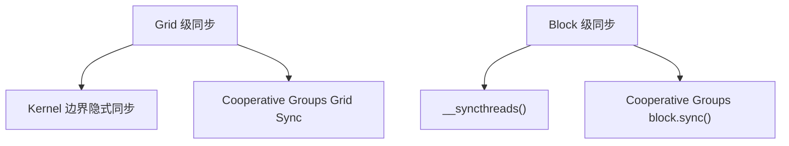
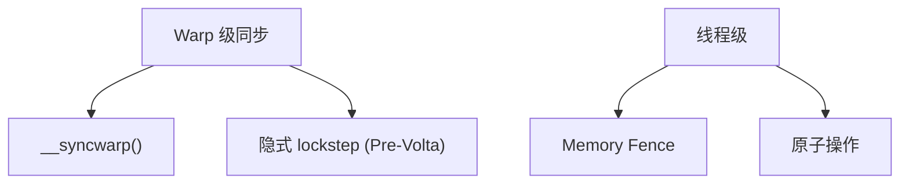

正确的同步机制是编写无 Bug 并行程序的基础。本文详解 CUDA 中的块内同步 `__syncthreads()`、Warp 级同步、Memory Fence，以及原子操作的使用场景、性能代价与优化技巧，帮助你在保证正确性的前提下写出高性能的并行代码。

<!-- more -->

## 📑 目录

- [1. 为什么并行需要同步](#1-为什么并行需要同步)
- [2. Block 内同步：\_\_syncthreads\(\)](#2-block-内同步__syncthreads)
- [3. Warp 级同步](#3-warp-级同步)
- [4. Memory Fence 与内存可见性](#4-memory-fence-与内存可见性)
- [5. 原子操作](#5-原子操作)
- [6. 原子操作的性能优化](#6-原子操作的性能优化)
- [7. 协作组（Cooperative Groups）](#7-协作组cooperative-groups)
- [总结](#-总结)
- [自我检验清单](#-自我检验清单)
- [参考资料](#-参考资料)

---

## 1. 为什么并行需要同步

在串行程序中，语句按顺序执行，后面的语句总能看到前面语句的结果。但在并行世界中，数千个线程同时运行，如果不加控制，就像一群人同时抢着往同一块白板上写字——结果必然混乱不堪。

同步机制解决两个核心问题：

1. **执行顺序**：确保线程 A 写入的数据在线程 B 读取之前已经完成
2. **内存可见性**：确保一个线程的写入对其他线程"可见"（不被缓存遮挡）

### 1.1 CUDA 同步层级





---

## 2. Block 内同步：\_\_syncthreads()

### 2.1 基本语义

`__syncthreads()` 是 CUDA 中最常用的同步原语，其语义为：

> Block 内的所有线程都到达此屏障点后，才能继续向下执行。同时保证屏障前的所有内存写入对 Block 内所有线程可见。

这就像一群人约好在路口集合，所有人到齐之后才一起出发。

### 2.2 典型使用场景

```cpp
__global__ void shared_memory_example(float* input, float* output, int N) {
    __shared__ float smem[256];
    int tid = threadIdx.x;
    int gid = blockIdx.x * blockDim.x + tid;

    // 阶段一：所有线程将数据从全局内存加载到共享内存
    smem[tid] = (gid < N) ? input[gid] : 0.0f;

    // 必须同步！确保所有线程的写入完成后再读取
    __syncthreads();

    // 阶段二：每个线程读取其他线程写入的数据
    float left = (tid > 0) ? smem[tid - 1] : 0.0f;
    float right = (tid < blockDim.x - 1) ? smem[tid + 1] : 0.0f;
    output[gid] = left + smem[tid] + right;
}
```

⚠️ **注意**：如果删除 `__syncthreads()`，线程可能读到未初始化的共享内存值（其他线程尚未完成写入），导致结果错误且难以调试（因为行为取决于时序，可能偶尔正确）。

### 2.3 使用规则与陷阱

**规则一：所有线程必须到达同一个 `__syncthreads()`**

```cpp
// ❌ 致命错误：条件分支中使用 __syncthreads()
if (threadIdx.x < 128) {
    __syncthreads();  // 只有前128个线程到达这里
}
// 后128个线程永远不会到达 → 程序死锁或未定义行为

// ✅ 正确做法：同步放在条件外部
if (threadIdx.x < 128) {
    // 做一些工作
}
__syncthreads();  // 所有线程都到达这里
```

**规则二：在循环中使用时，确保所有线程循环次数相同**

```cpp
// ❌ 危险：不同线程循环次数不同
for (int i = 0; i < array_len[threadIdx.x]; i++) {
    smem[threadIdx.x] = data[i];
    __syncthreads();  // 如果有线程提前退出循环 → 死锁
    // ...
}

// ✅ 正确做法：统一循环次数
int max_len = MAX_ARRAY_LEN;  // 编译时常量或块内最大值
for (int i = 0; i < max_len; i++) {
    if (i < array_len[threadIdx.x]) {
        smem[threadIdx.x] = data[i];
    }
    __syncthreads();
    // ...
}
```

### 2.4 __syncthreads() 的性能代价

`__syncthreads()` 本身的硬件开销很低（通常几个时钟周期），真正的代价在于：

1. **等待最慢的线程**：如果一些线程需要更长时间才能到达屏障（比如因为分支分歧或内存延迟不均），其他线程只能空等
2. **流水线断裂**：屏障点会打断编译器的指令重排优化

💡 **提示**：尽量减少 `__syncthreads()` 的使用次数。如果 Kernel 中有多个阶段的共享内存读写，考虑能否重新组织算法，将多次同步合并为一次。

---

## 3. Warp 级同步

### 3.1 隐式同步（Pre-Volta）

在 Volta 之前的架构（Pascal、Maxwell 等），同一 Warp 内的线程以 lockstep 方式执行——硬件保证它们始终在同一条指令上。因此 Warp 内的线程天然同步，不需要显式屏障。

```cpp
// Pre-Volta：Warp 内无需同步即可安全通信
// （但这是未定义行为，不推荐依赖）
__shared__ float smem[256];
smem[threadIdx.x] = value;
// 同 Warp 内的线程此刻已经全部完成写入
float neighbor = smem[threadIdx.x ^ 1];  // Warp 内安全（但不规范）
```

### 3.2 显式 Warp 同步（Volta+）

从 Volta 开始引入独立线程调度，同一 Warp 内的线程**可能**不再步调一致。因此需要显式同步：

```cpp
__shared__ float smem[256];
smem[threadIdx.x] = value;

// Volta+ 架构必须显式同步
__syncwarp(0xFFFFFFFF);  // 确保 Warp 内 32 个线程都完成写入

float neighbor = smem[threadIdx.x ^ 1];
```

`__syncwarp(mask)` 的参数是参与同步的线程掩码。通常使用 `0xFFFFFFFF`（所有 32 个线程），但如果你知道只有部分线程参与，可以使用更精确的掩码。

### 3.3 何时需要 __syncwarp()

| 场景 | Pre-Volta | Volta+ |
|------|-----------|--------|
| Warp 内通过共享内存通信 | 隐式安全（但不推荐） | 必须 `__syncwarp()` |
| Warp Shuffle 前后 | 不需要 | 不需要（Shuffle 自带同步语义） |
| Warp Vote 前后 | 不需要 | 不需要 |
| Warp 内的归约循环 | 不需要额外同步 | Shuffle 版本不需要 |

---

## 4. Memory Fence 与内存可见性

### 4.1 为什么需要 Memory Fence

`__syncthreads()` 解决了 Block 内的同步问题，但跨 Block 通信怎么办？GPU 没有全局屏障（传统意义上），但提供了 Memory Fence 保证内存写入的可见性。

Memory Fence 不会阻塞线程执行，它只保证：**Fence 之前的内存写入在 Fence 之后对目标范围内的其他线程可见**。

### 4.2 三个层级的 Fence

```cpp
// Block 级：确保写入对同一 Block 内的线程可见
__threadfence_block();

// Device 级：确保写入对同一 GPU 上所有线程可见
__threadfence();

// System 级：确保写入对系统内所有设备（包括 CPU、其他 GPU）可见
__threadfence_system();
```

### 4.3 经典用例：跨 Block 归约中的标志位

```cpp
__device__ unsigned int block_counter = 0;

__global__ void multi_block_reduce(float* input, float* output,
                                    float* partial, int N) {
    // 步骤1：每个 Block 做局部归约，结果写入 partial[blockIdx.x]
    float block_sum = block_level_reduce(input, N);
    if (threadIdx.x == 0) {
        partial[blockIdx.x] = block_sum;

        // 确保 partial 的写入对其他 Block 可见
        __threadfence();

        // 原子递增计数器，最后一个完成的 Block 负责最终归约
        unsigned int ticket = atomicInc(&block_counter, gridDim.x);

        // 判断是否是最后一个完成的 Block
        if (ticket == gridDim.x - 1) {
            // 这个 Block 是最后一个，可以安全读取所有 partial 值
            float total = 0.0f;
            for (int i = 0; i < gridDim.x; i++) {
                total += partial[i];
            }
            output[0] = total;
            block_counter = 0;  // 重置
        }
    }
}
```

📌 **关键点**：`__threadfence()` 确保 `partial[blockIdx.x]` 的写入在 `atomicInc` 之前对全局可见。没有这道 Fence，最后一个 Block 可能读到其他 Block 的旧值。

---

## 5. 原子操作

### 5.1 什么是原子操作

原子操作（Atomic Operation）是不可分割的读-修改-写操作。就像银行柜台一次只处理一个客户——在一个线程的原子操作完成之前，其他线程对同一地址的访问会被排队等候。

```cpp
// 非原子操作（data race！）
// 线程A：读 counter=5, 加1, 写回6
// 线程B：读 counter=5, 加1, 写回6  ← 丢失了线程A的更新！
counter += 1;

// 原子操作（正确）
// 硬件保证 读→改→写 在一条不可中断的操作中完成
atomicAdd(&counter, 1);
```

### 5.2 CUDA 原子操作清单

| 📊 操作 | 函数 | 支持类型 |
|---------|------|---------|
| 加法 | `atomicAdd(addr, val)` | int, unsigned, float, double |
| 减法 | `atomicSub(addr, val)` | int, unsigned |
| 最小值 | `atomicMin(addr, val)` | int, unsigned |
| 最大值 | `atomicMax(addr, val)` | int, unsigned |
| 交换 | `atomicExch(addr, val)` | int, unsigned, float |
| CAS | `atomicCAS(addr, compare, val)` | int, unsigned, unsigned long long |
| 按位与 | `atomicAnd(addr, val)` | int, unsigned |
| 按位或 | `atomicOr(addr, val)` | int, unsigned |
| 按位异或 | `atomicXor(addr, val)` | int, unsigned |
| 递增 | `atomicInc(addr, val)` | unsigned |
| 递减 | `atomicDec(addr, val)` | unsigned |

### 5.3 原子操作的性能代价

原子操作的代价取决于**冲突程度**——多少个线程同时竞争同一个地址：

| 📊 场景 | 性能影响 |
|---------|---------|
| 所有线程原子操作不同地址 | 接近非原子操作的速度 |
| 同一 Warp 内多线程竞争同一地址 | 串行化，最差 32x 慢 |
| 跨 Block 大量线程竞争同一地址 | 极慢，可能成为严重瓶颈 |

**全局内存上的原子操作**延迟约 400\~600 cycles（需要一路走到 L2 或 DRAM 完成操作）。**共享内存上的原子操作**延迟约 20~100 cycles（在 SM 内部完成）。

### 5.4 atomicCAS：万能原子操作

`atomicCAS`（Compare-And-Swap）是最底层的原子原语，其他所有原子操作都可以用它实现：

```cpp
// atomicCAS 语义：
// old = *addr;
// if (old == compare) *addr = val;
// return old;

// 用 CAS 实现 atomicAdd for double（旧架构不直接支持 double atomicAdd）
__device__ double atomicAddDouble(double* addr, double val) {
    unsigned long long int* addr_as_ull = (unsigned long long int*)addr;
    unsigned long long int old = *addr_as_ull;
    unsigned long long int assumed;

    do {
        assumed = old;
        old = atomicCAS(addr_as_ull, assumed,
                       __double_as_longlong(
                           __longlong_as_double(assumed) + val));
    } while (assumed != old);
    // CAS 失败意味着其他线程修改了值，需要重试

    return __longlong_as_double(old);
}
```

⚠️ **注意**：CAS 循环在高竞争下可能重试多次，性能急剧下降。这是为什么应该尽量减少原子冲突的根本原因。

---

## 6. 原子操作的性能优化

### 6.1 策略一：分层归约减少冲突

最经典的优化模式——不要让所有线程直接 `atomicAdd` 到同一地址，而是分层聚合：

```cpp
__global__ void hierarchical_reduce(float* input, float* output, int N) {
    __shared__ float block_sum;
    if (threadIdx.x == 0) block_sum = 0.0f;
    __syncthreads();

    int gid = blockIdx.x * blockDim.x + threadIdx.x;
    float val = (gid < N) ? input[gid] : 0.0f;

    // 第一层：Warp 内归约（无需原子操作）
    for (int offset = 16; offset > 0; offset >>= 1) {
        val += __shfl_down_sync(0xFFFFFFFF, val, offset);
    }

    // 第二层：每个 Warp 的 lane 0 原子加到共享内存
    // 只有 blockDim.x/32 个线程竞争 → 冲突很小
    if (threadIdx.x % 32 == 0) {
        atomicAdd(&block_sum, val);
    }
    __syncthreads();

    // 第三层：每个 Block 的 thread 0 原子加到全局结果
    // 只有 gridDim.x 个线程竞争（远少于总线程数）
    if (threadIdx.x == 0) {
        atomicAdd(output, block_sum);
    }
}
```

冲突分析：
- 直接全局原子：N 个线程竞争 1 个地址
- 分层后：Warp 归约无冲突 + 8 个线程/Block 竞争共享内存 + gridDim.x 个线程竞争全局地址

### 6.2 策略二：共享内存原子代替全局内存原子

```cpp
// ❌ 每个线程直接对全局内存做 atomicAdd
__global__ void histogram_naive(int* data, int* hist, int N) {
    int tid = threadIdx.x + blockIdx.x * blockDim.x;
    if (tid < N) {
        atomicAdd(&hist[data[tid]], 1);  // 全局内存原子，慢
    }
}

// ✅ 先在共享内存聚合，再写回全局
__global__ void histogram_shared(int* data, int* hist, int N, int numBins) {
    __shared__ int local_hist[256];  // 假设 bin 数 <= 256

    // 初始化局部直方图
    if (threadIdx.x < numBins) {
        local_hist[threadIdx.x] = 0;
    }
    __syncthreads();

    // 在共享内存上做原子加（快得多）
    int tid = threadIdx.x + blockIdx.x * blockDim.x;
    if (tid < N) {
        atomicAdd(&local_hist[data[tid]], 1);
    }
    __syncthreads();

    // 将局部结果原子加回全局（只有 numBins 次全局原子操作）
    if (threadIdx.x < numBins) {
        atomicAdd(&hist[threadIdx.x], local_hist[threadIdx.x]);
    }
}
```

### 6.3 策略三：私有化（Privatization）

每个线程或每个 Warp 维护私有副本，最后再合并：

```cpp
__global__ void privatized_histogram(int* data, int* hist, int N) {
    // 每个线程维护私有计数器（适用于 bin 数很少的情况）
    int private_hist[4] = {0, 0, 0, 0};  // 假设只有4个 bin

    int tid = threadIdx.x + blockIdx.x * blockDim.x;
    int stride = blockDim.x * gridDim.x;

    for (int i = tid; i < N; i += stride) {
        private_hist[data[i]]++;  // 纯寄存器操作，无冲突
    }

    // 最终写回（大幅减少原子操作次数）
    for (int bin = 0; bin < 4; bin++) {
        if (private_hist[bin] > 0) {
            atomicAdd(&hist[bin], private_hist[bin]);
        }
    }
}
```

### 6.4 策略四：Warp 聚合原子（CUDA 9+）

在某些场景下，同一 Warp 的多个线程要对同一地址做 `atomicAdd`。可以利用 Warp 级归约先求和，再由一个线程执行一次原子操作：

```cpp
__device__ int atomicAggInc(int* counter) {
    // 找出 Warp 内所有要做 +1 的线程
    unsigned int active = __activemask();
    int leader = __ffs(active) - 1;  // 选出领导者（最低位的活跃线程）
    int lane = threadIdx.x % 32;

    int num_peers = __popc(active);  // 活跃线程数

    int old_val;
    if (lane == leader) {
        old_val = atomicAdd(counter, num_peers);  // 一次原子操作代替多次
    }
    old_val = __shfl_sync(active, old_val, leader);

    // 每个线程得到自己的唯一递增值
    int rank = __popc(active & ((1 << lane) - 1));  // 在活跃线程中的排名
    return old_val + rank;
}
```

---

## 7. 协作组（Cooperative Groups）

### 7.1 为什么需要 Cooperative Groups

传统的 `__syncthreads()` 和 `__syncwarp()` 是固定粒度的同步——要么整个 Block，要么整个 Warp。Cooperative Groups（CUDA 9+）提供了灵活的线程分组和同步机制：

```cpp
#include <cooperative_groups.h>
namespace cg = cooperative_groups;
```

### 7.2 常用线程组类型

```cpp
__global__ void cg_example() {
    // 获取当前 Block 的线程组
    cg::thread_block block = cg::this_thread_block();

    // 获取当前 Warp 的线程组
    cg::coalesced_group active = cg::coalesced_threads();

    // 将 Block 分成固定大小的 Tile（必须是 2 的幂且 <= 32）
    cg::thread_block_tile<16> tile16 = cg::tiled_partition<16>(block);

    // 在任意线程组上同步
    block.sync();    // 等价于 __syncthreads()
    tile16.sync();   // 只同步 16 线程的 Tile
}
```

### 7.3 Cooperative Groups 归约

```cpp
__device__ float cg_reduce_sum(cg::thread_block_tile<32>& warp, float val) {
    // 使用 cooperative groups 的 shfl_down
    for (int offset = warp.size() / 2; offset > 0; offset >>= 1) {
        val += warp.shfl_down(val, offset);
    }
    return val;
}

__global__ void cg_kernel(float* input, float* output, int N) {
    cg::thread_block block = cg::this_thread_block();
    cg::thread_block_tile<32> warp = cg::tiled_partition<32>(block);

    int gid = block.group_index().x * block.group_dim().x + block.thread_rank();
    float val = (gid < N) ? input[gid] : 0.0f;

    // Warp 级归约
    float warp_sum = cg_reduce_sum(warp, val);

    // ... 后续 Block 级归约
}
```

### 7.4 Grid 级同步

Cooperative Groups 甚至支持跨所有 Block 的 Grid 级同步（需要所有 Block 同时驻留在 GPU 上）：

```cpp
__global__ void grid_sync_kernel(float* data, int N) {
    cg::grid_group grid = cg::this_grid();

    // 第一阶段：所有 Block 处理数据
    int gid = grid.thread_rank();
    if (gid < N) data[gid] *= 2.0f;

    // Grid 级同步：等待所有 Block 完成第一阶段
    grid.sync();

    // 第二阶段：可以安全读取其他 Block 写入的数据
    if (gid < N && gid > 0) {
        data[gid] += data[gid - 1];
    }
}

// 启动时需要使用 cooperative launch
cudaLaunchCooperativeKernel(
    (void*)grid_sync_kernel, grid, block, args, 0, stream);
```

⚠️ **注意**：Grid Sync 要求所有 Block 能同时驻留（Occupancy 允许），否则会死锁。因此 Grid 的大小有上限。

---

## 📝 总结

| 同步机制 | 作用范围 | 使用场景 | 性能代价 |
|---------|---------|---------|---------|
| `__syncthreads()` | Block 内所有线程 | 共享内存读写之间 | 低（等待最慢线程） |
| `__syncwarp()` | Warp 内 32 线程 | Volta+ 架构 Warp 内通信 | 极低 |
| `__threadfence()` | Device 全局 | 跨 Block 的标志位/信号 | 中等（刷新缓存） |
| 原子操作 | 特定地址 | 多线程竞争更新同一值 | 高（取决于冲突度） |
| Cooperative Groups | 灵活分组 | 任意粒度的同步和归约 | 取决于组大小 |

原子操作优化策略速查：

| 策略 | 方法 | 收益 |
|------|------|------|
| 分层归约 | Warp→Block→Grid 逐层聚合 | 冲突从 N 降到 gridDim.x |
| 共享内存原子 | 先在 smem 聚合再写全局 | 延迟从 400cy 降到 20cy |
| 私有化 | 每线程/Warp 维护副本，最终合并 | 消除运行时冲突 |
| Warp 聚合 | Warp 内归约后一次原子操作 | 冲突减少 32x |

---

## 🎯 自我检验清单

- 能正确使用 `__syncthreads()` 并避免死锁陷阱（条件分支、不等循环）
- 能解释 `__syncwarp()` 在 Volta+ 架构中为何必要
- 能区分 `__threadfence_block()`、`__threadfence()`、`__threadfence_system()` 的适用范围
- 能使用原子操作 + Memory Fence 实现跨 Block 的全局归约
- 能正确使用 `atomicCAS` 实现自定义原子操作
- 能将"所有线程 atomicAdd 到同一地址"优化为分层归约方案
- 能使用共享内存原子操作实现高效直方图
- 能解释原子操作的性能与冲突度的关系
- 能使用 Cooperative Groups 实现灵活粒度的同步
- 能判断 Grid Sync 的适用条件和 Block 数量限制

---

## 📚 参考资料

- [NVIDIA CUDA C++ Programming Guide - Synchronization Functions](https://docs.nvidia.com/cuda/cuda-c-programming-guide/index.html#synchronization-functions)
- [NVIDIA CUDA C++ Programming Guide - Atomic Functions](https://docs.nvidia.com/cuda/cuda-c-programming-guide/index.html#atomic-functions)
- [NVIDIA CUDA C++ Programming Guide - Cooperative Groups](https://docs.nvidia.com/cuda/cuda-c-programming-guide/index.html#cooperative-groups)
- [CUDA Pro Tip: Optimized Filtering with Warp-Aggregated Atomics - NVIDIA Developer Blog](https://developer.nvidia.com/blog/cuda-pro-tip-optimized-filtering-warp-aggregated-atomics/)
- [Cooperative Groups: Flexible CUDA Thread Programming - NVIDIA Developer Blog](https://developer.nvidia.com/blog/cooperative-groups/)
