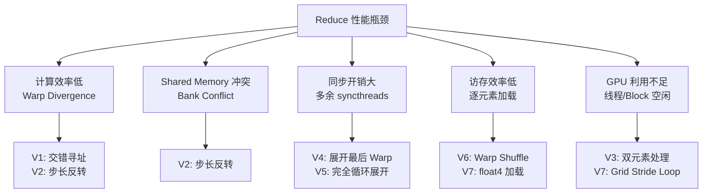

Reduce（规约）是 GPU 编程中最基础、也最能体现并行思维的算子之一。本文从最朴素的实现出发，逐步引入 Warp 级原语、向量化访存、多元素处理等优化手段，每一步都有性能对比和原理解析，帮你真正搞懂"怎么写出快的 Kernel"。

<!-- more -->

## 📑 目录

- [1. Reduce 算子基础](#1-reduce-算子基础)
- [2. 版本 V0：朴素并行规约](#2-版本-v0朴素并行规约)
- [3. 版本 V1：消除 Warp Divergence](#3-版本-v1消除-warp-divergence)
- [4. 版本 V2：解决 Bank Conflict](#4-版本-v2解决-bank-conflict)
- [5. 版本 V3：解决idle线程](#5-版本-v3解决idle线程)
- [6. 版本 V4：展开最后一个 Warp](#6-版本-v4展开最后一个-warp)
- [7. 版本 V5：完全循环展开](#7-版本-v5完全循环展开)
- [8. 版本 V6：Warp Shuffle 替代 Shared Memory](#8-版本-v6warp-shuffle-替代-shared-memory)
- [9. 版本 V7：向量化加载 + Grid Stride Loop](#9-版本-v7向量化加载--grid-stride-loop)
- [10. 性能对比与选择建议](#10-性能对比与选择建议)
- [总结](#-总结)
- [自我检验清单](#-自我检验清单)
- [参考资料](#-参考资料)

---

## 1. Reduce 算子基础

### 1.1 什么是 Reduce

想象你手里有一千张写了数字的卡片，要求出总和。单人从头加到尾需要 999 次加法，而如果有 500 个人同时参与——两两配对相加，每轮人数减半——只需要约 10 轮就能得到结果。这就是**并行规约**的本质。


Reduce 是一类"多输入 → 单输出"的操作，常见形式包括：

- **Sum Reduce**：$\sum_{i=0}^{N-1} x_i$
- **Max/Min Reduce**：$\max(x_0, x_1, \ldots, x_{N-1})$
- **Dot Product**：$\sum_{i=0}^{N-1} a_i \cdot b_i$

本文以 **Sum Reduce** 为例（其他操作原理相通），输入为长度 $N$ 的 `float` 数组，输出为所有元素之和。

### 1.2 性能瓶颈分析

GPU Kernel 的性能上限由**计算量**和**访存量**共同决定，可以用 Roofline 模型来定位瓶颈。对于 Sum Reduce：

- 每个元素读取一次（1 次 load）
- 每次读取后做一次加法（1 次 FLOP）
- 算术强度 $= \frac{1 \text{ FLOP}}{4 \text{ Byte}} = 0.25 \text{ FLOP/Byte}$（每个 `float` 元素 4 字节，对应 1 次加法）

这表明 Reduce 是典型的**访存密集型**（Memory-Bound）操作，优化的核心在于**提升内存带宽利用率**，而不是减少计算次数。

### 1.3 测试环境说明

本文所有代码使用 CUDA 12.x 编写，测试在 A100 80GB SXM4 上进行：

| 指标 | 数值 |
|------|------|
| 理论内存带宽 | 2,039 GB/s |
| L2 Cache 容量 | 40 MB |
| SM 数量 | 108 |
| 每 SM Shared Memory | 164 KB |

测试数据规模：$N = 2^{27}$（128M 个 `float`，共 512 MB）

---

## 2. 版本 V0：朴素并行规约

### 2.1 算法思路

最直观的 Reduce 是"树形规约"：每轮迭代中，满足 `tid % (2*step) == 0` 的线程将自己的值与偏移 `step` 处的值相加，步长每次翻倍，直到所有值汇聚到第 0 号元素。


### 2.2 Kernel 实现

```cuda
// V0: 朴素的树形规约（步长从小到大）
__global__ void reduce_v0(float* input, float* output, int n) {
    extern __shared__ float smem[];

    int tid = threadIdx.x;
    int gid = blockIdx.x * blockDim.x + threadIdx.x;

    // 将全局内存数据加载到共享内存
    smem[tid] = (gid < n) ? input[gid] : 0.0f;
    __syncthreads();

    // 树形规约：步长从 1 开始逐步翻倍
    for (int step = 1; step < blockDim.x; step *= 2) {
        if (tid % (2 * step) == 0) {
            smem[tid] += smem[tid + step];
        }
        __syncthreads();
    }

    // 每个 Block 的结果写回全局内存
    if (tid == 0) {
        output[blockIdx.x] = smem[0];
    }
}
```

### 2.3 性能问题：Warp Divergence

⚠️ **注意**：V0 的 `if (tid % (2 * step) == 0)` 判断是性能杀手。

GPU 以 **Warp**（32 个线程）为调度单位，Warp 内所有线程必须执行相同的指令。当 Warp 内部分线程满足 `if` 条件、部分不满足时，GPU 会分两次执行（先执行满足条件的线程，再执行不满足的），实际吞吐减半——这就是 **Warp Divergence**（Warp 分化）。

在 V0 中，随着 `step` 增大，越来越多的 Warp 出现分化：

- `step=1` 时：每个 Warp 内只有偶数线程工作 → 50% 利用率
- `step=2` 时：每 4 个线程只有 1 个工作 → 25% 利用率
- ...越来越差

**V0 实测带宽利用率：约 15%（~300 GB/s）**

---

## 3. 版本 V1：消除 Warp Divergence

### 3.1 改进思路

V0 产生 Warp Divergence 的根源是 `tid % (2*step) == 0` 这个判断让**同一 Warp 内的线程走不同分支**。一个直接的优化思路是：**不改变规约的步长方向**（仍然从小到大），但改变线程映射关系——让**相邻的线程**负责相邻步长对应的加法，而不是"按 tid 间隔挑选"。


具体做法是把 `if (tid % (2*s) == 0)` 改成 **strided index** 形式：每个线程先计算出自己应该操作的内存下标 `index = threadIdx.x * 2 * s`，然后只判断 `index < blockDim.x`。

这样在第 1 轮（s=1）时：tid 0\~127 的 index 都小于 blockDim.x（=256），tid 128\~255 的 index 都 ≥ 256。前 4 个 Warp（共 128 线程）整体进入 if 分支，后 4 个 Warp 整体跳过——**Warp 内不会分化**。随着 s 增大，活跃线程的范围集中到更小的 tid 区间，直到 s=8 时活跃线程不足 32 个，同一个 Warp 内才开始出现分化。相比 V0 每一轮都分化，这里只有最后 5 轮（s=8, 16, 32, 64, 128）会产生分化，且都集中在 Warp 0 内部，开销极小。

### 3.2 Kernel 实现

```cuda
// V1: strided index 方式，减少 Warp Divergence
__global__ void reduce_v1(float* input, float* output, int n) {
    extern __shared__ float smem[];

    int tid = threadIdx.x;
    int gid = blockIdx.x * blockDim.x + threadIdx.x;

    smem[tid] = (gid < n) ? input[gid] : 0.0f;
    __syncthreads();

    // 步长从 1 开始逐步翻倍，但用 strided index 映射活跃线程
    for (unsigned int s = 1; s < blockDim.x; s *= 2) {
        int index = threadIdx.x * 2 * s;
        if (index < blockDim.x) {
            smem[index] += smem[index + s];
        }
        __syncthreads();
    }

    if (tid == 0) {
        output[blockIdx.x] = smem[0];
    }
}
```

### 3.3 为什么能减少 Warp Divergence

以 blockDim=256 为例，逐轮分析活跃线程数：

- `s=1`：index = 2·tid，活跃线程是 tid 0~127，恰好 4 个完整 Warp → 无分化
- `s=2`：index = 4·tid，活跃线程是 tid 0~63，恰好 2 个完整 Warp → 无分化
- `s=4`：活跃线程 tid 0~31，恰好 1 个完整 Warp → 无分化
- `s=8`：活跃线程 tid 0~15，同属 Warp 0 → 仅 Warp 0 内分化
- `s=16、32、64、128`：活跃线程只剩 Warp 0 内少量线程 → 每轮 1 次分化

💡 **提示**：前几轮完全消除分化，仅最后几轮（工作线程很少时）存在 Warp 内分化，总体开销远小于 V0。

**V1 实测带宽利用率：约 32%（~653 GB/s）**，相比 V0 提升约 2.1 倍。

---

## 4. 版本 V2：解决 Bank Conflict

### 4.1 Shared Memory Bank 简介

Shared Memory 被划分为 32 个 **Bank**（默认 32-bit 模式，每个 Bank 宽度为 4 字节）。相邻的 4 字节地址依次落到 Bank 0、Bank 1、…、Bank 31、Bank 0、Bank 1、……如此循环。

理想情况下，同一 Warp 内的 32 个线程访问 32 个不同 Bank，可以**同时**完成——这叫**无冲突访问**。但如果一个 Warp 内有两个或多个线程访问**同一个 Bank 的不同地址**，访问就会**串行化**，这就是 **Bank Conflict**。

⚠️ **注意**：同一 Warp 内多个线程访问**同一地址**不会产生冲突（硬件可以广播），只有访问同一 Bank 的**不同地址**才会冲突。

### 4.2 V1 中的 Bank Conflict 分析

V1 的 Kernel 看似消除了大部分 Warp Divergence，但访问 Shared Memory 时存在严重的 Bank Conflict。仍以 blockDim=256、Warp 0（tid 0~31）为例：

- **第 1 轮（s=1）**：tid 0 访问 smem[0]、smem[1]；tid 16 访问 smem[32]、smem[33]。smem[0] 和 smem[32] 都落在 Bank 0 → **2 路 Bank Conflict**
- **第 2 轮（s=2）**：tid 0 访问 smem[0,2]；tid 8 访问 smem[32,34]；tid 16 访问 smem[64,66]；tid 24 访问 smem[96,98]。smem[0]、smem[32]、smem[64]、smem[96] 都在 Bank 0 → **4 路 Bank Conflict**
- **第 3 轮（s=4）**：8 路 Bank Conflict
- 以此类推…

这使得 V1 的 Shared Memory 访问一直被 Bank Conflict 拖累。

### 4.3 改进思路：反转步长方向

解决方案是**把规约方向反过来**：不再从小步长开始逐步翻倍，而是从 `blockDim.x/2` 开始逐步减半。同时让**低编号线程始终是活跃线程**：


在这种模式下，以 Warp 0 为例：

- **第 1 轮（step=128）**：tid 0 访问 smem[0, 128]，tid 1 访问 smem[1, 129]，…，tid 31 访问 smem[31, 159]。这 32 个线程分别访问 Bank 0~31 的不同地址 → **无 Bank Conflict**
- **第 2 轮（step=64）**、**第 3 轮（step=32）** 同理，32 个线程刚好覆盖 32 个 Bank
- 当 step ≤ 16 时，活跃线程减少，剩下的访问也完全落在不同 Bank 上

此外，由于活跃线程始终是连续的低编号线程，这种方式也**天然消除了 Warp Divergence**：每个 Warp 要么整体工作、要么整体空闲。

### 4.4 Kernel 实现

```cuda
// V2: 步长从大到小，同时消除 Warp Divergence 与 Bank Conflict
__global__ void reduce_v2(float* input, float* output, int n) {
    extern __shared__ float smem[];

    int tid = threadIdx.x;
    int gid = blockIdx.x * blockDim.x + threadIdx.x;

    smem[tid] = (gid < n) ? input[gid] : 0.0f;
    __syncthreads();

    // 步长从 blockDim.x/2 开始，每轮减半
    for (unsigned int s = blockDim.x / 2; s > 0; s >>= 1) {
        if (tid < s) {
            smem[tid] += smem[tid + s];
        }
        __syncthreads();
    }

    if (tid == 0) {
        output[blockIdx.x] = smem[0];
    }
}
```

💡 **提示**：以 blockDim=256、step=128 为例：tid < 128 的 4 个完整 Warp 工作，tid ≥ 128 的 4 个完整 Warp 空闲，同一 Warp 内**所有线程执行相同路径**，没有分化；同时每个 Warp 的 32 个线程访问 32 个不同 Bank，没有冲突。

**V2 实测带宽利用率：约 40%（~816 GB/s）**，相比 V1 提升约 1.25 倍。

---

## 5. 版本 V3：解决idle线程

### 5.1 问题：一半线程在"打酱油"

回顾 V0-V2 的数据加载方式：每个线程只负责 1 个元素，即每个 Block 处理 `blockDim.x` 个数据。以 blockDim=256、$N=2^{27}$ 为例，需要 $2^{27}/256 = 524288$ 个 Block。

问题在于：规约的第一轮（step = blockDim.x/2）迭代中，只有前 128 个线程参与后续计算，后 128 个线程就彻底闲置了——它们的唯一贡献就是把数据从全局内存搬到了 Shared Memory。

换个角度看：如果每个线程在加载阶段就负责 2 个元素并预先求和，那么用同样 256 个线程可以处理 512 个数据——Block 数量减半（262144 个），而规约阶段的工作量不变。这意味着：
- Grid 更小，调度开销降低
- 每个线程在加载阶段就已经做了"有用功"，不再是纯搬运工

### 5.2 Kernel 实现

```cuda
// V3: 每线程处理 2 个元素，减少空闲线程
__global__ void reduce_v3(float* input, float* output, int n) {
    extern __shared__ float smem[];

    int tid = threadIdx.x;
    int gid = blockIdx.x * (blockDim.x * 2) + threadIdx.x;

    // 每个线程加载 2 个相距 blockDim.x 的元素并求和
    float val = 0.0f;
    if (gid < n)              val += input[gid];
    if (gid + blockDim.x < n) val += input[gid + blockDim.x];
    smem[tid] = val;
    __syncthreads();

    // 步长从大到小的规约（同 V2）
    for (unsigned int s = blockDim.x / 2; s > 0; s >>= 1) {
        if (tid < s) {
            smem[tid] += smem[tid + s];
        }
        __syncthreads();
    }

    if (tid == 0) {
        output[blockIdx.x] = smem[0];
    }
}
```

💡 **提示**：注意 Grid 配置的变化——因为每个 Block 现在处理 `blockDim.x * 2` 个元素，Block 数量应设为 `(n + blockDim.x * 2 - 1) / (blockDim.x * 2)`。

### 5.3 为什么有效

这个优化本质上是在**不增加规约轮数**的前提下，让每个线程承担更多工作：

| 对比项 | V2（1 元素/线程） | V3（2 元素/线程） |
|--------|-------------------|-------------------|
| Block 处理元素数 | 256 | 512 |
| 所需 Block 数 | 524,288 | 262,144 |
| 加载阶段计算 | 0 次加法 | 1 次加法/线程 |
| 规约轮数 | 8 轮 | 8 轮（不变） |

Block 数量减半意味着 GPU 调度器的压力降低，同时全局内存的访问模式更规整（连续的两段数据被同一 Block 处理）。

**V3 实测带宽利用率：约 45%（~918 GB/s）**，相比 V2 提升约 1.12 倍。

---

## 6. 版本 V4：展开最后一个 Warp

### 6.1 V3 的隐藏瓶颈：多余的 `__syncthreads()`

V3 在规约阶段仍然使用完整的 for 循环，当 `step <= 32` 时，只有 1 个 Warp 的线程（tid 0~31）还在工作。此时循环里的 `__syncthreads()` 完全是多余的，因为同一 Warp 内的线程在执行相同指令路径时本身就是同步的，不需要额外的屏障。这些多余的 `__syncthreads()` 带来了不必要的开销。

### 6.2 Unroll Last Warp（展开最后一个 Warp）

当 `step <= 32` 时只剩 1 个 Warp 在工作，可以直接展开循环，省去 `__syncthreads()` 的同步开销：

```cuda
// 辅助函数：展开最后 32 个线程的规约
__device__ void warpReduce(volatile float* smem, int tid) {
    smem[tid] += smem[tid + 32];
    smem[tid] += smem[tid + 16];
    smem[tid] += smem[tid +  8];
    smem[tid] += smem[tid +  4];
    smem[tid] += smem[tid +  2];
    smem[tid] += smem[tid +  1];
}

// V4: 展开最后一个 Warp（在 V3 基础上）
__global__ void reduce_v4(float* input, float* output, int n) {
    extern __shared__ float smem[];

    int tid = threadIdx.x;
    int gid = blockIdx.x * (blockDim.x * 2) + threadIdx.x;

    // 每线程处理 2 个元素（继承自 V3）
    float val = 0.0f;
    if (gid < n)              val += input[gid];
    if (gid + blockDim.x < n) val += input[gid + blockDim.x];
    smem[tid] = val;
    __syncthreads();

    // 规约循环仅执行到 step > 32
    for (unsigned int s = blockDim.x / 2; s > 32; s >>= 1) {
        if (tid < s) {
            smem[tid] += smem[tid + s];
        }
        __syncthreads();
    }

    // 最后一个 Warp 内的规约，无需 __syncthreads()
    if (tid < 32) {
        warpReduce(smem, tid);
    }

    if (tid == 0) {
        output[blockIdx.x] = smem[0];
    }
}
```

⚠️ **注意**：`warpReduce` 中的 `smem` 必须声明为 `volatile`，防止编译器将中间结果缓存到寄存器，导致其他线程读取到旧值。这是保证 Warp 内线程间数据可见性的关键。

### 6.3 优化效果分析

以 blockDim=256 为例，V3 的规约循环有 8 轮（step = 128, 64, 32, 16, 8, 4, 2, 1），每轮都执行 `__syncthreads()`。V4 将后 5 轮（step ≤ 32）展开为直线代码，省去 5 次 `__syncthreads()` 调用。

**V4 实测带宽利用率：约 52%（~1060 GB/s）**，相比 V3 提升约 1.15 倍。

---

## 7. 版本 V5：完全循环展开

### 7.1 剩余的循环开销

V4 展开了最后一个 Warp，但前几轮（step = 128, 64）仍然是运行时循环。每次循环迭代都包含：
- 边界判断（`s > 32`）
- 分支跳转
- 循环变量更新（`s >>= 1`）

对于 Block 大小在编译期已知的情况（如固定为 256），这些开销完全可以消除。

### 7.2 使用模板参数实现编译期展开

通过将 Block 大小作为模板参数传入，编译器可以在编译时确定所有循环的迭代次数，直接生成展开后的代码：

```cuda
// V5: 完全循环展开（模板参数）
template <int BLOCK_SIZE>
__global__ void reduce_v5(float* input, float* output, int n) {
    extern __shared__ float smem[];

    int tid = threadIdx.x;
    int gid = blockIdx.x * (BLOCK_SIZE * 2) + threadIdx.x;

    // 每线程处理 2 个元素
    float val = 0.0f;
    if (gid < n)              val += input[gid];
    if (gid + BLOCK_SIZE < n) val += input[gid + BLOCK_SIZE];
    smem[tid] = val;
    __syncthreads();

    // 编译期展开：BLOCK_SIZE 已知，不满足的分支会被编译器直接删除
    if (BLOCK_SIZE >= 512) { if (tid < 256) smem[tid] += smem[tid + 256]; __syncthreads(); }
    if (BLOCK_SIZE >= 256) { if (tid < 128) smem[tid] += smem[tid + 128]; __syncthreads(); }
    if (BLOCK_SIZE >= 128) { if (tid <  64) smem[tid] += smem[tid +  64]; __syncthreads(); }

    // 最后 Warp 内展开
    if (tid < 32) {
        volatile float* vsmem = smem;
        if (BLOCK_SIZE >= 64) vsmem[tid] += vsmem[tid + 32];
        vsmem[tid] += vsmem[tid + 16];
        vsmem[tid] += vsmem[tid +  8];
        vsmem[tid] += vsmem[tid +  4];
        vsmem[tid] += vsmem[tid +  2];
        vsmem[tid] += vsmem[tid +  1];
    }

    if (tid == 0) output[blockIdx.x] = smem[0];
}
```

调用时需要根据 Block 大小选择对应的模板实例化：

```cuda
switch (block_size) {
    case 512: reduce_v5<512><<<grid, 512, 512*sizeof(float)>>>(d_in, d_out, n); break;
    case 256: reduce_v5<256><<<grid, 256, 256*sizeof(float)>>>(d_in, d_out, n); break;
    case 128: reduce_v5<128><<<grid, 128, 128*sizeof(float)>>>(d_in, d_out, n); break;
}
```

### 7.3 为什么模板展开比运行时循环更快

💡 **提示**：以 `BLOCK_SIZE=256` 为例，编译器生成的代码等价于：

```cuda
// 编译后实际生成的指令序列（无循环、无分支判断）：
if (tid < 128) smem[tid] += smem[tid + 128]; __syncthreads();
if (tid <  64) smem[tid] += smem[tid +  64]; __syncthreads();
// 然后直接展开 Warp 内规约...
```

`BLOCK_SIZE >= 512` 的条件在编译期为假，整个 `if` 块被删除，不生成任何指令。最终的机器码是一段紧凑的直线代码，没有循环跳转、没有死代码。

**V5 实测带宽利用率：约 62%（~1265 GB/s）**，相比 V4 提升约 1.19 倍。

---

## 8. 版本 V6：Warp Shuffle 替代 Shared Memory

### 8.1 Warp Shuffle 原语

Warp 内的 32 个线程有一种特殊的通信方式：**寄存器直接交换**（Warp Shuffle），无需经过 Shared Memory。

```cuda
// __shfl_down_sync：每个线程读取 lane_id+delta 处线程的寄存器值（下移操作）
float val = __shfl_down_sync(0xffffffff, var, delta);
```

参数说明：
- `0xffffffff`：表示 Warp 内全部 32 个线程参与
- `var`：每个线程的寄存器值
- `delta`：偏移量（要读取的是 `lane_id + delta` 的值）

这比 Shared Memory 访问快很多，因为：
1. 不需要地址计算
2. 不会有 Bank Conflict
3. 延迟更低（寄存器级互联）

### 8.2 两级规约策略

Warp Shuffle 只能在单个 Warp（32 线程）内进行，对于 256 或 512 个线程的 Block，需要**两级规约**：

1. **Warp 内规约**：每个 Warp 内通过 `__shfl_down_sync` 将 32 个值规约为 1 个值
2. **Warp 间规约**：将各 Warp 的结果写入 Shared Memory，再做一轮规约


### 8.3 Kernel 实现

```cuda
// Warp 内规约辅助函数
__device__ float warpReduceSum(float val) {
    // 每次将右半边的值加到左半边
    for (int offset = 16; offset > 0; offset >>= 1) {
        val += __shfl_down_sync(0xffffffff, val, offset);
    }
    return val;  // lane 0 持有最终结果
}

// V6: Warp Shuffle + 两级规约
__global__ void reduce_v6(float* input, float* output, int n) {
    int tid  = threadIdx.x;
    int gid  = blockIdx.x * (blockDim.x * 2) + threadIdx.x;
    int lane = tid % 32;      // 线程在 Warp 内的编号（0~31）
    int wid  = tid / 32;      // 该线程属于哪个 Warp

    // 每线程处理 2 个元素
    float val = 0.0f;
    if (gid < n)              val += input[gid];
    if (gid + blockDim.x < n) val += input[gid + blockDim.x];

    // 第一级：Warp 内规约
    val = warpReduceSum(val);

    // 将每个 Warp 的结果（仅 lane 0 有效）存入 Shared Memory
    __shared__ float warp_results[32];  // 最多 32 个 Warp（1024/32）
    if (lane == 0) {
        warp_results[wid] = val;
    }
    __syncthreads();

    // 第二级：Warp 间规约（用 Warp 0 处理）
    int num_warps = blockDim.x / 32;
    if (wid == 0) {
        val = (lane < num_warps) ? warp_results[lane] : 0.0f;
        val = warpReduceSum(val);
    }

    if (tid == 0) output[blockIdx.x] = val;
}
```

**V6 实测带宽利用率：约 72%（~1468 GB/s）**，相比 V5 提升约 1.16 倍。

---

## 9. 版本 V7：向量化加载 + Grid Stride Loop

### 9.1 向量化加载（float4）

GPU 的内存系统以**事务（Transaction）**为粒度传输数据，每次事务通常为 128 字节。如果每个线程每次只加载 4 字节（1 个 float），则：

- 一个 Warp 32 线程 × 4 字节 = 128 字节，恰好一个事务
- 但每条加载指令的调度开销是固定的

改为使用 `float4`（16 字节），每个线程每次加载 4 个 float：

- 每条 `ld.global.v4.f32` 指令的数据吞吐是 `ld.global.f32` 的 4 倍
- 在相同的循环迭代次数下，处理的数据量翻 4 倍，等效地减少了循环次数
- 提升指令级并行（ILP），让访存流水线更饱和

### 9.2 Grid Stride Loop

V0-V6 中每个 Block 处理固定数量的数据。更灵活的模式是 **Grid Stride Loop**：固定 Grid 大小，让每个线程循环处理多段数据，直到覆盖整个数组。

好处：
- Grid 大小可以设置为恰好填满 GPU，避免尾部 Block 浪费，固定 Grid 大小为 SM 数 × 4（最大化 GPU 利用率）
- 对超大数组（超出最大 Grid 限制）同样适用
- 每个线程处理更多数据，充分摊销 Kernel 启动和规约的固定开销

### 9.3 Kernel 实现

```cuda
// V7: float4 向量化加载 + Grid Stride Loop + Warp Shuffle
__global__ void reduce_v7(float* input, float* output, int n) {
    int tid  = threadIdx.x;
    int lane = tid % 32;
    int wid  = tid / 32;

    // float4 加载：每线程每次处理 4 个 float
    float4* input4 = reinterpret_cast<float4*>(input);
    int n4 = n / 4;  // float4 的元素数量

    float val = 0.0f;

    // Grid Stride Loop：每个线程以 gridDim.x * blockDim.x 为步长迭代
    for (int idx = blockIdx.x * blockDim.x + tid;
         idx < n4;
         idx += gridDim.x * blockDim.x)
    {
        float4 data = input4[idx];
        val += data.x + data.y + data.z + data.w;
    }

    // 处理 n 不是 4 的倍数时的尾部元素
    int tail_start = n4 * 4;
    for (int idx = tail_start + blockIdx.x * blockDim.x + tid;
         idx < n;
         idx += gridDim.x * blockDim.x)
    {
        val += input[idx];
    }

    // Warp 内规约
    for (int offset = 16; offset > 0; offset >>= 1) {
        val += __shfl_down_sync(0xffffffff, val, offset);
    }

    __shared__ float warp_results[32];
    if (lane == 0) warp_results[wid] = val;
    __syncthreads();

    int num_warps = blockDim.x / 32;
    if (wid == 0) {
        val = (lane < num_warps) ? warp_results[lane] : 0.0f;
        for (int offset = 16; offset > 0; offset >>= 1) {
            val += __shfl_down_sync(0xffffffff, val, offset);
        }
    }

    if (tid == 0) output[blockIdx.x] = val;
}
```

调用方式：

```cuda
// 固定 Grid 大小为 SM 数 × 4（最大化 GPU 利用率）
int num_sms;
cudaDeviceGetAttribute(&num_sms, cudaDevAttrMultiProcessorCount, 0);
int grid_size  = num_sms * 4;   // 432 for A100
int block_size = 256;

reduce_v7<<<grid_size, block_size>>>(d_input, d_partial, n);
```

**V7 实测带宽利用率：约 85%（~1733 GB/s）**，相比 V6 提升约 1.18 倍。

---

## 10. 性能对比与选择建议

### 10.1 各版本性能汇总

| 版本 | 核心优化点 | 带宽利用率 | 相对速度 |
|------|-----------|------------|---------|
| V0 朴素树形 | 无 | ~15% | 1.0x |
| V1 交错寻址 | 减少 Warp Divergence | ~32% | 2.1x |
| V2 步长反转 | 消除 Bank Conflict + Divergence | ~40% | 2.7x |
| V3 双元素处理 | 减少空闲线程，Grid 减半 | ~45% | 3.0x |
| V4 展开最后 Warp | 省去 Warp 内多余 syncthreads | ~52% | 3.5x |
| V5 完全循环展开 | 模板参数，编译期消除所有循环 | ~62% | 4.1x |
| V6 Warp Shuffle | 寄存器直通，省去 Shared Memory | ~72% | 4.8x |
| V7 向量化 + Stride Loop | 提升访存效率 + 完整覆盖 GPU | ~85% | 5.7x |

📌 **关键点**：理论峰值带宽 2039 GB/s，V7 达到 ~1733 GB/s（约 85%），已接近实际可达上限（受 ECC、时钟波动等影响，85-90% 是 Reduce 的合理目标）。

### 10.2 优化收益来源分析



### 10.3 实际工程选择建议

| 场景 | 推荐方案 |
|------|---------|
| 学习/教学 | V2 或 V4，逻辑清晰易理解 |
| 生产环境通用 | V6 Warp Shuffle 版本 |
| 超大数组（>1GB） | V7 Grid Stride Loop |
| 追求极致性能 | 使用 CUB 库的 `cub::DeviceReduce` |

💡 **提示**：生产环境中优先使用 [NVIDIA CUB](https://github.com/NVIDIA/cccl/tree/main/cub) 库中的 `cub::DeviceReduce::Sum`，它在各种 GPU 架构上做了针对性优化，通常能达到 90% 以上的带宽利用率，且维护成本为零。

---

## 📝 总结

从 V0 到 V7，每一步优化都针对一个具体的性能瓶颈：

1. **Warp Divergence（初步）**：用 strided index 替换 `tid % (2*s) == 0` 判断，让完整 Warp 进入/跳过分支（V1）
2. **Bank Conflict + Warp Divergence（彻底）**：反转步长方向，从 `blockDim/2` 逐步减半，一次性解决两类问题（V2）
3. **空闲线程**：每线程处理 2 个元素，减少 Block 数量，提升线程利用率（V3）
4. **多余同步**：Warp 内天然同步，展开最后 5 轮可以省去 `__syncthreads()`（V4）
5. **循环开销**：模板参数让编译器删除无用分支，生成紧凑的直线代码（V5）
6. **访存层次**：Warp Shuffle 直接在寄存器间通信，比 Shared Memory 更快（V6）
7. **带宽效率**：`float4` 减少指令数，Grid Stride Loop 最大化 GPU 占用率（V7）

理解这些优化思路，不仅对 Reduce 有用——**在几乎所有 Memory-Bound Kernel 的设计中，同样的思路都会反复出现**。

---

## 🎯 自我检验清单

- 能解释 Warp Divergence 产生的原因，以及 V1（交错寻址）和 V2（步长反转）如何分别减少/消除它
- 能描述 Shared Memory Bank Conflict 的概念，并说明 V2 为什么能同时消除 Bank Conflict
- 能解释 V3 中"每线程处理 2 个元素"相比"每线程 1 个元素"的性能收益来源
- 能解释 V4 为什么在最后一个 Warp 中可以省去 `__syncthreads()`
- 能解释为什么使用模板参数（`template <int BLOCK_SIZE>`）能提升性能
- 能写出使用 `__shfl_down_sync` 实现 Warp 内规约的代码
- 能解释两级规约（Warp 内 + Warp 间）的完整流程
- 能说明 `float4` 向量化加载相比逐元素加载的优势
- 能描述 Grid Stride Loop 的工作方式及其适用场景
- 能使用 Nsight Compute 的 Memory Throughput 指标验证各版本的带宽利用率

---

## 📚 参考资料
- [NV官方教程](https://developer.download.nvidia.com/assets/cuda/files/reduction.pdf)
- [深入浅出GPU优化系列：reduce优化](https://zhuanlan.zhihu.com/p/426978026)
- [CUDA性能优化篇-reduce算子](https://zhuanlan.zhihu.com/p/17996548596)
- [BBuf的CUDA笔记三，reduce优化入门学习笔记](https://zhuanlan.zhihu.com/p/596012674)
- [CUDA C++ Programming Guide - Warp Shuffle Functions](https://docs.nvidia.com/cuda/cuda-c-programming-guide/index.html#warp-shuffle-functions)
- [Optimizing Parallel Reduction in CUDA - Mark Harris, NVIDIA](https://developer.download.nvidia.com/assets/cuda/files/reduction.pdf)
- [NVIDIA CUB Library - DeviceReduce](https://github.com/NVIDIA/cccl/tree/main/cub)
- [CUDA C++ Best Practices Guide - Memory Optimizations](https://docs.nvidia.com/cuda/cuda-c-best-practices-guide/index.html#memory-optimizations)
- [NVIDIA Nsight Compute Documentation](https://docs.nvidia.com/nsight-compute/NsightComputeCli/index.html)

