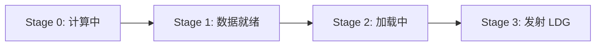

矩阵乘法（GEMM）是深度学习中最核心的计算原语——从全连接层到注意力机制，绝大多数运算最终都归结为矩阵乘法。本文从朴素实现出发，逐步Block-Warp-Thread三级Tiling优化、向量化访存、Bank Conflict 消除、双缓冲等优化手段，带你系统掌握 CUDA GEMM 优化的完整方法论。

<!-- more -->

## 📑 目录

- [1. 背景与问题定义](#1-背景与问题定义)
- [2. 性能分析方法论](#2-性能分析方法论)
- [3. 朴素实现：建立 Baseline](#3-朴素实现建立-baseline)
- [4. Thread Block级 Tiling优化](#4-Thread-Block-tiling)
- [5. Thread级Tiling优化](#5-线程分块寄存器级数据复用)
- [6. Warp 级分块优化](#6-warp-级分块优化)
- [7. 向量化访存：float4 优化](#7-向量化访存float4-优化)
- [8. Bank Conflict 消除](#8-bank-conflict-消除)
- [9. 双缓冲与流水线](#9-双缓冲与流水线)
- [10. Ampere 异步拷贝流水线](#10-ampere-异步拷贝流水线)
- [11. SASS 级优化与寄存器调度](#11-sass-级优化与寄存器调度)
- [12. 实战参数选择与调优指南](#12-实战参数选择与调优指南)
- [总结](#-总结)
- [自我检验清单](#-自我检验清单)
- [参考资料](#-参考资料)

---

## 1. 背景与问题定义

### 1.1 GEMM 的定义

GEMM（General Matrix Multiply）计算的是：

$$
C = A \times B
$$

其中 $A$ 的维度为 $M \times K$，$B$ 为 $K \times N$，$C$ 为 $M \times N$。总浮点运算量为 $2 \times M \times N \times K$ FLOPs（每个输出元素需要 $K$ 次乘法和 $K-1$ 次加法）。


### 1.2 为什么 GEMM 如此重要

深度学习模型中大量运算的底层实现都依赖 GEMM：

- **全连接层**：$Y = XW + b$，直接是矩阵乘法
- **卷积层**：通过 im2col 转化为 GEMM
- **注意力机制**：$QK^T$ 和 $\text{Attention} \cdot V$ 都是矩阵乘法
- **Batched GEMM**：多头注意力中的批量矩阵乘

优化 GEMM 的收益会直接传递到几乎所有深度学习工作负载。

### 1.3 性能指标

衡量 GEMM kernel 性能的核心指标是**有效算力**（TFLOPS）：

$$
\text{TFLOPS} = \frac{2 \times M \times N \times K}{\text{Kernel 执行时间（秒）} \times 10^{12}}
$$

通常以占理论峰值算力的百分比来评估优化效果。cuBLAS 在大矩阵上通常能达到理论峰值的 90%+。

---

## 2. 性能分析方法论

### 2.1 Roofline 模型与计算访存比

GPU 的性能由两个物理上限决定：

- **计算上限**：SM 的浮点吞吐（如 V100 约 15.7 TFLOPS FP32）
- **带宽上限**：显存带宽（如 V100 HBM 约 900 GB/s）

一个 kernel 是**计算瓶颈**还是**访存瓶颈**，取决于它的**算术强度**（Arithmetic Intensity）：

$$
\text{算术强度} = \frac{\text{浮点运算量（FLOPs）}}{\text{数据搬运量（Bytes）}}
$$

当算术强度超过**平衡点**（= 峰值算力 / 峰值带宽）时，kernel 受计算限制；否则受带宽限制。对 V100 而言，平衡点约为 $15.7 \times 10^{12} / (900 \times 10^9) \approx 17.4$ FLOPs/Byte。

💡 **提示**：GEMM 优化的核心目标就是提高算术强度——通过数据复用让每字节数据参与尽可能多的计算。

### 2.2 带宽视角分析法

分析 GEMM kernel 性能时，应该用**带宽**而非**延迟**作为主要指标。原因是 GPU 的海量线程可以通过流水线隐藏延迟，但带宽是物理硬限。一个优化是否有效，最终看它是否减少了对某级存储的带宽需求。

GPU 存储层次的带宽参考值（以 V100 为例）：

| 📊 存储层次 | ⚡ 带宽 | ⏱️ 延迟 |
|------------|---------|---------|
| 寄存器 | ~20 TB/s | 0 cycle |
| Shared Memory | ~12 TB/s | 20-30 cycles |
| L2 Cache | ~2 TB/s | ~200 cycles |
| HBM (Global) | ~900 GB/s | 300-400 cycles |

### 2.3 Wave 模型与 L2 Cache 分析

**Wave**（执行波）是指 GPU 同一时刻能并行执行的 Thread Block 集合。例如 V100 有 80 个 SM，每个 SM 能容纳 2 个 Block，则一个 Wave 最多 160 个 Block。

矩阵 C 被划分为 $(M/BM) \times (N/BN)$ 个 Block Tile。如果一个 Wave 内的 Block 在 M 和 N 方向上分别跨越 $W_m$ 和 $W_n$ 个 Tile，则 L2 Cache 命中率的近似公式为：

$$
\text{L2 命中率} \approx 1 - \frac{W_m \times W_n}{W_m \times W_n + W_m \times N_{block} + W_n \times M_{block}}
$$

⚠️ **注意**：Thread Block 的调度顺序（行优先 vs 列优先 vs Z 形）会显著影响 L2 命中率，对大矩阵可产生 10% 以上的性能差异。

---

## 3. 朴素实现：建立 Baseline

### 3.1 最直接的实现

最简单的思路：每个线程负责计算 $C$ 矩阵的一个元素，遍历 $K$ 维度做内积。

```cuda
__global__ void sgemm_naive(const float* A, const float* B, float* C,
                            int M, int N, int K) {
    int row = blockIdx.y * blockDim.y + threadIdx.y;
    int col = blockIdx.x * blockDim.x + threadIdx.x;

    if (row < M && col < N) {
        float sum = 0.0f;
        for (int k = 0; k < K; k++) {
            sum += A[row * K + k] * B[k * N + col];
        }
        C[row * N + col] = sum;
    }
}
```

### 3.2 性能分析

这个 kernel 的算术强度极低。计算一个 $C[i][j]$：
- 运算量：$2K$ FLOPs
- 数据搬运：读取 $A$ 的一行（$K$ 个 float）+ $B$ 的一列（$K$ 个 float）= $8K$ Bytes

$$
\text{算术强度} = \frac{2K}{8K} = 0.25 \text{ FLOPs/Byte}
$$

远低于平衡点（17 FLOPs/Byte），严重受带宽限制。实测通常只有理论峰值的 6%~11%。

📌 **关键点**：朴素实现的根本问题是**数据复用率几乎为零**——$A$ 的同一行被不同列的线程重复读取，$B$ 的同一列被不同行的线程重复读取，全部走 Global Memory。

---

## 4. Thread Block 级 Tiling 优化

### 4.1 核心思想

把矩阵 $C$ 划分为 $BM \times BN$ 的分块，每个 Thread Block 负责一块。沿 $K$ 维度以步长 $BK$ 迭代：每次将 $A$ 的 $BM \times BK$ 子块和 $B$ 的 $BK \times BN$ 子块协作搬运到 Shared Memory，然后在 Shared Memory 上做局部乘累加。

这就像一个**流水线上的小仓库**——与其每次从遥远的总仓（Global Memory）取货，不如每次批量运一小批到车间旁的货架（Shared Memory），然后工人们从货架上反复取用。


### 4.2 为什么沿 K 维度切分

既然要计算一块 $BM \times BN$ 的 $C$，一个自然的疑问是：为什么不直接取 $A$ 的一整个 $BM \times K$ 行块和 $B$ 的一整个 $K \times BN$ 列块，一次外积乘完？为什么还要沿 $K$ 维度再切成 $BK$ 步迭代？

**根本原因是 Shared Memory 容量有限**。在实际场景中 $K$ 往往是几千到上万，$BM \times K$ 和 $K \times BN$ 两个块加起来动辄几十 MB，远超单个 SM 上 Shared Memory 的容量（通常仅 48~228 KB）。因此必须沿 $K$ 方向切成大小为 $BK$ 的小块，分批载入 SMEM 累加。

沿 K 切分还带来一个关键的复用收益：每次载入 SMEM 的 $A$ 子块（$BM \times BK$）和 $B$ 子块（$BK \times BN$），**会被 block 内的所有线程协同复用**——$BM \times BN$ 个输出元素都需要这对子块参与累加。换言之，一次 Global → SMEM 的搬运，能服务整个 block 的计算，把 Global Memory 访问量从 Naive 的 $O(MNK)$ 降到 $O(MNK/BK \cdot \text{常数})$ 量级。

💡 **提示**：沿 K 维度切分是 GEMM 分块优化的黄金法则。后续更深层的优化（线程分块、Warp 分块）也全部沿用这一原则——在每一层存储层级（Global → Shared → Register），都是沿 K 方向逐步迭代累加，让每份数据被尽可能多的下游计算复用。

### 4.3 计算访存比提升

分块后的算术强度：

$$
\text{算术强度} = \frac{BM \times BN \times 2 \times BK}{(BM \times BK + BK \times BN) \times 4} = \frac{BM \times BN}{2 \times (BM + BN)} = \frac{1}{2 \times \left(\frac{1}{BM} + \frac{1}{BN}\right)}
$$

将分子分母同除以 $BM \times BN$ 后可以看出：在 $BM + BN$（即 Shared Memory 占用）固定的约束下，由均值不等式知 $\frac{1}{BM} + \frac{1}{BN}$ 在 $BM = BN$ 时取最小值，即**当 $BM$ 与 $BN$ 越接近时，计算访存比越大**。

取 $BM = BN = 128$：算术强度 = $128 \times 128 / (2 \times 256) = 32$ FLOPs/Byte，远超平衡点。

### 4.4 协作加载的线程排布

一个关键细节：加载 tileA 和 tileB 时，线程的排列方式应当保证 **Global Memory 的合并访问**（Coalesced Access）——即同一个 warp 内相邻线程访问连续内存地址。

以 $BM=128, BK=8, \text{Block Size}=256$ 为例：

- **加载 tileA**（$128 \times 8$）：一行只有 8 个元素，应让 8 个相邻线程负责一行。256 个线程重排为 $32 \times 8$（32 行 × 8 列），每轮加载 32 行，循环 4 次覆盖 128 行。
- **加载 tileB**（$8 \times 128$）：一行有 128 个元素，应让 32 个相邻线程负责一行的连续段。256 个线程重排为 $8 \times 32$（8 行 × 32 列），每轮加载所有 8 行，每行循环 4 次覆盖 128 列。

线程重排的索引计算：

```cuda
int tid = threadIdx.x;

// 加载 tileA 时的线程坐标（8列×32行）
int a_thread_x = tid % 8;       // 列方向
int a_thread_y = tid / 8;       // 行方向

// 加载 tileB 时的线程坐标（32列×8行）
int b_thread_x = tid % 32;      // 列方向
int b_thread_y = tid / 32;      // 行方向
```

💡 **提示**：这种排布方式使同一个 warp（32 个连续 tid）在加载 tileB 时恰好覆盖一行的 32 个连续 float，实现完美合并访问。加载 tileA 时，warp 内的 32 个线程覆盖连续 4 行 × 8 列，每行的 8 个元素也是连续的。

### 4.5 代码实现

```cuda
template <int BM, int BN, int BK, int BLOCK_SIZE>
__global__ void sgemm_block_tiling(float* A, float* B, float* C,
                                   int M, int K, int N) {
    __shared__ float As[BM][BK];
    __shared__ float Bs[BK][BN];

    int r0 = blockIdx.y * BM;
    int c0 = blockIdx.x * BN;
    int tid = threadIdx.x;

    // 加载 tileA 时的线程重排
    constexpr int A_BLOCK_X = BK;  // = 8
    constexpr int A_BLOCK_Y = BLOCK_SIZE / A_BLOCK_X;  // = 32
    int a_thread_x = tid % A_BLOCK_X;
    int a_thread_y = tid / A_BLOCK_X;

    // 加载 tileB 时的线程重排
    constexpr int B_BLOCK_X = 32;
    constexpr int B_BLOCK_Y = BLOCK_SIZE / B_BLOCK_X;  // = 8
    int b_thread_x = tid % B_BLOCK_X;
    int b_thread_y = tid / B_BLOCK_X;

    // 计算 tileC 时的线程排布（16×16）
    constexpr int C_BLOCK_X = 16;
    constexpr int C_BLOCK_Y = BLOCK_SIZE / C_BLOCK_X;  // = 16
    int c_thread_x = tid % C_BLOCK_X;
    int c_thread_y = tid / C_BLOCK_X;

    // 每个线程负责 Tm×Tn 个输出元素
    constexpr int Tm = BM / C_BLOCK_Y;  // = 8
    constexpr int Tn = BN / C_BLOCK_X;  // = 8
    float Ct[Tm][Tn] = {0.0f};

    // K-Loop
    for (int k = 0; k < K; k += BK) {
        // 协作加载 tileA（使用跨步循环覆盖 BM 行）
        #pragma unroll
        for (int i = a_thread_y; i < BM; i += A_BLOCK_Y) {
            int r = r0 + i, c = k + a_thread_x;
            As[i][a_thread_x] = (r < M && c < K) ? A[r * K + c] : 0.0f;
        }

        // 协作加载 tileB（使用跨步循环覆盖 BN 列）
        #pragma unroll
        for (int j = b_thread_x; j < BN; j += B_BLOCK_X) {
            int r = k + b_thread_y, c = c0 + j;
            Bs[b_thread_y][j] = (r < K && c < N) ? B[r * N + c] : 0.0f;
        }

        __syncthreads();

        // 外积方式计算 As × Bs
        #pragma unroll
        for (int p = 0; p < BK; p++) {
            for (int i = 0; i < Tm; i++) {
                int row = c_thread_y + i * C_BLOCK_Y;
                for (int j = 0; j < Tn; j++) {
                    int col = c_thread_x + j * C_BLOCK_X;
                    Ct[i][j] += As[row][p] * Bs[p][col];
                }
            }
        }

        __syncthreads();
    }

    // 写回结果
    for (int i = 0; i < Tm; i++) {
        int r = r0 + c_thread_y + i * C_BLOCK_Y;
        for (int j = 0; j < Tn; j++) {
            int c = c0 + c_thread_x + j * C_BLOCK_X;
            if (r < M && c < N) C[r * N + c] = Ct[i][j];
        }
    }
}
```

⚠️ **注意**：这里每个线程负责的 8×8 个输出元素并非连续的，而是以 `C_BLOCK_Y=16` 行、`C_BLOCK_X=16` 列为间距的**跨步分布**。这是因为 256 个线程排成 $16 \times 16$ 的网格，每个线程在 M 和 N 方向各"跳"8 次覆盖 $128 \times 128$ 的 tileC。

### 4.6 参数选择

| 📊 参数 | 📝 推荐值 | 💡 理由 |
|---------|-----------|---------|
| BM, BN | 128 | 算术强度 32，足以饱和计算单元 |
| BK | 8 | Shared Memory 占用可控（128×8×4=4KB/矩阵） |
| Block size | 16×16=256 | 匹配 BM/BN 划分，支持 2 blocks/SM |

⚠️ **注意**：两次 `__syncthreads()` 是必须的——第一次确保数据加载完成后再计算，第二次确保计算完成后再覆盖 Shared Memory。

---

## 5. Thread 级 Tiling 优化：寄存器级数据复用

到这里，我们的优化形成了一条清晰的**三级数据搬运链**：


每一级搬运都遵循相同原则：沿 K 维度迭代，每次搬运一小块，在当前存储层级上最大化复用后再搬运下一块。现在我们聚焦从 Shared Memory 到 Register 这一级。

### 5.1 问题：Shared Memory 仍是瓶颈

上一步的 kernel（Section 4.5）虽然已经让每个线程负责 $TM \times TN$ (8 x 8) 个输出，但代码中对 `As[row][p]` 和 `Bs[p][col]` 的访问直接写在三层循环内部——编译器可能会优化，但从代码结构上看，每次 FMA 都伴随着对 Shared Memory 的隐式读取依赖。当 256 个线程同时高频访问 Shared Memory 时，会出现 **MIO Throttle Stall**。

解决思路：将"从 Shared Memory 读取"和"FMA 计算"显式分离——先批量读取到寄存器数组（`a_frag`、`b_frag`），再在寄存器上做外积。这样每次 p-Loop 迭代只需 $TM + TN$ 次 Shared Memory 读取，就完成 $TM \times TN$ 次 FMA。

### 5.2 外积（Outer Product）分解


关键在于循环顺序。传统内积写法（K-先）导致 $A$ 和 $B$ 的元素无法复用：

```
// 内积：每个线程独立累加一个 C 元素 -> 复用率低
for k: sum += A[row][k] * B[k][col]
```

改为**外积**写法（K 在最外层）：

```
// 外积：每个线程负责 TM×TN 个 C 元素
for k:
    load A_frag[TM] from smem  // 读一次 A 的 TM 个元素
    load B_frag[TN] from smem  // 读一次 B 的 TN 个元素
    for i in TM:
        for j in TN:
            C_frag[i][j] += A_frag[i] * B_frag[j]  // TM×TN 次 FMA
```

**计算-访存比分析**：每轮 K 迭代中，从 Shared Memory 读取 $TM + TN$ 个 float（即 $4(TM + TN)$ 字节），完成 $TM \times TN$ 次 FMA（即 $2 \times TM \times TN$ FLOPs）。则：

$$
\text{算术强度} = \frac{2 \times TM \times TN}{4 \times (TM + TN)} = \frac{TM \times TN}{2 \times (TM + TN)} = \frac{1}{2 \times \left(\frac{1}{TM} + \frac{1}{TN}\right)}
$$

形式与 Section 4.3 完全一致——这并非巧合，而是因为外积本质上是把 Block 分块的思想下沉到了 Register 层级。同样由均值不等式可知：在 $TM + TN$（寄存器占用近似项）固定时，**$TM = TN$ 时计算访存比最大**。

**为什么取 $TM = TN = 8\$**：

- 单线程寄存器占用：$a_{frag}[TM] + b_{frag}[TN] + c_{frag}[TM][TN] = TM + TN + TM \times TN$。$TM=TN=8$ 时为 $8 + 8 + 64 = 80$ 个 float。
- 加上索引、循环变量等开销，单线程寄存器数约 90~120，刚好接近 SM 单线程寄存器上限（255）的 1/2，能保证 occupancy（每个 SM 至少驻留 2 个 Block）。
- 若取 $TM=TN=16$，则 $c_{frag}$ 就要占 256 个寄存器，会触发寄存器溢出（spill 到 Local Memory），反而劣化性能。

**和内积写法的对比**：内积每完成一次 FMA 都要从 Shared Memory 读 $A$、$B$ 各一个 float，比值为 $2/(2 \times 4) = 1/4$（按字节算）或 $1$（按元素算）。外积取 $TM = TN = 8$ 时按元素算的比值为 $64/16 = 4$，**提升 4 倍**——这意味着原本 4 次 Shared Memory 访问才能驱动的计算，现在只需 1 次。

### 5.3 代码实现

```cuda
template <int BM, int BN, int BK, int TM, int TN>
__global__ void sgemm_thread_tiling(const float* A, const float* B, float* C,
                                    int M, int N, int K) {
    __shared__ float As[BM][BK];
    __shared__ float Bs[BK][BN];

    // 每个线程在 C 中负责 TM×TN 的子块
    const int thread_num = BM / TM * BN / TN;  // = 256
    int tid = threadIdx.x;
    int thread_row = (tid / (BN / TN)) * TM;
    int thread_col = (tid % (BN / TN)) * TN;

    // 寄存器存储
    float a_frag[TM];
    float b_frag[TN];
    float c_frag[TM][TN] = {0.0f};

    int by = blockIdx.y, bx = blockIdx.x;

    for (int bk = 0; bk < K; bk += BK) {
        // 协作加载 A、B 到 Shared Memory（省略边界检查）
        load_tile_A(A, As, by, bk, tid, M, K);
        load_tile_B(B, Bs, bx, bk, tid, K, N);
        __syncthreads();

        // 外积累加
        for (int k = 0; k < BK; k++) {
            // 从 Shared Memory 加载到寄存器
            for (int i = 0; i < TM; i++)
                a_frag[i] = As[thread_row + i][k];
            for (int j = 0; j < TN; j++)
                b_frag[j] = Bs[k][thread_col + j];

            // 寄存器上做外积
            for (int i = 0; i < TM; i++)
                for (int j = 0; j < TN; j++)
                    c_frag[i][j] += a_frag[i] * b_frag[j];
        }
        __syncthreads();
    }

    // 写回 Global Memory
    for (int i = 0; i < TM; i++)
        for (int j = 0; j < TN; j++)
            C[(by * BM + thread_row + i) * N + bx * BN + thread_col + j] = c_frag[i][j];
}
```

### 5.4 寄存器预算

以 $TM = TN = 8$ 为例：
- `c_frag`：$8 \times 8 = 64$ 个寄存器
- `a_frag` + `b_frag`：$8 + 8 = 16$ 个寄存器
- 索引、临时变量等：~30 个寄存器
- 合计：约 110-128 个寄存器/线程

V100 每个 SM 有 65536 个寄存器。128 寄存器/线程 × 256 线程/Block = 32768 寄存器/Block，每个 SM 可容纳 2 个 Block（512 线程 = 16 warps），occupancy = 25%。

💡 **提示**：25% 的 occupancy 看似很低，但 GEMM 有极高的指令级并行度（ILP），每个线程有 64 个独立的 FMA 链，足以隐藏流水线延迟。

---

## 6. Warp 级分块优化

### 6.1 动机

在线程分块的基础上，进一步考虑：一个 warp 的 32 个线程在 Shared Memory 上的访问模式如何最优化？

如果 warp 内线程排列为 $1 \times 32$（一行 32 个），那么读取 $A$ 时 32 个线程都需要同一个元素（可以 Broadcast），但读取 $B$ 时需要 32 个不同元素。反过来 $32 \times 1$ 则对 $B$ 友好但 $A$ 不友好。

### 6.2 Warp Tile 形状与计算访存比推导

假设 warp 在 M 方向有 $x$ 个线程、N 方向有 $y$ 个线程（$x \times y = 32$），每个线程负责 $TM \times TN$ 的子块。在一次 p-Loop（K 方向一步）中：

- 利用 Shared Memory 广播，warp 实际从 tileA 读取 $x \times TM$ 个不同元素（同一 M 位置的 $y$ 个线程共享相同的 $TM$ 个值）
- 从 tileB 读取 $y \times TN$ 个不同元素（同一 N 位置的 $x$ 个线程共享相同的 $TN$ 个值）
- 每个线程计算 $TM \times TN$ 次 FMA，整个 warp 计算 $32 \times TM \times TN \times 2$ FLOPs

Warp 级计算-访存比（令 $TM = TN$，此时分母 $(x \cdot TM + y \cdot TN) = (x + y) \cdot TM$）：

$$
\text{ratio} = \frac{32 \times TM \times TN \times 2}{(x \cdot TM + y \cdot TN) \times 4} \xlongequal{TM=TN} \frac{32 \times TM^2 \times 2}{(x + y) \times TM \times 4} = \frac{16 \times TM}{x + y}
$$

比值与 $1/(x + y)$ 成正比。在 $x \times y = 32$ 约束下，$x + y$ 取最小值时比值最大。由均值不等式，$x + y \geq 2\sqrt{xy} = 2\sqrt{32} \approx 11.3$。整数解中 $4 \times 8$（$x+y=12$）和 $8 \times 4$（$x+y=12$）是最优选择。


### 6.3 Warp 内线程位置计算

$BM = 128, BN = 128$，一个 Block 有 256 / 32 = 8 个 warp。

取 $4 \times 8$ warp 布局、$TM = TN = 8$：每个 warp 计算 $32 \times 64$ 的 C 子块。

确定了 $4 \times 8$ 的 warp 内布局后，需要精确计算每个线程在 Block Tile 中的起始坐标。设 `tid` 为线程在 Block 内的全局 ID：

```cuda
int warp_id = tid >> 5;            // tid / 32
int lane_id = tid & 31;           // tid % 32

// warp 在 Block 中的位置（4×2 排列）
int warp_row = warp_id >> 1;      // M 方向：0~3
int warp_col = warp_id & 1;       // N 方向：0~1

// lane 在 warp 内的位置（4×8 排列，行主序）
int lane_row = lane_id >> 3;      // M 方向：0~3
int lane_col = lane_id & 7;       // N 方向：0~7

// 线程负责的 TM×TN 子块在 Block Tile 中的起始行列
int row_c = (warp_row * 4 + lane_row) * TM;  // = (warp_row*4 + lane_row) * 8
int col_c = (warp_col * 8 + lane_col) * TN;  // = (warp_col*8 + lane_col) * 8
```

以 `tid = 18` 为例：`warp_id = 0`, `lane_id = 18`, `warp_row = 0`, `warp_col = 0`, `lane_row = 18 >> 3 = 2`, `lane_col = 18 & 7 = 2`。该线程的起始坐标为 `row_c = 16, col_c = 16`，负责计算 Block Tile 中第 16\~23 行、第 16\~23 列的 $8 \times 8$ 子块。

---

## 7. 向量化访存：float4 优化

### 7.1 为什么需要向量化

从 Global Memory 加载数据到 Shared Memory 时，如果每次只搬运一个 float（32 bit），需要执行大量 LDG/STS 指令。GPU 的内存系统支持一次搬运 128 bit（即一个 `float4`），这能将指令数量减少为原来的 1/4，显著降低指令发射压力。

### 7.2 float4 加载宏

```cuda
#define FLOAT4(ptr) (reinterpret_cast<float4*>(&(ptr))[0])
```

使用时：

```cuda
// 一次加载 4 个连续 float
float4 tmp = FLOAT4(A[row * K + col]);
```

### 7.3 转置A存储策略

问题：矩阵 $A$ 在 Global Memory 中按行存储，加载到 Shared Memory 后，内层循环需要按列读取（同一行的不同线程读 As 的同一列），无法使用 `float4`。

解决方案：将 $A$ 在 Shared Memory 中**转置存储**，即 `As[BK][BM]` 代替 `As[BM][BK]`。这样原本的列访问变为行访问，可以使用 `float4` 一次读取 4 个连续元素。

```cuda
// 从 Global Memory 加载 A 的一行（连续），转置存入 Shared Memory
float4 a_val = FLOAT4(A[global_row * K + bk + load_col]);
As[load_col + 0][local_row] = a_val.x;
As[load_col + 1][local_row] = a_val.y;
As[load_col + 2][local_row] = a_val.z;
As[load_col + 3][local_row] = a_val.w;

// 从 Shared Memory 读取时可以用 float4（连续地址）
float4 a_frag_vec = FLOAT4(As[k][thread_row]);
```

### 7.4 float4 引入后的坐标映射变化

使用 float4 读取后，每个线程负责的 8 个元素不再是间隔 `C_BLOCK_Y` 行的 8 个离散位置，而变为两组各 4 个连续元素（因为 float4 一次读取 4 个连续 float）。这改变了 Ct 结果写回矩阵 $C$ 时的坐标计算。

**未使用 float4 时**：Ct 中第 $i$ 行数据在 tileC 中的行坐标为 `C_THREAD_Y + i * C_BLOCK_Y`。

**使用 float4 后**：Ct 的 8 行分为两组（前 4 行连续，后 4 行连续），坐标变为：

```
tileC_row = 4 * C_THREAD_Y + (i / 4) * 4 * C_BLOCK_Y + (i % 4)
tileC_col = 4 * C_THREAD_X + (j / 4) * 4 * C_BLOCK_X + (j % 4)
```

写回代码相应修改：

```cuda
for (int i = 0; i < Tm; i++) {
    int r = r0 + 4 * C_THREAD_Y + (i / 4) * 4 * C_BLOCK_Y + (i % 4);
    for (int j = 0; j < Tn; j++) {
        int c = c0 + 4 * C_THREAD_X + (j / 4) * 4 * C_BLOCK_X + (j % 4);
        if (r < M && c < N) C[r * N + c] = Ct[i][j];
    }
}
```

### 7.5 性能提升

向量化访存的效果：
- 减少 75% 的 load/store 指令数量
- 降低 MIO Throttle stall
- 提高 Global Memory 到 Shared Memory 的有效带宽
- 实测通常带来 15%~30% 的性能提升

---

## 8. Bank Conflict 消除

### 8.1 什么是 Bank Conflict

Shared Memory 被划分为 32 个 bank，每个 bank 宽度 4 字节。地址映射规则：第 $i$ 字节属于 bank $\lfloor i/4 \rfloor \mod 32$。

**为什么是 32 个 bank？** 这不是巧合——32 恰好等于一个 warp 中的线程数。硬件设计的意图是：在理想情况下，warp 的 32 个线程各访问不同的 bank，一个时钟周期内全部完成，达到峰值带宽。可以把每个 bank 想象成一条**单车道**：每个时钟周期只能通过一辆车（一次 4 字节访问）。32 条车道并行，恰好服务一个 warp 的 32 个线程。

当同一个 warp 内的多个线程**同时访问同一个 bank 的不同地址**时，这些访问必须串行化，形成 N-way Bank Conflict——相当于多辆车挤同一条车道排队通过，吞吐量降为 $1/N$。

反之，如果多个线程访问**同一 bank 的同一地址**，硬件会进行**广播**（Broadcast）：只需一次读取，结果分发给所有请求线程，不产生冲突。

⚠️ **注意**：Bank conflict 只在 **warp 内部**定义。不同 warp 之间访问同一 bank 不存在 bank conflict——它们在时间上本就是分时调度的。

以 LDS.32（每线程取 1 个 float）为例的几种典型场景：

| 📊 场景 | ✅ 是否冲突 | 📝 原因 |
|---------|------------|---------|
| 32 个线程各访问不同 bank | 无冲突 | 理想状态，1 次 transaction |
| 线程 0~31 访问不同 layer 的不同 bank | 无冲突 | bank 不同即可，layer 不影响 |
| 多线程访问同一 bank 的同一地址 | 无冲突 | 触发广播机制 |
| 2 个线程访问同一 bank 的不同地址 | 2-way 冲突 | 需串行 2 次 transaction |

### 8.2 float4 访存下的 Memory Transaction 机制

理解 float4 下的 bank conflict 需要先理解 **Memory Transaction 拆分机制**：

- **float 访存**（32 bit/线程）：一个 warp 访问 128 bytes，恰好一个 memory transaction
- **float2 访存**（64 bit/线程）：一个 warp 访问 256 bytes，拆分为 2 个 memory transaction，每组 16 个线程（half-warp）
- **float4 访存**（128 bit/线程）：一个 warp 访问 512 bytes，拆分为 4 个 memory transaction，每组 8 个线程（**quarter-warp**）

Bank conflict 是在**单个 memory transaction 内部**判定的，因此使用 float4 时只需关注 8 个线程（quarter-warp）之间的冲突。

**广播（Broadcast）触发条件**（float4 下）：

当以下任一条件满足时，两个 quarter-warp 可以合并为一个 memory transaction：
- 条件 A：warp 内第 $i$ 号线程与第 ($i \oplus 1$) 号线程访问相同地址（或其中一个不活跃）
- 条件 B：warp 内第 $i$ 号线程与第 ($i \oplus 2$) 号线程访问相同地址（或其中一个不活跃）

### 8.3 Warp 形状对 Bank Conflict 的影响

不同的 warp 形状（线程在 M×N 方向上的排布）直接决定了从 Shared Memory 读取时是否会产生 bank conflict。我们以 $2 \times 16$ 的 warp 形状为反面教材来分析。

**$2 \times 16$ warp 读取 tileB 的冲突分析**：

tileB 的形状为 $(BK, BN) = (8, 128)$，按行存储时每 32 个 float 填满一层 bank。每个线程需要读取 $TN=8$ 个连续 float（使用 LDS.128 分两次读取 float4）。

在 $2 \times 16$ 排布下，第一个 quarter-warp（线程 0~7）中：
- 线程 0 读 bank 0\~3 的 layer 0（B 的第 0\~3 个元素）
- 线程 4 读 bank 0\~3 的 layer 1（B 的第 32\~35 个元素，偏移 $4 \times TN = 32$ 个元素 = 1 个 bank layer）

线程 0 和线程 4 访问了相同 bank 的不同地址 → 2-way bank conflict！原本一个 quarter-warp 只需 1 次 transaction，现在变成了 2 次。

**$2 \times 16$ warp 读取 tileA 的冲突分析**：

若 tileA 未转置，形状为 `As[BM][BK]` = $(128, 8)$，每行 8 个元素，4 行填满一层 bank（$4 \times 8 = 32$ 个元素）。线程需沿 M 方向读取 $TM=8$ 个值，这些值在内存中间隔 $BK=8$ 个 float（跨行），**不连续**，只能用 LDS.32 逐个取值。此时 bank conflict 在整个 warp 范围内判定。

线程 0（M 方向第 0 行）读 `As[row][k]`，线程 16（M 方向第 1 行）读 `As[row+8][k]`。由于行间距为 8 个 float，8 行恰好跨越 2 层 bank（$8 \times 8 = 64$ 个元素 = 2 层），两线程落在同一 bank 的不同 layer → 2-way bank conflict。

📌 **关键点**：$2 \times 16$ 排布在 A 和 B 方向**都**存在 bank conflict，是最糟糕的情况之一。解决 A 方向冲突最直接的办法是**转置存储**（`As[BK][BM]`），让 M 方向的读取变为连续地址，可以使用 LDS.128 并在 quarter-warp 内触发广播。

$4 \times 8$ 排布配合 A 转置存储，在两个方向都能避免冲突。

### 8.4 float4 下 warp(4x8) 的 Transaction 分析

warp 形状为 $4 \times 8$ ，使用 `float4` 访问时，bank conflict 在 quarter-warp（8 个线程）内部判定。quarter-warp 在 N 方向被铺满，形状为 $1 \times 8$。下面分别分析两种 tile 的访问模式。


**读取 tileA（转置存储 `As[k][thread_row..thread_row+7]`）**：

每个 lane 的起始 M 坐标为 `lane_row * TM = lane_row * 8`。quarter-warp 内 8 个 lane 的 `lane_row` 相同（都为 0）→ **8 个 lane 访问完全相同的 float4 地址**。

quarter-warp 内有 **1 个 unique float4**，触发 8 路广播 → quarter-warp 内只需 1 个 transaction。

再检查跨 quarter-warp 的 uniform-access 合并条件（参见 §8.2）：

- 条件 A：`lane i` 与 `lane i⊕1` —— xor 1 只翻转 bit 0，落在 `lane_col` 上，`lane_row` 不变 → 两者读取相同的 A 地址 → **全局满足条件 A** ✅

→ LDS.128 触发 register packing，请求数从 4 降至 2 → **整个 warp 共 2 个 transactions**。

> 📎 这与 NVIDIA 官方论坛的硬件描述一致：在 CC 7.0+ 上，uniform 访问可以让 LDS.128 的 requests/instruction 从 4 降至 2 ([Greg @NV, 2018](https://forums.developer.nvidia.com/t/unexpected-shared-memory-bank-conflict/77228/2))。

**读取 tileB（`Bs[k][thread_col..thread_col+7]`）**：

每个 lane 的起始 N 坐标为 `lane_col * TN = lane_col * 8`。quarter-warp 内 8 个 lane 的 `lane_col = 0..7` 各不相同：

| lane | 起始 N 坐标 | 读取的 B 元素 | 占用 banks |
|------|------------|---------------|------------|
| 0    | 0          | B[0:4]    | 0~3 (layer 0) |
| 1    | 8          | B[8:12]   | 8~11 (layer 0) |
| 2    | 16         | B[16:20]  | 16~19 (layer 0) |
| 3    | 24         | B[24:28]  | 24~27 (layer 0) |
| 4    | 32         | B[32:36]  | 0~3 (layer 1) |
| 5    | 40         | B[40:44]  | 8~11 (layer 1) |
| 6    | 48         | B[48:52]  | 16~19 (layer 1) |
| 7    | 56         | B[56:60]  | 24~27 (layer 1) |

quarter-warp 内有 **8 个 unique float4**，无广播。更糟的是，相邻 lane 之间 N 坐标相差 8 个 float（32 字节 = 8 个 bank），lane 0 起始于 bank 0，lane 4 起始于 bank 0 的下一层（$4 \times 8 = 32$ floats = 1 bank layer）→ **2-way bank conflict**。

→ 每个 quarter-warp 因 bank conflict 拆为 2 个 transactions → **整个 warp 共 8 个 transactions**。

**汇总**：

| tile | quarter-warp 内 unique float4 数 | 广播 / 冲突 | warp 内 transaction 数 |
|------|------------------|--------------|------------------------|
| tileA | 1 | 8 路广播 + condition A halving | 2 |
| tileB | 8 | 2-way bank conflict，无 halving | 8 |
| **合计** |  |  | **10** |

📌 **观察**：行主序排布下，tileA 受益于完美广播 + uniform-access halving（仅 2 个 transactions），但 tileB 在 N 方向跨度 = $TN=8$ 引发 2-way bank conflict 且不满足 halving 条件，整体（10）仍劣于列主序（6 transactions）。这种**一边过强、一边过弱**的不对称正是 §8.5 方案三（Z-order 线程映射）要消除的——通过 $2 \times 4$ 形状的 quarter-warp，让 xor 1 / xor 2 的 lane 对**同时**在 tileA 上 row 相同、在 tileB 上 col 相同，两边都能合并 transaction 而不引入冲突。


### 8.5 解决方案

**方案一：Padding（tileA转置存储）**

在 Shared Memory 声明时额外加一列：

```cuda
__shared__ float As[BK][BM + 4];  // 错开 bank 映射
```

缺点：破坏 `float4` 对齐，可能导致无法使用向量化读取。

**方案二：XOR Swizzle（tileA转置存储）**

通过异或运算打乱存储地址，使原本会冲突的访问分散到不同 bank：

```cuda
// 写入时 swizzle
As[k][row ^ (k * 4)] = value;

// 读取时用相同规则反算地址
float val = As[k][target_row ^ (k * 4)];
```

优势：不增加额外空间，保持 `float4` 对齐。

**方案三：$8 \times 8$ 计算区域拆分为 $4 \times 4$ 子块**

另一种思路不改变 warp 形状，而是改变每个线程负责的计算区域布局。原本每个线程计算连续的 $8 \times 8$ 区域，改为拆分成 4 个 $4 \times 4$ 子块（分散在 tileC 中）。


核心原理：当每个线程读取 float4 时，同一 quarter-warp 内的 8 个线程恰好覆盖一整层 bank（连续 32 个 float = 8 × float4），不会出现跨 layer 的冲突。拆分的关键是让 quarter-warp 内的线程读取地址**连续铺满一层 bank**，而不是跳跃到不同层。

这种方法的优势是不需要修改线程-warp 映射逻辑，只需调整 C 矩阵的局部布局。代价是写回 Global Memory 时地址不连续，需要 scatter write。

QW 内 8 个 lane 共享同一行（`lane_row=0`），在 N 方向铺满 8 列。

**读取 tileA（转置存储 `As[k][row*4 .. row*4+3]`）**：

每个 lane 读取起始 M 坐标为 `lane_row * 4`。QW 内 8 个 lane 的 `lane_row` 相同（都为 0）→ **8 个 lane 访问完全相同的 float4 地址**，触发 8 路广播。

再检查跨 QW 的合并条件：
- 条件 A：`lane i` 与 `lane i⊕1`（xor 1 翻转 bit 0，仅改变 `lane_col`，`lane_row` 不变）→ 两者读相同 A 地址 → **满足条件 A** ✅

→ 4 个 QW 请求合并为 2 → **整个 warp 的 tileA 读取：2 个 transactions**。

**读取 tileB（`Bs[k][col*4 .. col*4+3]`）**：

每个 lane 读取起始 N 坐标为 `lane_col * 4`（而非基线的 `lane_col * 8`）。QW 内 8 个 lane 的起始地址与 bank 占用：

| lane | 起始 N 偏移 | 读取元素 | 占用 banks |
|------|------------|----------|------------|
| 0 | 0 | B[0:4] | 0\~3 (layer 0) |
| 1 | 4 | B[4:8] | 4\~7 (layer 0) |
| 2 | 8 | B[8:12] | 8\~11 (layer 0) |
| 3 | 12 | B[12:16] | 12\~15 (layer 0) |
| 4 | 16 | B[16:20] | 16\~19 (layer 0) |
| 5 | 20 | B[20:24] | 20\~23 (layer 0) |
| 6 | 24 | B[24:28] | 24\~27 (layer 0) |
| 7 | 28 | B[28:32] | 28\~31 (layer 0) |

8 个 lane 的 float4 地址连续铺满 bank 0\~31 的 layer 0，**各 lane 占用不同 bank，无 bank conflict**。

与基线（`lane_col * 8` 间距）的关键区别：基线中 lane 0 和 lane 4 的起始偏移差为 32 float = 1 个 bank layer，落入相同 bank 的不同地址导致 2-way 冲突。而方案四将间距从 8 缩小为 4，使 QW 内 8 个 lane 恰好铺满一整层 bank 而不溢出到下一层。

但检查跨 QW 的合并条件：
- 条件 A：`lane i` 与 `lane i⊕1`（`lane_col` 差 1）→ B 起始偏移差 4 → 不同地址 → **不满足** ❌
- 条件 B：`lane i` 与 `lane i⊕2`（`lane_col` 差 2）→ B 起始偏移差 8 → 不同地址 → **不满足** ❌

无法触发跨 QW 合并 → 每个 QW 独立 1 个 transaction → **整个 warp 的 tileB 读取：4 个 transactions**。

**每个子块一次 p-Loop 的 transaction 汇总**：

| tile | QW 内冲突 | 跨 QW 合并 | warp 内 transaction 数 |
|------|-----------|-----------|------------------------|
| tileA | 无（8 路广播） | 条件 A 合并 | 2 |
| tileB | 无（铺满一层 bank） | 不满足合并条件 | 4 |
| **合计** | | | **6** |


**方案四：Z-order 线程映射**

在方案三的基础上将 quarter-warp 的形状从默认的 $1 \times 8$（行主序）调整为 Z-order 排布，可以让 tileA 和 tileB 的读取**都**触发广播机制，将 memory transaction 从 10 个降至 4 个。

```cuda
int lane_id = threadIdx.x % 32;
int lane_row = lane_id % 2 + (lane_id / 16) * 2;    // 4 行
int lane_col = (lane_id % 16) / 2;                  // 8 列
```

按上面的映射展开，warp 内 32 个 lane 在 $4 \times 8$ 网格上的位置如下：


每个 quarter-warp 形状为 **2 行 × 4 列**。核心原理：QW 内 8 个 lane 仅覆盖 2 个不同的 `lane_row` 与 4 个不同的 `lane_col`，使 tileA 和 tileB 的读取都能在 QW 内触发广播；同时 xor 1 与 xor 2 分别保留 `lane_col` 与 `lane_row` 不变，正好对应跨 QW 合并的条件 A 与条件 B。

**读取 tileA（转置存储 `As[k][row*4 .. row*4+3]`）**：

QW 内仅 2 个独立 A 地址，每个地址被 4 个 lane 共享（4 路广播），两地址落入不同 bank（0\~3 vs 4\~7），**无 bank conflict**。

再检查跨 QW 的合并条件：
- 条件 B：`lane i` 与 `lane i⊕2`（xor 2 翻转 bit 1，仅改变 `lane_col`，`lane_row` 不变）→ 两者读相同 A 地址 → **满足条件 B** ✅

→ 4 个 QW 请求合并为 2 → **整个 warp 的 tileA 读取：2 个 transactions**。

**读取 tileB（`Bs[k][col*4 .. col*4+3]`）**：

每个 lane 读取起始 N 坐标为 `lane_col * 4`。QW0 内 8 个 lane 的起始地址与 bank 占用：

| lane | (row, col) | 起始 N 偏移 | 占用 banks |
|------|------------|------------|------------|
| 0 | (0, 0) | 0 | 0\~3 (layer 0) |
| 1 | (1, 0) | 0 | 0\~3 (layer 0) |
| 2 | (0, 1) | 4 | 4\~7 (layer 0) |
| 3 | (1, 1) | 4 | 4\~7 (layer 0) |
| 4 | (0, 2) | 8 | 8\~11 (layer 0) |
| 5 | (1, 2) | 8 | 8\~11 (layer 0) |
| 6 | (0, 3) | 12 | 12\~15 (layer 0) |
| 7 | (1, 3) | 12 | 12\~15 (layer 0) |

QW 内仅 4 个独立 B 地址，每个地址被 2 个 lane 共享（2 路广播），4 组地址铺满 bank 0\~15 的 layer 0，**无 bank conflict**。

再检查跨 QW 的合并条件：
- 条件 A：`lane i` 与 `lane i⊕1`（xor 1 翻转 bit 0，仅改变 `lane_row`，`lane_col` 不变）→ 两者读相同 B 地址 → **满足条件 A** ✅

→ 4 个 QW 请求合并为 2 → **整个 warp 的 tileB 读取：2 个 transactions**。

**每个子块一次 p-Loop 的 transaction 汇总**：

| tile | QW 内冲突 | 跨 QW 合并 | warp 内 transaction 数 |
|------|-----------|-----------|------------------------|
| tileA | 无（4 路广播） | 条件 B 合并 | 2 |
| tileB | 无（2 路广播） | 条件 A 合并 | 2 |
| **合计** | | | **4** |

相比默认 $1 \times 8$ 排布（tileA 2 个 + tileB 8 个 = 10 个 transactions），Z-order 排布（各 2 个 = 4 个 transactions）减少了 60% 的 memory transactions。

---

## 9. 双缓冲与流水线

### 9.1 隐藏 Global Memory 延迟

前面的实现中，每次 K 循环迭代都要等待 Global → Shared Memory 的数据搬运完成后才能开始计算。Global Memory 访问延迟高达 300~500 个时钟周期，这段时间计算单元完全空闲。

双缓冲的思路类似**乒乓球**：准备两套 Shared Memory 缓冲区，一边用 Buffer 0 做计算，一边往 Buffer 1 加载下一轮数据。

### 9.2 p-Loop 级双缓冲（Shared → Register）

在 p-Loop（K 方向内层循环）中，每步需要：(1) 从 Shared Memory 读取 regA/regB；(2) 计算 regA × regB 的外积。串行执行时，计算必须等待 Shared Memory 读取完成（20-30 cycle 延迟）。

使用双缓冲寄存器，将读取和计算重叠：

```cuda
float regA[2][Tm], regB[2][Tn];

#pragma unroll
for (int p = 0; p < BK + 1; p++) {
    // 计算阶段：使用上一步读取的数据
    if (p > 0) {
        for (int i = 0; i < Tm; i++)
            for (int j = 0; j < Tn; j++)
                Ct[i][j] += regA[(p - 1) & 1][i] * regB[(p - 1) & 1][j];
    }

    // 预取阶段：读取本步数据到另一组寄存器
    if (p < BK) {
        for (int i = 0; i < Tm / 4; i++)
            FLOAT4(regA[p & 1][i * 4]) = FLOAT4(As[p][...]);
        for (int j = 0; j < Tn / 4; j++)
            FLOAT4(regB[p & 1][j * 4]) = FLOAT4(Bs[p][...]);
    }
}
```

由于计算阶段（FFMA 指令）和预取阶段（LDS 指令）分属不同的 GPU 执行单元，硬件可以并行调度两者，实现 Shared Memory 延迟的隐藏。

### 9.3 K-Loop 级双缓冲（Global → Shared）

**第一级：Global → Shared 双缓冲**

```cuda
__shared__ float As[2][BK][BM];  // 两个 buffer
__shared__ float Bs[2][BK][BN];
```

**第二级：Shared → Register 双缓冲**

```cuda
float a_frag[2][TM];  // 两组寄存器
float b_frag[2][TN];
```

### 9.4 流水线编排

流水线的关键是指令排布顺序。在主循环的每次迭代中：

```
┌──────────────────────────────────────────────┐
│ 1. 发射 LDG 指令（加载下一轮数据到寄存器暂存）     │
│ 2. 执行 FFMA 计算（使用当前 buffer 的数据）      │
│ 3. 执行 STS 指令（将暂存寄存器写入另一 buffer）   │
│ 4. __syncthreads() 切换 buffer               │
└──────────────────────────────────────────────┘
```

📌 **关键点**：先发射 LDG 再做计算是关键——LDG 是异步的，发射后线程继续执行后续 FFMA 指令，当 FFMA 执行完毕时 LDG 数据通常已经就绪。这样 300+ cycle 的 Global Memory 延迟被 FFMA 计算完美隐藏。

### 9.5 代码框架

```cuda
template <int BM, int BN, int BK, int TM, int TN>
__global__ void sgemm_double_buffer(const float* A, const float* B, float* C,
                                    int M, int N, int K) {
    __shared__ float As[2][BK][BM];
    __shared__ float Bs[2][BK][BN];

    float a_frag[2][TM], b_frag[2][TN];
    float c_frag[TM][TN] = {0.0f};
    float ldg_a[4], ldg_b[4];  // 暂存 Global Memory 加载结果

    int buf_idx = 0;

    // Prologue: 加载第一个 tile
    load_global_to_shared(A, B, As[0], Bs[0], /*tile_k=*/0);
    __syncthreads();

    // 预取第一组寄存器数据
    load_shared_to_reg(As[0], Bs[0], a_frag[0], b_frag[0], /*k=*/0);

    for (int tile_k = BK; tile_k < K + BK; tile_k += BK) {
        int next_buf = 1 - buf_idx;

        #pragma unroll
        for (int k = 0; k < BK; k++) {
            // 预取下一个 k 步的寄存器数据
            if (k + 1 < BK) {
                load_shared_to_reg(As[buf_idx], Bs[buf_idx],
                                   a_frag[1 - k % 2], b_frag[1 - k % 2], k + 1);
            }

            // 在第一个 k 步时，发射下一 tile 的 Global Memory 加载
            if (k == 0 && tile_k < K) {
                issue_ldg(A, B, ldg_a, ldg_b, tile_k);
            }

            // 执行 TM×TN 的外积计算
            outer_product(a_frag[k % 2], b_frag[k % 2], c_frag);
        }

        // 将 LDG 结果写入下一 buffer
        if (tile_k < K) {
            store_reg_to_shared(ldg_a, ldg_b, As[next_buf], Bs[next_buf]);
        }
        __syncthreads();

        buf_idx = next_buf;
        load_shared_to_reg(As[buf_idx], Bs[buf_idx], a_frag[0], b_frag[0], 0);
    }

    // 写回结果
    store_c(c_frag, C);
}
```

### 9.6 同步优化

双缓冲的一个重要好处：主循环中只需要**一次** `__syncthreads()`（在 buffer 切换时），而非两次。这减少了同步开销。

---

## 10. Ampere 异步拷贝流水线

### 10.1 cp.async 指令

从 SM80（Ampere）开始，NVIDIA 引入了 `cp.async` 指令，支持从 Global Memory 到 Shared Memory 的**异步直接拷贝**，无需经过寄存器中转：

```
cp.async.cg.shared.global [smem_ptr], [gmem_ptr], 16;
```

好处：
- 节省用于中转的寄存器（约 8 个/线程）
- 硬件流水线更深，延迟隐藏效果更好
- 支持多级流水线（3-4 stages）

### 10.2 Pipeline 同步模型

```cuda
// 提交一组异步拷贝
cp.async.commit_group;

// 等待最多还有 N 组未完成
cp.async.wait_group N;
__syncthreads();
```

通过控制 `wait_group` 的参数 $N$，可以实现多级流水线：加载 stage $i+2$ 的数据，同时计算 stage $i$ 的数据。

### 10.3 C++ API

CUDA 11+ 提供了更高层的 C++ 抽象：

```cuda
#include <cuda/pipeline>
#include <cooperative_groups.h>

auto group = cooperative_groups::this_thread_block();
__shared__ cuda::pipeline_shared_state<cuda::thread_scope_block, 2> pipe_state;
auto pipe = cuda::make_pipeline(group, &pipe_state);

// 发射异步拷贝
pipe.producer_acquire();
cuda::memcpy_async(group, smem_ptr, gmem_ptr, sizeof(float) * BK * BM, pipe);
pipe.producer_commit();

// 等待数据就绪
pipe.consumer_wait();
// ... 计算 ...
pipe.consumer_release();
```

### 10.4 CUTLASS 多级流水线

CUTLASS 库在 Ampere 架构上默认使用 3~4 级 Shared Memory buffer：



更多 stage 能隐藏更长的延迟，但也消耗更多 Shared Memory。3 stage 在大多数场景下是最佳平衡点。

### 10.5 Hopper（SM90）：TMA 与 WGMMA

更新一代的 Hopper 架构引入了：
- **TMA**（Tensor Memory Accelerator）：专用硬件单元处理多维张量的地址计算和搬运
- **wgmma.async**：Warp Group 级别的异步矩阵乘指令，直接操作 Shared Memory

这些特性进一步解耦了数据搬运和计算，是 GEMM 优化的未来方向。

---

## 11. SASS 级优化与寄存器调度

### 11.1 寄存器 Bank Conflict

GPU 的寄存器文件也有 bank 结构，所有架构均为 4 个 bank，映射规则为 `reg_id % 4 = bank_id`。

当一条 FFMA 指令的 3 个源操作数（$a$, $b$, $c$）中**任意两个**落在同一 bank 时，就会产生寄存器 bank conflict，浪费 1 个周期。

### 11.2 Register Reuse Cache

从 Maxwell 开始，硬件引入了 Register Reuse Cache。当 SASS 指令的操作数被标记 `.reuse` 标志时，该寄存器值被缓存在一个小型 buffer 中，下一条指令可以直接从 cache 读取而不走寄存器文件，避免 bank conflict。

编译器（nvcc）的自动 reuse 标记率通常在 20% 左右，而手动优化的 SASS 代码可以达到 49%+，性能差距可达 5%~10%。

### 11.3 寄存器重映射

通过精心安排 `c_frag` 各元素对应的物理寄存器编号，使得连续 FFMA 指令的操作数尽量落在不同 bank：

```
// 目标：FFMA R_c, R_a, R_b, R_c
// 确保 R_a, R_b, R_c 的 bank 两两不同
// 策略：按照 c_frag 的访问顺序分配寄存器号
```

这需要在 SASS 层面手动调整，使用工具如 CuAssembler、maxas 等。

### 11.4 指令交错

将 FFMA 指令与 LDS（Shared Memory Load）指令交错排列，利用 FFMA 的计算延迟来隐藏 LDS 的访存延迟：

```sass
LDS R0, [R_addr]      // 发射 smem 读取，20-30 cycle 延迟
FFMA R10, R4, R5, R10 // 利用等待时间做计算（需要足够多独立 FFMA）
FFMA R11, R4, R6, R11
FFMA R12, R4, R7, R12
FFMA R13, R4, R8, R13
...                    // 实际需要 ~20 条独立 FFMA 才能完全隐藏 LDS 延迟
FFMA R28, R2, R9, R28
// R0 此时已就绪
FFMA R14, R0, R5, R14 // 使用 LDS 结果
```

---

## 12. 实战参数选择与调优指南

### 12.1 推荐参数表

| 📊 参数 | ✅ 推荐值 | 📝 说明 |
|---------|-----------|---------|
| BM | 128 | 过小则算术强度不足，过大则 Shared Memory 放不下 |
| BN | 128 | 同上 |
| BK | 8 | 影响 Shared Memory 用量和加载指令数 |
| TM | 8 | 每线程负责 8 行，寄存器可承受 |
| TN | 8 | 每线程负责 8 列 |
| Block Size | 256 | = (128/8) × (128/8) = 16×16 |
| Warp 形状 | 4×8 | 平衡 A/B 的访问效率 |
| Registers/Thread | 120-128 | 用 `__launch_bounds__` 控制 |
| Shared Mem/Block | 16-32 KB | 含双缓冲 |

### 12.2 优化级别与预期性能

| 📊 优化阶段 | ⚡ 相对 cuBLAS 性能 | 📝 核心改进 |
|-------------|-------------------|------------|
| Naive | 6%~11% | 无优化基线 |
| Shared Memory Tiling | 25%~40% | 数据复用 |
| Thread Tiling（寄存器外积） | 50%~65% | 减少 smem 访问 |
| Vectorized Load（float4） | 60%~75% | 减少指令数 |
| Bank Conflict 消除 | 70%~80% | 提高 smem 吞吐 |
| Warp Tiling | 80%~87% | 优化 warp 内访问 |
| Double Buffering | 90%~97% | 隐藏延迟 |
| SASS 手调 | 95%~99% | 寄存器调度 |

### 12.3 调优工具

- **Nsight Compute**：分析 warp stall 原因
  - `Stall Long Scoreboard`：Global Memory 延迟未隐藏
  - `Stall MIO Throttle`：Shared Memory 指令压力过大
  - `Stall Short Scoreboard`：Shared Memory 延迟
  - `Stall Barrier`：同步等待
- **cuobjdump / nvdisasm**：查看编译后的 SASS 指令
- **Occupancy Calculator**：评估资源使用与占用率

### 12.4 写法优化：被忽视的性能杀手

看似等价的代码写法在 SASS 层面可能产生巨大差异。参考实现中，仅靠写法优化就能把性能从 ~60% 提升到 ~93% cuBLAS：

**位运算替代除法取模**

整数除法和取模在 GPU 上编译为多条指令序列（特别是除数非 2 的幂时）。替换为位运算可以节省大量指令 slot：

```cuda
// ❌ 慢：编译器生成 IMAD + SHR + ... 序列
int row = threadIdx.x / BN_TILE;
int col = threadIdx.x % BN_TILE;

// ✅ 快：单条指令（BN_TILE 为 2 的幂时）
int row = threadIdx.x >> 3;  // BN_TILE = 8
int col = threadIdx.x & 7;
```

**`#pragma unroll` 陷阱**

编译器展开循环时要求能在编译期确定循环次数（trip count）。如果循环起始值来自运行时变量，nvcc 往往无法推断出 trip count 是常量，`#pragma unroll` 会静默失效：

```cuda
// ❌ 不会展开：start 来自运行时计算
int start = threadIdx.x * TM;
#pragma unroll
for (int i = start; i < start + TM; i++) { ... }

// ✅ 正确展开：循环变量从 0 开始
#pragma unroll
for (int i = 0; i < TM; i++) {
    int idx = threadIdx.x * TM + i;
    ...
}
```

**消除冗余循环**

当内循环只迭代一次时（如 `BK/float4_size = 8/4 = 2` 或 `= 1`），手动展开可以消除循环开销和可能的寄存器溢出：

```cuda
// ❌ 循环只执行 1 次，但编译器可能保留循环结构
for (int k = 0; k < BK / 4; k++) {
    tileA[...] = ldg_ptr[k];
}

// ✅ 直接展开
tileA[...] = ldg_ptr[0];  // BK=8, float4 load, 只需 2 次
tileA[...] = ldg_ptr[1];
```

**模板参数实现常量折叠**

将分块参数作为 template 参数传入，编译器可以在编译期计算所有依赖值，消除运行时计算：

```cuda
template <int BM, int BN, int BK, int TM, int TN>
__global__ void sgemm_kernel(float* A, float* B, float* C, int M, int N, int K) {
    // BM/TM, BN/TN 等在编译期求值
    constexpr int THREAD_X = BN / TN;
    constexpr int THREAD_Y = BM / TM;
    ...
}
```

📌 **关键点**：这些写法优化的本质是减少非计算指令（整数运算、分支、地址计算）对指令流水线的占用，让更多 slot 留给 FFMA。

### 12.5 常见陷阱

❌ **不推荐做法**：
- 追求高 occupancy：GEMM 靠 ILP 而非 TLP，25% occupancy 通常足够
- 使用 `#pragma unroll` 但循环变量不从 0 开始：编译器无法展开
- Block 数量少于 SM 数量：GPU 利用率不足
- 忽略 K 不整除 BK 的边界处理

✅ **推荐做法**：
- 用位运算代替除法取模：`x / 8` → `x >> 3`，`x % 8` → `x & 7`
- 使用 `-maxrregcount=128` 或 `__launch_bounds__(256, 2)` 限制寄存器
- 先跑 Nsight Compute 定位瓶颈再针对性优化
- 对不同矩阵尺寸做 auto-tuning

---

## 📝 总结

CUDA GEMM 优化是一个从应用层到硬件微架构的全栈工程。核心方法论可以归结为：

1. **提升算术强度**：通过分块（Block Tile → Thread Tile → Warp Tile）逐层提高数据复用率
2. **隐藏访存延迟**：通过双缓冲/流水线让计算与数据搬运重叠执行
3. **最大化带宽利用**：向量化访存、消除 Bank Conflict、利用 Broadcast
4. **精细指令调度**：寄存器分配、指令交错、Reuse Cache

每一层优化都在"搬运"与"计算"的竞赛中为计算争取更多优势。理解了这套方法论，你不仅能写出高效的 GEMM kernel，也能将相同的思维迁移到其他访存密集型 CUDA 算子的优化中。

---

## 🎯 自我检验清单

- 能解释 GEMM 分块后算术强度从 0.25 提升到 32 FLOPs/Byte 的推导过程
- 能说出朴素实现、Shared Memory 分块、线程分块各自的性能瓶颈
- 能独立实现一个包含 Shared Memory Tiling + Thread Tiling 的 SGEMM kernel
- 能解释外积（Outer Product）相比内积为何能提高 Shared Memory 复用率
- 能画出双缓冲流水线中 LDG / FFMA / STS 的时序重叠关系
- 能使用 Nsight Compute 识别 Stall Long Scoreboard vs MIO Throttle 的含义
- 能解释 Shared Memory Bank Conflict 的产生条件和 3 种解决方案
- 能说明为什么 4×8 的 Warp 形状优于 1×32
- 能计算给定 TM/TN/BM/BN 参数下的寄存器用量和 occupancy
- 能解释 cp.async 相比传统 LDG+STS 的优势

---

## 📚 参考资料

- [CUTLASS: CUDA Templates for Linear Algebra Subroutines](https://github.com/NVIDIA/cutlass)
- [Optimizing-SGEMM-on-NVIDIA-Turing-GPUs (yzhaiustc)](https://github.com/yzhaiustc/Optimizing-SGEMM-on-NVIDIA-Turing-GPUs)
- [Hands-on-GEMM (AyakaGEMM)](https://github.com/AyakaGEMM/Hands-on-GEMM)
- [NVIDIA CUDA C++ Programming Guide - Shared Memory](https://docs.nvidia.com/cuda/cuda-c-programming-guide/index.html#shared-memory)
- [maxas - Open Source Maxwell Assembler](https://github.com/NervanaSystems/maxas)
- [How to Optimize a CUDA Matmul Kernel for cuBLAS-like Performance (Simon Boehm)](https://siboehm.com/articles/22/CUDA-MMM)
- [CUDA Matrix Multiply Optimization - Lei Mao's Blog](https://leimao.github.io/article/CUDA-Matrix-Multiplication-Optimization/)
- [CuAssembler - CUDA Assembler](https://github.com/cloudcores/CuAssembler)
- [NVIDIA Nsight Compute Documentation](https://docs.nvidia.com/nsight-compute/)
- [Volta Architecture and Performance Optimization (GTC 2018)](https://on-demand.gputechconf.com/gtc/2018/presentation/s81006-volta-architecture-and-performance-optimization.pdf)
- [NVIDIA Forum: How to understand the bank conflict of shared memory](https://forums.developer.nvidia.com/t/how-to-understand-the-bank-conflict-of-shared-mem/260900/2) — Robert Crovella 解释 LDS.128 的 4-transaction 拆分规则
- [NVIDIA Forum: Unexpected shared memory bank conflict](https://forums.developer.nvidia.com/t/unexpected-shared-memory-bank-conflict/77228/2) — Greg @NV 解释 SM 7.0+ uniform-access 让 LDS.128 请求数从 4 降至 2 的机制
- [官方 CUTLASS: Fast Linear Algebra in CUDA C++](https://developer.nvidia.com/blog/cutlass-linear-algebra-cuda/)
- [NervanaSystems-SGEMM优化](https://github.com/NervanaSystems/maxas/wiki/SGEMM)

