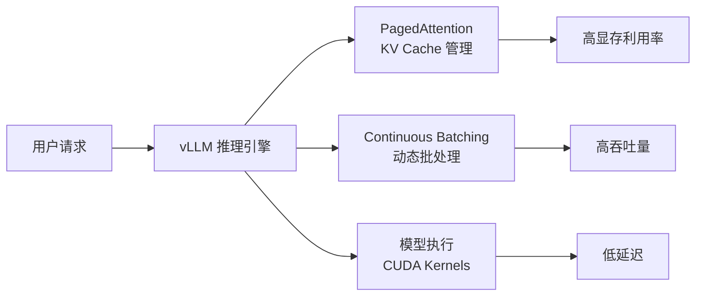

## 📑 目录

- [1. 什么是 vLLM](#1-什么是-vllm)
- [2. 核心原理：PagedAttention](#2-核心原理pagedattention)
- [3. 安装与环境准备](#3-安装与环境准备)
- [4. 离线批量推理](#4-离线批量推理)
- [5. 在线服务部署](#5-在线服务部署)
- [6. 关键参数调优](#6-关键参数调优)
- [7. 多 GPU 推理与张量并行](#7-多-gpu-推理与张量并行)
- [8. 常见问题与排错](#8-常见问题与排错)
- [总结](#-总结)
- [自我检验清单](#-自我检验清单)
- [参考资料](#-参考资料)

---

## 1. 什么是 vLLM

当你要把一个大语言模型"搬上线"提供服务时，最头疼的问题是什么？——**显存不够用，吞吐上不去**。传统的推理方式就像一个餐厅里每桌客人都被分配了一间独立包房，不管来了几个人，房间全部占满，后面的客人只能干等。vLLM 的出现就是为了解决这个"包房浪费"问题。

vLLM 是由 UC Berkeley Sky Computing Lab 开发的**高吞吐、低延迟 LLM 推理与服务引擎**。截至 v0.19.0（2026 年 4 月），项目在 GitHub 上已获得超过 76,000 星标，拥有 2,000+ 贡献者，是当前最主流的开源 LLM 推理框架之一。

### 1.1 vLLM 的核心优势

| 🏷️ 特性 | 📝 说明 |
|---------|---------|
| **PagedAttention** | 借鉴操作系统虚拟内存分页思想管理 KV Cache，显存利用率接近最优 |
| **Continuous Batching** | 动态地将新请求插入正在处理的批次，而非等一批全部完成再开始下一批 |
| **OpenAI 兼容 API** | 直接替换 OpenAI 客户端的 `base_url`，无需修改业务代码 |
| **200+ 模型支持** | 覆盖 Llama、Qwen、Mistral、DeepSeek 等主流架构，含 MoE 和多模态模型 |
| **多硬件支持** | NVIDIA GPU、AMD GPU、Google TPU、Intel Gaudi、CPU 等 |
| **丰富的量化方案** | FP8、INT8、INT4、GPTQ、AWQ、GGUF 等开箱即用 |

### 1.2 vLLM 在推理生态中的定位



## 2. 核心原理：PagedAttention

在深入使用之前，先理解 vLLM 为什么快——这能帮你在后续调参时做出更好的决策。

### 2.1 传统 KV Cache 的问题

LLM 推理的 Decode 阶段需要缓存之前所有 token 的 Key 和 Value 向量（即 KV Cache），以避免重复计算。传统做法是为每个请求**预分配一块连续的显存空间**，大小按模型支持的最大序列长度计算。

这就带来了三个问题：

- **内部碎片**：大多数请求用不到最大长度，预留空间大量浪费
- **外部碎片**：请求结束后释放的空间大小不一，难以被新请求复用
- **无法共享**：Beam Search 等场景中，多个候选序列共享前缀部分的 KV Cache，但连续内存布局无法实现共享

💡 **提示**：对于一个 13B 参数的模型，单个请求的 KV Cache 在最大序列长度下可能占用数 GB 显存。如果同时处理几十个请求，显存瓶颈会比模型权重本身更严重。

### 2.2 PagedAttention 的解决方案

PagedAttention 的核心思想非常直观——把操作系统管理内存的方式搬到 KV Cache 管理上来：

| 🖥️ 操作系统概念 | 🤖 PagedAttention 对应 |
|----------------|----------------------|
| 虚拟内存页（Page） | KV Block（固定大小的 KV Cache 块） |
| 页表（Page Table） | Block Table（逻辑块到物理块的映射） |
| 按需分页 | Token 生成时才分配新的 KV Block |
| 写时复制（Copy-on-Write） | Beam Search 场景共享前缀 KV Block |

具体工作方式：

1. **分块存储**：KV Cache 不再要求连续内存，而是被切分成固定大小的 Block（如 16 个 token 为一个 Block）
2. **按需分配**：每生成一个 token，只在当前 Block 未满时追加，填满后才分配新的 Block
3. **映射表管理**：每个请求维护一个 Block Table，记录自己的逻辑 Block 到物理 Block 的映射关系
4. **内存共享**：多个请求如果有相同的前缀（如 System Prompt），可以共享同一组物理 Block，大幅节省显存

⚠️ **注意**：PagedAttention 的分块存储意味着 KV Cache 在物理上是不连续的，vLLM 需要专门的 CUDA Kernel 来高效地从分散的 Block 中读取数据进行 Attention 计算。

## 3. 安装与环境准备

### 3.1 系统要求

| 📊 项目 | 📝 要求 |
|---------|---------|
| 操作系统 | Linux（推荐 Ubuntu 20.04+） |
| Python | 3.10 ~ 3.13 |
| CUDA | 12.x（NVIDIA GPU） |
| GPU | Compute Capability 7.0+（Volta 及以上） |

### 3.2 使用 uv 安装（推荐）

`uv` 是 Rust 编写的高速 Python 包管理器，vLLM 官方推荐使用它来安装，能自动检测 CUDA 版本并选择匹配的 PyTorch：

```bash
# 创建虚拟环境
uv venv --python 3.12 --seed
source .venv/bin/activate

# 安装 vLLM（自动检测 CUDA 版本）
uv pip install vllm --torch-backend=auto
```

`--torch-backend=auto` 会根据系统 CUDA 驱动自动选择合适的 PyTorch 版本。也可以显式指定后端，如 `--torch-backend=cu126`。

### 3.3 使用 conda + pip 安装

```bash
conda create -n vllm-env python=3.12 -y
conda activate vllm-env
pip install --upgrade uv
uv pip install vllm --torch-backend=auto
```

### 3.4 AMD ROCm 环境

```bash
uv venv --python 3.12 --seed
source .venv/bin/activate
uv pip install vllm --extra-index-url https://wheels.vllm.ai/rocm/
```

目前 ROCm 支持 Python 3.12、ROCm 7.0，要求 `glibc >= 2.35`。

### 3.5 验证安装

```bash
python -c "import vllm; print(vllm.__version__)"
```

## 4. 离线批量推理

离线推理适合**不需要实时响应**的场景，如批量文本生成、数据标注、评测跑分等。vLLM 提供 `LLM` 类作为离线推理的主入口。

### 4.1 基础用法

```python
from vllm import LLM, SamplingParams

# 定义采样参数
sampling_params = SamplingParams(
    temperature=0.8,
    top_p=0.95,
    max_tokens=256,
)

# 加载模型（自动下载 HuggingFace 模型）
llm = LLM(model="Qwen/Qwen2.5-7B-Instruct")

# 批量生成
prompts = [
    "请用一句话解释什么是 Transformer：",
    "Python 和 C++ 的主要区别是什么？",
    "推荐三本深度学习入门书籍：",
]

outputs = llm.generate(prompts, sampling_params)

for output in outputs:
    prompt = output.prompt
    generated = output.outputs[0].text
    print(f"Prompt: {prompt}")
    print(f"Generated: {generated}\n")
```

📌 **关键点**：`LLM` 构造时会一次性将模型加载到 GPU 显存中。默认情况下 vLLM 会使用 90% 的可用 GPU 显存（模型权重 + KV Cache），可通过 `gpu_memory_utilization` 参数调整。

### 4.2 Chat 模式推理

对于 Instruct/Chat 模型，需要正确应用 Chat Template。vLLM 提供了两种方式：

**方式一：使用 `llm.chat`（推荐）**

```python
from vllm import LLM, SamplingParams

llm = LLM(model="Qwen/Qwen2.5-7B-Instruct")
sampling_params = SamplingParams(temperature=0.7, max_tokens=512)

messages_list = [
    [
        {"role": "system", "content": "你是一个 AI Infra 专家。"},
        {"role": "user", "content": "解释什么是张量并行？"},
    ],
    [
        {"role": "user", "content": "vLLM 和 TensorRT-LLM 有什么区别？"},
    ],
]

outputs = llm.chat(messages_list, sampling_params)

for output in outputs:
    print(output.outputs[0].text)
```

**方式二：手动应用模板**

```python
from transformers import AutoTokenizer
from vllm import LLM, SamplingParams

model_name = "Qwen/Qwen2.5-7B-Instruct"
tokenizer = AutoTokenizer.from_pretrained(model_name)
llm = LLM(model=model_name)

messages_list = [
    [{"role": "user", "content": "什么是 KV Cache？"}],
]

# 手动应用 chat template
texts = tokenizer.apply_chat_template(
    messages_list,
    tokenize=False,
    add_generation_prompt=True,
)

outputs = llm.generate(texts, SamplingParams(temperature=0.7))
```

⚠️ **注意**：`llm.generate` 不会自动应用 Chat Template。如果直接传入裸文本给 Chat 模型，输出质量可能很差甚至乱码。务必使用 `llm.chat` 或手动调用 `apply_chat_template`。

### 4.3 HuggingFace generation_config 的影响

vLLM 默认会读取模型仓库中的 `generation_config.json`（如果存在），并用其中的参数覆盖 vLLM 的默认值。如果你想使用 vLLM 自身的默认采样配置，需要显式设置：

```python
llm = LLM(model="Qwen/Qwen2.5-7B-Instruct", generation_config="vllm")
```

## 5. 在线服务部署

在线服务是 vLLM 最常用的部署方式——启动一个 HTTP 服务器，暴露 **OpenAI 兼容的 API**，业务端只需修改 `base_url` 即可无缝切换。

### 5.1 启动服务器

```bash
vllm serve Qwen/Qwen2.5-7B-Instruct
```

默认监听 `http://localhost:8000`，可通过 `--host` 和 `--port` 自定义：

```bash
vllm serve Qwen/Qwen2.5-7B-Instruct \
    --host 0.0.0.0 \
    --port 8080 \
    --tensor-parallel-size 2
```

💡 **提示**：同样可以通过 `--generation-config vllm` 来禁用 HuggingFace 默认的 generation_config。

### 5.2 Chat Completions API

这是最常用的接口，对标 OpenAI 的 `v1/chat/completions`：

**使用 curl：**

```bash
curl http://localhost:8000/v1/chat/completions \
    -H "Content-Type: application/json" \
    -d '{
        "model": "Qwen/Qwen2.5-7B-Instruct",
        "messages": [
            {"role": "system", "content": "你是一个有帮助的助手。"},
            {"role": "user", "content": "什么是 PagedAttention？"}
        ],
        "temperature": 0.7,
        "max_tokens": 512
    }'
```

**使用 Python openai 客户端：**

```python
from openai import OpenAI

# 只需修改 base_url，其他代码完全不变
client = OpenAI(
    api_key="EMPTY",  # vLLM 默认不需要认证
    base_url="http://localhost:8000/v1",
)

response = client.chat.completions.create(
    model="Qwen/Qwen2.5-7B-Instruct",
    messages=[
        {"role": "system", "content": "你是一个 AI 基础设施专家。"},
        {"role": "user", "content": "解释 Continuous Batching 的工作原理。"},
    ],
    temperature=0.7,
    max_tokens=512,
)

print(response.choices[0].message.content)
```

### 5.3 Completions API

对标 OpenAI 的 `v1/completions`，适用于文本补全场景：

```python
from openai import OpenAI

client = OpenAI(api_key="EMPTY", base_url="http://localhost:8000/v1")

completion = client.completions.create(
    model="Qwen/Qwen2.5-7B-Instruct",
    prompt="LLM 推理优化的三个核心方向是",
    max_tokens=256,
    temperature=0.8,
)

print(completion.choices[0].text)
```

### 5.4 API 认证

生产环境中建议开启 API Key 认证：

```bash
vllm serve Qwen/Qwen2.5-7B-Instruct --api-key my-secret-key
```

也可以通过环境变量设置：

```bash
export VLLM_API_KEY=my-secret-key
vllm serve Qwen/Qwen2.5-7B-Instruct
```

客户端调用时传入对应的 `api_key`：

```python
client = OpenAI(api_key="my-secret-key", base_url="http://localhost:8000/v1")
```

### 5.5 支持的 API 端点

| 📡 端点 | 📝 说明 |
|---------|---------|
| `GET /v1/models` | 列出可用模型 |
| `POST /v1/completions` | 文本补全 |
| `POST /v1/chat/completions` | 对话补全 |
| `GET /health` | 健康检查 |

## 6. 关键参数调优

### 6.1 采样参数（SamplingParams）

| 📊 参数 | 📝 说明 | 默认值 |
|---------|---------|--------|
| `temperature` | 控制随机性，越高越随机 | 1.0 |
| `top_p` | 核采样，只从累计概率前 p 的 token 中采样 | 1.0 |
| `top_k` | 只从概率最高的 k 个 token 中采样 | -1（不限制） |
| `max_tokens` | 最大生成 token 数 | 16 |
| `repetition_penalty` | 重复惩罚系数，>1 减少重复 | 1.0 |
| `stop` | 遇到指定字符串时停止生成 | None |
| `n` | 为每个 prompt 生成的序列数 | 1 |
| `seed` | 随机种子，设置后可复现结果 | None |

💡 **提示**：对于大多数生产场景，推荐 `temperature=0.7, top_p=0.9` 作为起点。追求确定性输出时设 `temperature=0`。

### 6.2 引擎关键参数

| ⚙️ 参数 | 📝 说明 | 推荐值 |
|---------|---------|--------|
| `--model` | HuggingFace 模型标识 | - |
| `--tensor-parallel-size` | 张量并行 GPU 数 | 根据模型大小决定 |
| `--gpu-memory-utilization` | GPU 显存使用比例 | 0.9（默认） |
| `--max-model-len` | 模型最大序列长度 | 按需设置 |
| `--dtype` | 模型权重精度 | auto |
| `--quantization` | 量化方式 | None |
| `--max-num-seqs` | 最大并发序列数 | 256 |
| `--enforce-eager` | 禁用 CUDA Graph | 调试时使用 |

### 6.3 显存估算与 gpu-memory-utilization

vLLM 启动时会按照以下方式分配显存：

```
总 GPU 显存 × gpu_memory_utilization = 模型权重 + KV Cache + 临时缓冲区
```

KV Cache 可用空间 = 总配额 - 模型权重 - 固定开销。KV Cache 越大，能同时处理的请求越多，吞吐就越高。

```bash
# 如果显存紧张，适当降低利用率
vllm serve Qwen/Qwen2.5-7B-Instruct --gpu-memory-utilization 0.85

# 如果需要限制最大序列长度来节省 KV Cache 空间
vllm serve Qwen/Qwen2.5-7B-Instruct --max-model-len 4096
```

⚠️ **注意**：如果模型加载后启动报错 OOM，通常需要降低 `--gpu-memory-utilization` 或 `--max-model-len`，或者增加 `--tensor-parallel-size` 分摊到多卡。

### 6.4 Attention Backend 选择

vLLM 会自动选择当前平台上性能最优的 Attention 后端，也可以手动指定：

```bash
# 使用 FlashAttention
vllm serve Qwen/Qwen2.5-7B-Instruct --attention-backend FLASH_ATTN

# 使用 FlashInfer
vllm serve Qwen/Qwen2.5-7B-Instruct --attention-backend FLASHINFER
```

| 🖥️ 平台 | 📝 可用后端 |
|---------|------------|
| NVIDIA CUDA | `FLASH_ATTN`、`FLASHINFER` |
| AMD ROCm | `TRITON_ATTN`、`ROCM_ATTN` 等 |

## 7. 多 GPU 推理与张量并行

当单卡显存装不下模型时，需要使用张量并行（Tensor Parallelism）将模型切分到多张 GPU 上。

### 7.1 基础用法

```bash
# 2 卡张量并行
vllm serve Qwen/Qwen2.5-72B-Instruct --tensor-parallel-size 2

# 4 卡张量并行（适合 70B+ 模型）
vllm serve Qwen/Qwen2.5-72B-Instruct --tensor-parallel-size 4
```

在离线推理中同样支持：

```python
from vllm import LLM, SamplingParams

llm = LLM(
    model="Qwen/Qwen2.5-72B-Instruct",
    tensor_parallel_size=4,
)

outputs = llm.generate(["解释 vLLM 的架构"], SamplingParams(max_tokens=256))
```

### 7.2 模型大小与 GPU 数量参考

以下是常见模型大小在 FP16 精度下的显存需求估算：

| 🤖 模型规模 | 💾 权重大小 (FP16) | 📝 推荐最小 GPU 配置 |
|------------|-------------------|---------------------|
| 7B | ~14 GB | 1× A100 80G / 1× L40S 48G |
| 13B | ~26 GB | 1× A100 80G |
| 34B | ~68 GB | 1× A100 80G（需降低 max_model_len）或 2× A100 |
| 70B | ~140 GB | 2× A100 80G |
| 405B | ~810 GB | 16× A100 80G 或 8× H100 80G |

💡 **提示**：实际所需显存 = 模型权重 + KV Cache + 运行时开销。使用量化（如 AWQ INT4）可以将权重大小缩减约 4 倍，从而用更少的 GPU 服务更大的模型。

### 7.3 vLLM 支持的并行方式

vLLM 支持五种并行策略：

- **张量并行（Tensor Parallelism）**：将模型的各层权重矩阵按列/行切分到多张 GPU
- **流水线并行（Pipeline Parallelism）**：将模型的不同层分配到不同 GPU
- **数据并行（Data Parallelism）**：多个副本独立处理不同请求
- **专家并行（Expert Parallelism）**：MoE 模型中将不同专家分配到不同 GPU
- **上下文并行（Context Parallelism）**：将长序列的上下文分散到多张 GPU

对于大部分场景，**张量并行是首选**，配置最简单且效果最好。

## 8. 常见问题与排错

### 8.1 启动时 OOM

```
torch.cuda.OutOfMemoryError: CUDA out of memory.
```

✅ **解决方案**：

```bash
# 方法一：降低显存利用率
vllm serve model_name --gpu-memory-utilization 0.8

# 方法二：缩短最大序列长度
vllm serve model_name --max-model-len 2048

# 方法三：增加张量并行
vllm serve model_name --tensor-parallel-size 2

# 方法四：使用量化模型
vllm serve model_name --quantization awq
```

### 8.2 Chat 模型输出乱码

如果使用 `llm.generate` 直接传入文本给 Chat 模型，输出可能不符合预期。

✅ **解决方案**：改用 `llm.chat` 方法或手动调用 `tokenizer.apply_chat_template`，确保输入格式符合模型的 Chat Template。

### 8.3 ModelScope 下载模型

国内环境下载 HuggingFace 模型较慢，可以切换到 ModelScope：

```bash
export VLLM_USE_MODELSCOPE=True
vllm serve Qwen/Qwen2.5-7B-Instruct
```

### 8.4 指定信任远程代码

部分模型需要执行自定义代码：

```bash
vllm serve model_name --trust-remote-code
```

## 📝 总结

vLLM 通过 **PagedAttention** 和 **Continuous Batching** 两大核心技术，将 LLM 推理的显存利用率和吞吐量提升到新的水平。本文覆盖了从零开始使用 vLLM 的完整路径：

1. **理解原理**：PagedAttention 将 KV Cache 分块管理，借鉴 OS 虚拟内存分页的思想解决显存碎片问题
2. **离线推理**：通过 `LLM` 类和 `SamplingParams` 快速完成批量文本生成
3. **在线部署**：一行命令启动 OpenAI 兼容 API 服务器，业务端零成本迁移
4. **调优实践**：掌握 `gpu-memory-utilization`、`max-model-len`、`tensor-parallel-size` 等关键参数
5. **多 GPU 扩展**：通过张量并行轻松服务 70B+ 大模型

## 🎯 自我检验清单

- 能解释 PagedAttention 的核心思想及其解决的显存碎片问题
- 能使用 `LLM` 和 `SamplingParams` 完成离线批量推理
- 能正确使用 `llm.chat` 进行 Chat 模式推理，理解 Chat Template 的重要性
- 能用 `vllm serve` 启动 OpenAI 兼容的在线推理服务
- 能使用 Python openai 客户端调用 vLLM 服务
- 能根据模型大小和 GPU 显存选择合适的 `tensor-parallel-size`
- 能通过调整 `gpu-memory-utilization` 和 `max-model-len` 解决 OOM 问题
- 能说出 vLLM 与传统推理方式在显存管理上的核心区别

## 📚 参考资料

- [vLLM 官方文档 - Quickstart](https://docs.vllm.ai/en/stable/getting_started/quickstart.html)
- [vLLM GitHub 仓库](https://github.com/vllm-project/vllm)
- [Efficient Memory Management for Large Language Model Serving with PagedAttention（Kwon et al., 2023）](https://arxiv.org/abs/2309.06180)
- [vLLM 架构概览](https://docs.vllm.ai/en/stable/design/arch_overview.html)
- [vLLM 特性兼容矩阵](https://docs.vllm.ai/en/stable/features/index.html)
